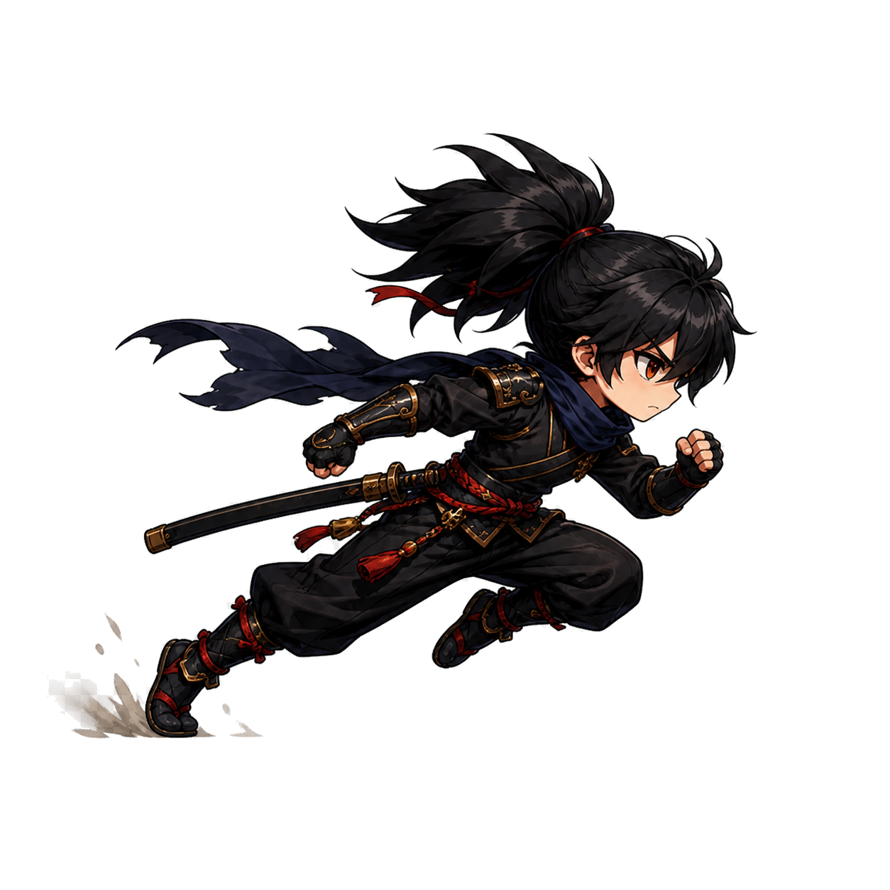
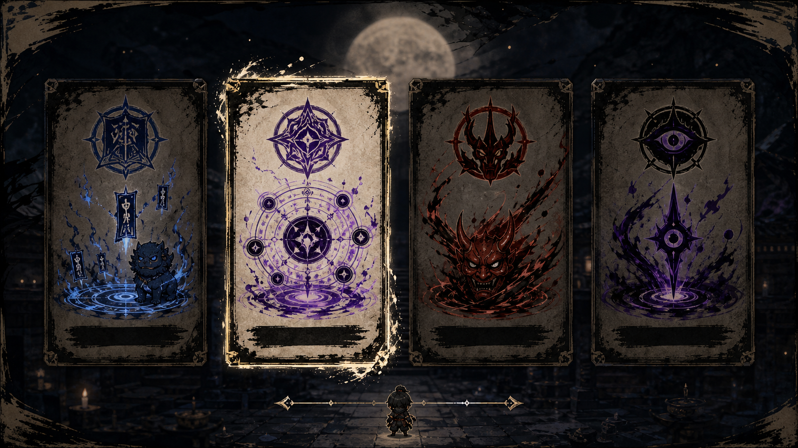
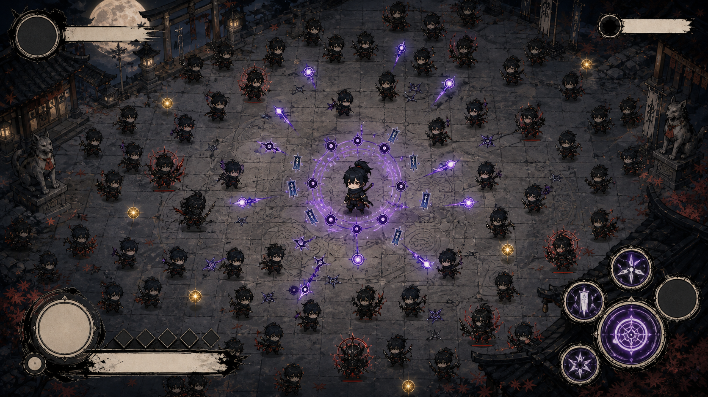
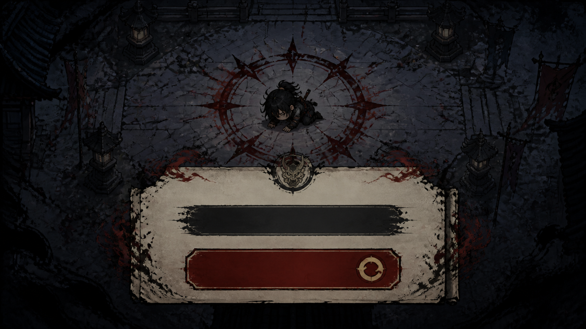
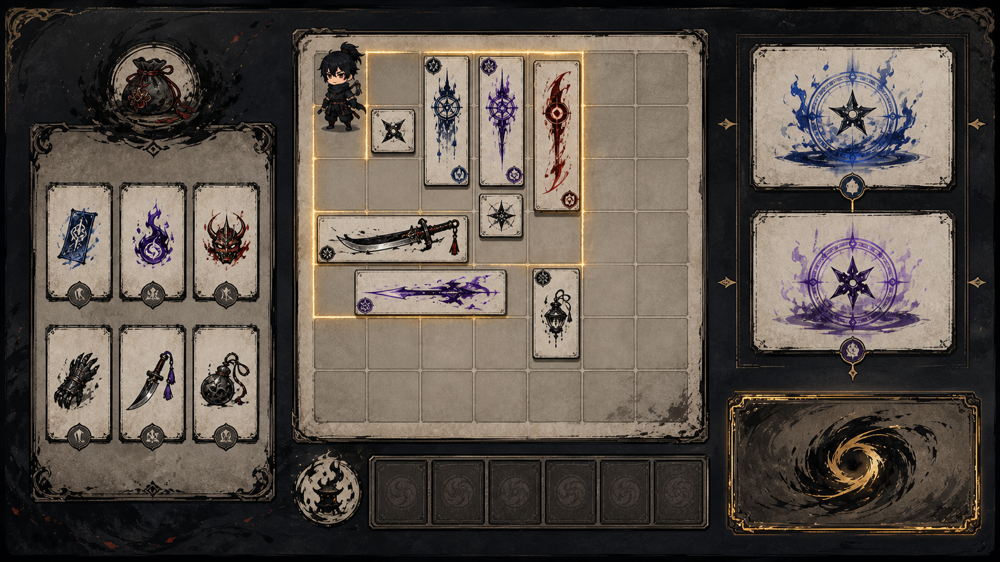
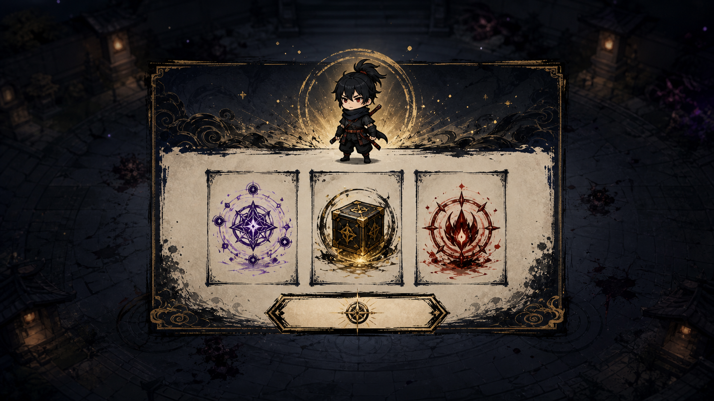
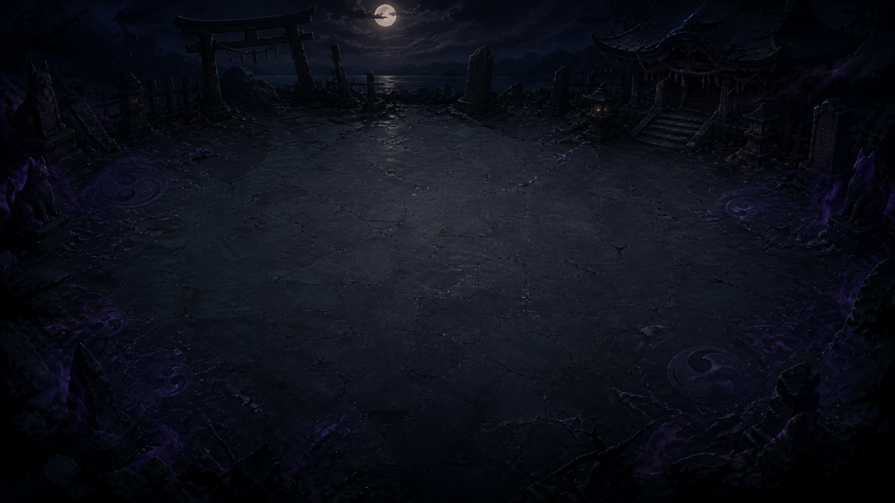

# 닌자의 신 — 사람용 게임 경험 블루프린트

> 이 문서는 처음 보는 사람이 “누구를 조작하고, 무엇을 보고, 어떤 선택을 하며, 왜 다시 도전하는가”를 한 번에 검수하기 위한 사람용 원고다. 실제 화면과 설계 도식은 구분해서 표시한다.

<!-- BLUEPRINT_PAGE: 01 / 28 -->
# 닌자의 신
> **검수 질문** · 이 한 장만 보고 어떤 닌자 경험인지 상상되는가?
> **한 줄 결론** · 한 명의 닌자가 전장을 읽고, 가방으로 자신만의 인법을 조립해 네 스테이지를 돌파한다.

## 약속
- 2D 탑다운 서바이벌과 공간 배치 빌드가 한 번의 Run 안에서 이어진다.
- 조준 연타가 아니라 **이동·위치·보상 배치**가 실력을 만든다.
- 네 명의 주인공을 바꾸지 않는다. 같은 닌자에게 전승의 흔적이 쌓인다.

## 이번 검수의 초점
- 내가 직접 움직이는 대상이 첫눈에 보이는가?
- 작은 3×3 가방이 성장의 출발점으로 읽히는가?
- 목적지를 스테이지, 내부 압박 단계를 페이즈로 이해하는가?

<!-- BLUEPRINT_PAGE: 02 / 28 -->
# 한 장으로 보는 플레이 감정
> **검수 질문** · 긴 설명 전에 “왜 이 게임을 계속할지”가 읽히는가?
> **한 줄 결론** · 살아남기 위해 움직이고, 더 잘 살아남기 위해 좁은 가방을 다시 조립한다.

:::flow
불안한 시작 | 위험을 읽는 이동 | Elite의 압박 | Trace 회수 | Boss 돌파 | 가방·Fate 결정 | 더 낯선 스테이지
:::

## 처음에는
- 3×3 가방 안에서 무엇을 가져갈지부터 고민한다.
- 적 무리가 가까워지면 빈 공간을 찾아 닌자를 움직인다.

## 중간에는
- Elite, Trace, Boss가 “지금 무엇을 해야 하는지”를 끊어 주지 않고 밀어 올린다.
- 획득한 물건이 즉시 숫자가 아니라 다음 배치의 재료가 된다.

## 끝에는
- 네 전승을 섞어 **내 방식의 닌자**를 만들었다는 기억이 남아야 한다.

<!-- BLUEPRINT_PAGE: 03 / 28 -->
# 당신은 한 명의 닌자를 움직인다
> **검수 질문** · 전투에서 내가 직접 바꾸는 것이 무엇인지 보이는가?
> **한 줄 결론** · 플레이어는 한 명의 고정 닌자를 움직이고, 공격은 그 위치에서 자동으로 일어난다.

## 보이는 것
- 화면 가운데 또는 추적 카메라 안의 **검은 닌자 한 명**
- 다가오는 적, 위험 지역, 투사체, 전승 효과
- 닌자 주변에서 자동으로 일어나는 공격과 반응

## 하는 것
- 방향키 또는 WASD로 닌자를 이동한다.
- 안전한 빈 곳으로 빠지거나, 전승 효과가 좋아지는 위치에 남는다.

## 자동으로 일어나는 것
- 공격 대상 선택, 기본 공격, 전승의 자동 반응은 직접 조준하지 않는다.
- 따라서 “적을 클릭하는 손”이 아니라 “어디에 설지 고르는 눈”이 핵심이다.

<!-- BLUEPRINT_PAGE: 04 / 28 -->
# 전투와 Workbench: 직접 행동의 두 얼굴
> **검수 질문** · 전투에서의 조작과 전투 뒤의 선택이 구분되는가?
> **한 줄 결론** · 전투에서는 닌자를 움직이고, Workbench에서는 빌드를 움직인다.

## 전투에서 직접 한다
- 이동하여 위험을 피한다.
- 적 무리를 모으거나 흩어, 자동 반응이 유리한 자리를 만든다.
- Elite·Trace·Boss의 경고를 보고 다음 위치를 고른다.

## Workbench에서 직접 한다
- 아이템과 가방을 고르고 90도로 돌린다.
- 3×3에서 시작한 공간을 어디에 넓힐지 결정한다.
- 조합, Fate, 다음 스테이지를 한 번에 확정한다.

## 하지 않는 것
- 공격 조준을 계속 누르지 않는다.
- 아직 확정하지 않은 미리보기 배치로 전투력을 얻지 않는다.

<!-- BLUEPRINT_PAGE: 05 / 28 -->
# 한 Run의 큰 흐름
> **검수 질문** · 시작부터 다음 도전까지의 목적이 끊기지 않는가?
> **한 줄 결론** · 스테이지 전투의 긴장과 Workbench의 결단이 번갈아 한 판을 만든다.

:::flow
시작 스테이지 선택 | 전투에서 이동 | Elite | Trace | Boss | 결과·보상 | Workbench | Fate·다음 스테이지 확정
:::

## 흐름의 규칙
- 네 스테이지는 같은 Run에서 각각 한 번만 선택한다.
- 한 스테이지의 Boss를 이기면 그 전승의 접근 경로가 열린다.
- 네 번째 Boss 뒤에는 Final Binding과 별도 최종 재앙이 남는다.

## 플레이어가 기억할 문장
- **전투의 위치 선택이, 다음 전투의 가방 선택으로 이어진다.**

<!-- BLUEPRINT_PAGE: 06 / 28 -->
# 한 스테이지 안의 자세한 여정
> **검수 질문** · 지금의 목표와 다음 목표가 계속 보이는가?
> **한 줄 결론** · Core를 견디고, Elite를 넘고, Trace를 회수해야 Boss에게 갈 수 있다.

:::flow
시그니처 30초 | Core 압박 | 약 3분 Elite | Trace 생성 | Trace에 다가감 | 약 5분 Boss 경고 | Boss
:::

## 보이는 것
- 초반에는 해당 스테이지의 위험 처리법을 한 번 보여 주는 시그니처 장면
- Elite 처치 뒤에는 보상과 다른 **Trace의 위치/방향 신호**
- Boss 직전에는 갑작스러운 등장 대신 경고

## 결정하는 것
- “지금 당장 적을 피할까, Trace를 회수하러 갈까?”
- “Boss 전에 어떤 공간과 위치를 준비할까?”

<!-- BLUEPRINT_PAGE: 07 / 28 -->
# 장면 아틀라스
> **검수 질문** · 주요 장면이 서로 다른 질문을 해결하는가?
> **한 줄 결론** · 선택·전투·Workbench·결과는 같은 Run의 다른 결정을 맡는다.

## 장면과 플레이어 질문
- **스테이지 선택** · “어떤 위험 방식으로 시작할까?”
- **전투 HUD** · “무엇이 위험하고 어디로 움직일까?”
- **Workbench** · “무엇을 놓고 무엇을 포기할까?”
- **결과** · “무엇을 얻었고 다음에는 무엇을 바꿀까?”

## 화면 상태 표기
- 이 문서의 스크린샷은 실제 또는 현재 화면 참고다.
- 3×3 성장, 흐름 화살표, 입력 설명은 구현 전에도 수정 가능한 **설계 도식**이다.

<!-- BLUEPRINT_PAGE: 08 / 28 -->
# 시작 장면: 아직 완성되지 않은 닌자
> **검수 질문** · 시작 직후 플레이어의 정체성과 목적이 설명 없이 느껴지는가?
> **한 줄 결론** · 당신은 예언으로 선택된 영웅이 아니라, 전장을 통과하며 자기 방식을 만드는 닌자다.

## 보이는 것
- 달빛의 어두운 전장과 한 명의 닌자
- 네 전승으로 이어지는 갈림길
- “첫 선택은 영구 직업이 아니다”라는 부담 없는 시작

## 하는 것
- 첫 스테이지를 선택한다.
- 선택한 전승이 위험을 다루는 기본 감각을 가장 강하게 남긴다.

## 결정하는 것
- 익숙한 안전함보다, 지금 배우고 싶은 위험 처리 방식을 고른다.

<!-- BLUEPRINT_PAGE: 09 / 28 -->
# 스테이지 선택: 네 개의 위험 방식
> **검수 질문** · 네 선택지가 색만 다른 스킨이 아니라 다른 판단으로 읽히는가?
> **한 줄 결론** · 스테이지는 배경 이름이 아니라 “위험을 다루는 방식”을 고르는 선택이다.

## 봉마 스테이지
- 식신과 결계가 유지되는 이동 경로를 만든다.

## 천술 스테이지
- 상태와 원소 반응이 이어질 장소를 만든다.

## 귀인 스테이지
- 위험한 근접 거리에서 버틸 가치가 있는 순간을 고른다.

## 흑영 스테이지
- 가장 위험한 적이 먼저 무너지게 하는 위치와 빌드를 만든다.

<!-- BLUEPRINT_PAGE: 10 / 28 -->
# 전투 HUD: 먼저 읽히는 것은 위험과 내 위치
> **검수 질문** · 공격 효과보다 닌자의 위치와 위험이 먼저 보이는가?
> **한 줄 결론** · HUD는 “지금 무엇을 피하고 무엇을 활용할지”를 빠르게 읽게 해야 한다.

## 보이는 것
- 닌자와 가까운 적, 위험 지역, 보스 경고
- 상태를 구분하는 작은 아이콘과 피격 직후의 적 하나에만 나타나는 HP 정보

## 하는 것
- 빈 공간, 준비된 결계, 적 군집, 보스 경고 사이에서 다음 이동 경로를 고른다.

## 결정하는 것
- 안전을 위해 흩어질지, 더 큰 자동 반응을 위해 잠깐 위험에 남을지 결정한다.

<!-- BLUEPRINT_PAGE: 11 / 28 -->
# 자동 공격은 조작을 지우지 않는다
> **검수 질문** · “자동”이 무관여가 아니라 위치 판단의 결과로 느껴지는가?
> **한 줄 결론** · 자동 공격은 손의 부담을 줄이고, 이동 판단의 결과를 더 잘 보이게 한다.

## 닌자가 자동으로 하는 일
- 가까운 위협에 기본 공격을 한다.
- 확정된 빌드와 전승 조건에 맞춰 효과를 낸다.

## 플레이어가 만든 조건
- 적을 모을지, 거리를 벌릴지, 결계 밖으로 유도할지 결정한다.
- Trace를 회수하러 가는 위험을 감수할지 결정한다.

## 좋은 피드백
- 좋은 이동은 적 정리, 안전지대, 연쇄 반응처럼 즉시 보인다.
- 나쁜 이동은 “무엇을 놓쳤는지”를 다음 시도에 남긴다.

<!-- BLUEPRINT_PAGE: 12 / 28 -->
# 스테이지와 페이즈를 구분한다
> **검수 질문** · “다음 목적지”와 “그 안의 압박 단계”가 다른 말로 이해되는가?
> **한 줄 결론** · 스테이지는 목적지, 페이즈 1–4는 그 목적지 안에서 위험이 깊어지는 순서다.

## 스테이지
- 봉마, 천술, 귀인, 흑영 중 아직 방문하지 않은 다음 전장
- 각 스테이지는 다른 위험 처리 철학과 보상 접근을 가진다.

## 페이즈 1–4
- 같은 스테이지 안에서 적 패턴과 압박이 쌓이는 진행 축
- “Stage 1–4”라는 이중 표현 대신 **페이즈 1–4**로 부른다.

## 플레이어 문장
- “다음 **스테이지**는 어디로 갈까?”
- “이 스테이지의 **페이즈 3**에서 무엇을 준비해야 할까?”

<!-- BLUEPRINT_PAGE: 13 / 28 -->
# 네 스테이지의 차이는 전투 동사다
> **검수 질문** · 각 스테이지를 한 문장으로 설명할 수 있는가?
> **한 줄 결론** · 네 전승은 효과 목록이 아니라 서로 다른 위치 판단을 요구한다.

## 봉마: 이동하는 진지
- 결계와 식신을 유지할 수 있는 길을 만든다.

## 천술: 준비된 반응
- 적이 모인 곳에 상태와 반응의 순서를 만든다.

## 귀인: 위험한 근접
- 너무 가까운 곳에서 버틸 보상과 빠져나올 시점을 고른다.

## 흑영: 위협 우선순위
- 가장 위험한 적이 먼저 사라지도록 전장을 유도한다.

<!-- BLUEPRINT_PAGE: 14 / 28 -->
# 페이즈 1–4: 압박은 늘어도 읽을 수 있어야 한다
> **검수 질문** · 난이도 상승이 갑작스러운 잡음이 아니라 배운 판단의 확장으로 느껴지는가?
> **한 줄 결론** · 페이즈는 새 규칙을 한꺼번에 던지지 않고, 기존 판단에 한 층씩 부담을 더한다.

:::flow
페이즈 1: 기본 시그니처 | 페이즈 2: 상호작용 하나 | 페이즈 3: 시너지/필드 층 | 페이즈 4: 숙련 혼합과 Boss 전조
:::

## 제한
- 페이즈 1은 큰 위험 하나만 강조한다.
- 페이즈 2는 고급 기믹 하나를 더한다.
- 페이즈 3–4와 Boss도 동시에 읽어야 할 고급 기믹은 둘을 넘기지 않는다.

<!-- BLUEPRINT_PAGE: 15 / 28 -->
# Elite → Trace → Boss: 목적이 보이는 압박
> **검수 질문** · Trace가 단순 보상과 다르게, Boss로 가기 위한 행동으로 읽히는가?
> **한 줄 결론** · Elite를 이긴 뒤 Trace를 전장에서 회수해야 Boss가 열린다.

## Elite
- 약 3분 무렵, 스테이지가 요구하는 판단을 시험한다.
- 승리하면 상자 토큰과 Trace가 생긴다.

## Trace
- 즉시 전투력을 주는 아이템이 아니다.
- 전장에 남아 있으므로 닌자가 직접 다가가 위험을 감수해 회수한다.

## Boss
- Elite 처치, Trace 회수, 시간, 경고가 모두 갖춰진 뒤에만 등장한다.

<!-- BLUEPRINT_PAGE: 16 / 28 -->
# 실패와 재도전: 잃는 것과 남는 것
> **검수 질문** · 실패 뒤에 다음 행동을 배우되, 긴장이 사라지지 않는가?
> **한 줄 결론** · 기본 실패는 Run 종료지만, 유효한 Workbench 체크포인트가 있다면 한 번의 같은 스테이지 재도전이 가능하다.

## 잃는 것
- 실패한 스테이지에서 얻은 임시 G, 보상, Trace, 진행

## 남는 것
- 이전에 성공적으로 확정한 Workbench 시점의 가방·Fate·경로

## 다시 묻는 질문
- “이번에는 어느 위험에서 먼저 빠져나와야 할까?”

<!-- BLUEPRINT_PAGE: 17 / 28 -->
# 가방은 정확히 3×3에서 시작한다
> **검수 질문** · 첫 가방이 작고, 그래서 배치가 곧 선택이라는 점이 보이는가?
> **한 줄 결론** · Run 시작의 실제 사용 가능 공간은 정확히 3×3이다.

:::grid
[ ][ ][ ]
[ ][ ][ ]
[ ][ ][ ]
:::

## 보이는 것
- 처음부터 빈 6×6 판이 아니라, 닌자가 실제로 쓸 수 있는 작은 3×3 공간
- 큰 아이템 하나가 여러 칸을 차지하는 분명한 압박

## 결정하는 것
- 지금 강한 아이템을 둘지, 첫 확장을 위해 공간을 남길지
- 조합을 노릴지, 즉시 안전한 효과를 챙길지

<!-- BLUEPRINT_PAGE: 18 / 28 -->
# 가방은 아이템이 아니라 가능한 선택지를 늘린다
> **검수 질문** · 가방 구매가 단순 용량 숫자보다 다음 빌드의 가능성으로 느껴지는가?
> **한 줄 결론** · 새 가방을 붙이면 사용할 수 있는 칸과 배치 방향이 늘어나며, 최대 외곽은 6×6 안에서 조립된다.

:::flow
3×3 시작 | 작은 가방 획득 | 방향을 맞춰 확장 | 인접 효과 연결 | 더 큰 조합의 자리 확보
:::

## 보호되는 규칙
- 아이템과 가방은 90도로 돌릴 수 있다.
- 직교로 맞닿은 배치가 시너지와 조합의 조건이 된다.
- 특수 가방은 한 칸 이상 겹쳐 활성화될 수 있다.

## 화면의 약속
- 아직 사용 불가능한 외곽은 “처음부터 내 가방”처럼 보이지 않아야 한다.

<!-- BLUEPRINT_PAGE: 19 / 28 -->
# Workbench: 전투 후에는 빌드를 움직인다
> **검수 질문** · 보상을 얻는 순간과 빌드를 확정하는 순간이 분명히 분리되는가?
> **한 줄 결론** · Workbench는 보상 선택, 배치, 조합, Fate, 다음 스테이지를 한 번의 결단으로 묶는다.

## 보이는 것
- 새 보상 후보, 가방, 현재 배치, 다음 스테이지 미리보기, Fate의 이득과 대가

## 하는 것
- 보상 하나를 고르고, 배치·회전·조합을 시험한다.
- 다음 스테이지와 Fate를 임시로 고른다.

## 결정하는 것
- 마지막 확정 전에는 모든 것이 미리보기다. 확정 뒤에만 다음 전투력과 경로가 된다.

<!-- BLUEPRINT_PAGE: 20 / 28 -->
# 배치·회전·인접·조합
> **검수 질문** · 가방 안의 한 칸이 실제 전투 방식으로 이어진다고 이해되는가?
> **한 줄 결론** · 좋은 아이템을 얻는 것보다, 어디에 어떻게 놓는지가 빌드를 만든다.

## 배치
- 작은 3×3에서 시작하므로 아이템 크기는 즉시 선택 비용이 된다.

## 회전
- 90도 회전으로 막힌 길을 열거나 인접 조건을 맞춘다.

## 인접
- 직교로 닿는 아이템이 시너지와 조합의 가능성을 만든다.

## 조합
- 정해진 조건을 만족한 명시적 조합만 만들어진다. 우연한 중복이나 자동 합성은 없다.

<!-- BLUEPRINT_PAGE: 21 / 28 -->
# 보상·상점·Fate는 다음 위험을 고르는 과정이다
> **검수 질문** · 이득만 고르는 화면이 아니라, 다음 스테이지를 감당할 선택으로 읽히는가?
> **한 줄 결론** · 보상은 가방에 들어가고, Fate와 다음 스테이지는 마지막에 함께 확정된다.

## 보상과 상점
- 새로운 전승 접근, 기존 빌드의 연속성, 어느 스테이지에서나 쓸 수 있는 연결 보상을 함께 제안한다.

## Fate
- 이득과 대가를 한 문장으로 보여 준다.
- “무엇을 얻나”와 “다음에 어떤 위험을 감수하나”를 분리하지 않는다.

## 확정
- 완성된 가방 배치 + 하나의 Fate + 하나의 다음 스테이지가 모두 준비되어야 한다.

<!-- BLUEPRINT_PAGE: 22 / 28 -->
# 다음 스테이지 미리보기: 아직 바꿀 수 있고, 그래서 신중하다
> **검수 질문** · 다음 목적지가 임시 선택과 최종 확정으로 나뉜다는 것이 이해되는가?
> **한 줄 결론** · Workbench에서 고른 다음 스테이지는 Fate와 가방을 확정하기 전까지 바꿀 수 있다.

:::flow
Boss 보상 | 배치 시험 | Fate 임시 선택 | 다음 스테이지 임시 선택 | 전체 확정 | 다음 전투
:::

## 왜 한 번에 확정하는가
- 미리보기 아이템만 전투력에 들어가는 실수를 막는다.
- Fate만 적용되거나 경로만 바뀌는 반쪽 선택을 막는다.
- 플레이어가 “이 빌드로 이 위험을 받겠다”고 분명히 말하게 한다.

<!-- BLUEPRINT_PAGE: 23 / 28 -->
# 네 전승은 한 명의 닌자에게 쌓인다
> **검수 질문** · 스테이지를 바꿔도 주인공이 바뀌지 않는다고 느껴지는가?
> **한 줄 결론** · 네 전승의 흔적은 하나의 닌자 위에 층처럼 쌓이며, 플레이 방식은 섞이고 정체성은 하나로 남는다.

## 시각 원칙
- 얼굴, 몸 비율, 핵심 복장은 같은 닌자를 유지한다.
- 시작 스테이지의 강한 흔적이 중심이 되고, 나머지는 보조 층이 된다.

## 플레이 원칙
- 봉마의 안전 공간, 천술의 반응, 귀인의 근접, 흑영의 우선순위가 가방과 위치를 통해 섞인다.

## 최종 감정
- “전승을 갈아입었다”가 아니라 “내 닌자식을 완성했다.”

<!-- BLUEPRINT_PAGE: 24 / 28 -->
# 결과: 다음 Run을 위한 한 문장
> **검수 질문** · 결과 화면이 숫자 정산보다 다음 시도를 위한 피드백을 주는가?
> **한 줄 결론** · 결과는 무엇을 얻었는지와, 다음에 무엇을 다르게 할지를 한 화면에서 연결한다.

## 보이는 것
- 이번 스테이지의 Boss 보상, 가방에 남긴 결정, 다음 스테이지 또는 다음 Run의 이유

## 배우는 것
- 어느 위험에서 길이 막혔는지
- 어떤 가방 확장이나 Fate가 다음 번에는 더 가치 있을지

## 남기는 감정
- 실패해도 “다음에는 어느 칸을 비워 둘지”가 떠오른다.

<!-- BLUEPRINT_PAGE: 25 / 28 -->
# 보이는 톤: 달빛, 먹선, 읽히는 위험
> **검수 질문** · 어두운 판타지인데도 닌자와 위험이 묻히지 않는가?
> **한 줄 결론** · 검정·짙은 남색·붉은색·따뜻한 금색을 중심으로, 실루엣과 위험 신호를 먼저 읽게 한다.

## 키 아트와 게임 화면
- 키 아트/서사는 붓·먹선이 느껴지는 성숙한 닌자 판타지
- 실제 게임은 움직임이 읽히는 2–3등신 SD 애니메이션

## 정보 우선순위
- 배경보다 닌자
- 장식보다 위험 지역
- 긴 상태 단어보다 색과 실루엣이 다른 작은 아이콘

<!-- BLUEPRINT_PAGE: 26 / 28 -->
# 소리·접근성·입력: 아직 검증해야 할 약속
> **검수 질문** · 문서가 아직 확인하지 않은 경험을 사실처럼 말하지 않는가?
> **한 줄 결론** · 키보드 이동은 현재 기준 행동이지만, 전체 터치·게임패드·기기 경험은 별도 검증이 필요하다.

## 필요한 피드백
- 선택/확정/취소, Boss 경고, Trace 회수, 가방의 합법/불가 배치, Fate 확정, 실패/재도전

## 접근성 원칙
- 소리는 상태를 보강할 뿐, 규칙을 전달하는 유일한 수단이 아니다.
- 아이콘과 한글 설명 경로가 함께 있어야 한다.

## 아직 확인하지 않은 것
- 사람 플레이 가독성, 터치 이동, 게임패드 전 경로, Android/export 경험은 이 문서의 PDF 검수와 별개다.

<!-- BLUEPRINT_PAGE: 27 / 28 -->
# 이 블루프린트에서 확인할 질문
> **검수 질문** · 다음 구현 전에 의미를 바꿀 질문이 남아 있는가?
> **한 줄 결론** · 이 문서는 화면의 예쁨보다, 플레이어가 무엇을 조작하고 왜 결정하는지를 검수한다.

## 플레이어 조작
- 전투에서 한 명의 닌자를 움직인다는 사실이 즉시 보이는가?
- 자동 공격과 직접 이동의 경계가 납득되는가?

## 가방 성장
- 3×3 시작이 작고 중요한 선택으로 읽히는가?
- 가방 확장이 용량이 아니라 새 조합의 가능성으로 보이는가?

## 스테이지 흐름
- “다음 스테이지”와 “페이즈 1–4”를 혼동하지 않는가?
- Elite → Trace → Boss의 목적이 전투 중에도 이해될 것 같은가?

<!-- BLUEPRINT_PAGE: 28 / 28 -->
# 다음 단계: 사람 검수 뒤에만 런타임을 바꾼다
> **검수 질문** · 이 문서가 실제 구현 완료와 사람 경험 검증을 구분하는가?
> **한 줄 결론** · 이번 산출물은 사람용 블루프린트와 구현 명세다. 최종 PDF 승인이 있어야 3×3·Stage/Phase·UI를 런타임에 이행한다.

## 이번에 확정한 것
- 한 명의 닌자를 직접 이동한다.
- 가방은 정확히 3×3에서 시작해 확장된다.
- 공개 용어는 스테이지와 페이즈를 쓴다.

## 다음 구현에서 검증할 것
- 3×3 초기 보상과 큰 아이템의 배치 가능성
- 공개 UI와 내부 legacy key의 호환 migration
- 마우스, 키보드/게임패드, 터치의 실제 Workbench/전투 흐름

## 증거의 경계
- PDF 렌더링 통과는 Godot runtime, Human Usability, Player Experience, 기기/export 통과가 아니다.
