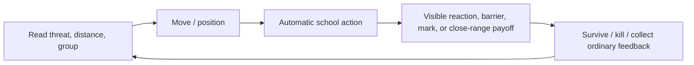
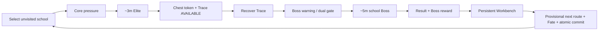
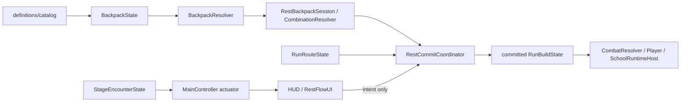

# 닌자의 신 — Master Game Design Document

> **문서 상태:** `CURRENT_PRODUCT_GDD / IMPLEMENTATION_CONTRACT_COMPANION`
> **기준 브랜치 / SHA:** `main` / `50fbf203ec3f71af1633a5b6cc74e7167c0604c8`
> **생성일:** 2026-08-29 KST
> **사람용 안내:** `docs/design/NINJA_SURVIVAL_HUMAN_GDD.md` source update에 따른 PDF 재발행이 main source merge 뒤 진행 중이다. 현재 상태는 `docs/publication/NINJA_SURVIVAL_HUMAN_GDD_PDF_MANIFEST.json`이 소유하며, `CURRENT` 전에는 이전 PDF snapshot을 최신 설명본으로 취급하지 않는다.
> **발행/검수 계약:** `docs/PDF_EXPORT.md`와 `docs/publication/NINJA_SURVIVAL_HUMAN_GDD_PDF_MANIFEST.json`; PDF 존재는 runtime·Human Usability·Player Experience 검증을 뜻하지 않는다.
> **정본 우선순위:** 최신 사용자 승인 → `AGENTS.md` → `CURRENT_CONFIRMED_DECISIONS.md` → dated canon → `ACTIVE_CONTEXT.md` → actual code/data/Scene/test → Base → benchmark
> **범위:** 이 파일은 제품 canon·구현 계약·증거 경계를 소유하는 기술 정본이다. 사람용 설명은 별도 Human GDD가 소유하며, 둘이 충돌하면 최신 승인과 이 기술 정본의 규칙을 따른다. DEC-035는 기존 Notion 구조와 현재 작업물을 repository migration archive에 보존한 뒤, repository-only owner로 전환한다.

## 00. Canon Snapshot

`닌자의 신`은 Godot 4.x/GDScript로 만드는 2D top-down survival roguelike다. 플레이어는 하나의 고정 닌자 신분으로 네 유파의 전장을 한 번씩 고르고, 각 유파가 가르치는 서로 다른 위험 처리법을 몸으로 익힌 뒤, 공간 배치형 백팩과 Fate를 조합해 최종 재앙에 맞설 자신만의 인법을 만든다.

### 상태 표기

| 상태 | 뜻 | 이 문서에서의 사용 |
| --- | --- | --- |
| `DOCUMENTED` | 문서에 정의됨 | 미래 product contract |
| `CONFIRMED` | 사용자 승인 정본 | 구현이 따라야 하는 rule |
| `IMPLEMENTED` | `main` code/Scene/data에 존재 | source path로 확인 |
| `AUTOMATED_TEST_PASS` | 해당 범위 GUT/CI evidence 존재 | Human 품질을 뜻하지 않음 |
| `RUNTIME_VERIFIED` | 실행 render/input evidence가 있음 | 범위와 SHA를 별도로 표시 |
| `UX_VERIFIED` | 실제 Human usability evidence 있음 | 현재 대부분 `NOT_RUN` |
| `RELEASE_READY` | platform/product quality gate 통과 | 현재 `NOT_READY` |

### 지금의 Work 5 위치

```text
Phase 1 기획/정본화: CONTRACT_READY_FOR_USER_APPROVAL
Phase 2 preproduction / Definition of Ready: READY_FOR_USER_IMPLEMENTATION_CONTRACT_APPROVAL
Phase 3 asset production: PARTIAL (기존 소비처 asset만)
Phase 4 Godot implementation: T12~T16 machine baseline merged; current package NOT STARTED
Phase 5 Human vertical-slice validation: DEFERRED_BY_DEC036_NOT_RUN
```

## 01. Source Registry

| ID | source | 역할 | 사용 상태 |
| --- | --- | --- | --- |
| `SRC-REPO-01` | `AGENTS.md` | engine, authority, protected boundaries | `CONFIRMED` |
| `SRC-REPO-02` | `docs/CURRENT_CONFIRMED_DECISIONS.md` | current product/visual/evidence ledger | `CONFIRMED` |
| `SRC-REPO-03` | `docs/ACTIVE_CONTEXT.md` | mutable resume route | `CONFIRMED` |
| `SRC-REPO-04` | DEC-014~025, DEC-026~036 | product, encounter, current decisions | `CONFIRMED` |
| `SRC-REPO-05` | `scripts/`, `scenes/`, `assets/`, `tests/` | actual implementation reality | `IMPLEMENTED` where paths exist |
| `SRC-REPO-06` | `docs/visual/*`, asset manifests | visual grammar and consumer evidence | mixed; see `AST-*` |
| `SRC-NOTION-01` | former Human Home / Core Systems / Visual Bible / Production Handoff | preserved migration snapshot and attachment provenance | `docs/migration/notion/`; not active canon |
| `SRC-EXT-01` | official/Steam pages, researched 2026-08-28 | positioning references | `REFERENCE_ONLY` |

### Current conflict register

| conflict ID | current canonical claim | actual source reality | disposition |
| --- | --- | --- | --- |
| `CON-01` | Trace is an in-world recovery/gate object | `MainController` currently exposes `R`/button recovery | `IMPLEMENTATION_REQUIRED` — canonical Trace behavior wins |
| `CON-02` | icon-first statuses; only struck enemy HP bar | `EnemyEffectBadge` is text and no enemy HP presentation exists | `IMPLEMENTATION_REQUIRED` |
| `CON-03` | school-owned Core/Elite/Boss compositions | current scene instantiates generic enemy/Boss representations | `IMPLEMENTATION_REQUIRED` |
| `CON-04` | Workbench is a full spatial decision | current `RestFlowUI` exposes route/Fate but not Boss reward selection or 6×6 placement | `BLOCKING_GAP` |
| `CON-05` | DEC-033 economy / persistent Soul settlement | current `RunBuildState` grants normal 1G and Boss 25G; no Elite, rank, wallet, or settlement owner | `IMPLEMENTATION_REQUIRED` |
| `CON-06` | true Run-end Soul settlement | first Human endpoint stops at fourth-Boss `final_binding_eligible` before Final Binding | `CONFIRMED` — no Soul settlement at that endpoint; true conclusion package owns success settlement |

## 02. One-page Vision

### Player Promise — `PX-001`

> “내가 선택한 유파의 위험 처리법으로 전장을 읽고, 네 전승을 하나의 닌자식으로 조립해 재앙을 봉인한다.”

```text
read threat / position
-> automatic school action reveals a school-specific opportunity
-> choose route, reward, spatial placement, Fate
-> commit one build and one next danger together
-> survive a harder school with the consequences
-> remember the personal ninja method that emerged
```

### Design Pillars

| ID | pillar | player value | guardrail |
| --- | --- | --- | --- |
| `PIL-01` | 위험을 다르게 다루는 네 유파 | 같은 적도 다른 위치·우선순위·준비로 풀린다 | 유파를 원소 스킨으로 축소하지 않는다 |
| `PIL-02` | 자동전투 안의 읽는 이동 | 조준 부담 없이 위치와 군집으로 실력 표현 | 자동전투를 완전 방치형으로 만들지 않는다 |
| `PIL-03` | 공간 백팩이 만든 인법 | 무엇을 얻고 어디에 놓을지의 고민이 전투력으로 읽힌다 | UI가 legality/economy/combat authority를 소유하지 않는다 |
| `PIL-04` | 네 전승을 쌓는 한 명의 닌자 | route clear order와 visual layers가 개인적 전설을 만든다 | 네 주인공/네 독립 게임으로 분열하지 않는다 |
| `PIL-05` | 빠르고 정직한 피드백 | 위험→선택→반응→보상/실패 학습이 읽힌다 | text badge, 숨은 rule, 장식이 전투 가독성을 이기지 않는다 |

### 차별점 / 판매 포인트

`USP-01` **유파 선택이 빌드 색상이 아니라 위험 처리 방식이다.** 봉마는 이동형 진지, 천술은 공간 반응, 귀인은 위험한 근접 지속, 흑영은 위협 우선 처형을 가르친다.

`USP-02` **자동 사격 survival과 spatial Workbench를 한 Run의 원인-결과로 묶는다.** Shop/Chest/Boss reward는 즉시 파워가 아니라 배치·인접·조합·Fate commit을 거쳐 전투 권한이 된다.

`USP-03` **하나의 닌자가 네 전승을 누적한다.** 선택한 시작 유파만 강한 Stage-3 시각 층이 되고, 나머지는 읽히는 보조 층으로 결합한다.

## 03. Player Experience: 첫 5·15·30분

| 시간 | player experience | 성공 신호 | 실패가 남길 학습 | current status |
| --- | --- | --- | --- | --- |
| 0–30초 | 선택 유파의 위험 처리 언어를 본다 | 학교 feedback, 움직임, 자동행동 결과 | “무엇을 보고 어디로 움직여야 하는가” | `PARTIAL`; optional help exists but unassisted UX `NOT_RUN` |
| 0–5분 | Core 압박→Elite→Trace→Boss의 긴장을 경험 | Elite token/Trace, Boss warning, victory result | Trace를 잃지 말고 gate를 열어야 함 | Cheonsul domain/machine slice `IMPLEMENTED`; release-near Human `NOT_RUN` |
| 5–15분 | reward/shop/route/Fate로 다음 학교를 준비 | unvisited route preview, pending/commit reasons | preview는 power가 아니며 commit이 중요 | domain partial; direct Workbench play `BLOCKING_GAP` |
| 15–20분 | 네 유파를 다른 순서로 풀며 build를 누적 | 4th Boss → `final_binding_eligible` | 선택 순서와 공간 build의 귀결 | `DOCUMENTED`; current runtime not proven |
| true Run end | rank + distinct Boss Soul + legend conclusion | clear breakdown, persistent wallet settlement | 다음 Run에서 쓸 한 번의 retry/수평 해금 | `DOCUMENTED`; final package deferred |

## 04. Loops and Game Flow

### Core Loop — `SYS-COMBAT-001`



### School Session Loop — `SYS-ENCOUNTER-002`



### Meta Loop — `SYS-META-003`

```text
true Run end
-> distinct school Boss eligibility + progress rank
-> one Ninja Soul settlement
-> horizontal unlock / hint / option (not permanent raw-stat dominance)
-> next Run, with optional one-Soul checkpoint retry if earned
```

### Four-school Run Flow — `UX-FLOW-001`

```text
start school
-> choose one unvisited school
-> Core / Elite / Trace / Boss
-> Boss reward -> Workbench -> Fate + provisional next route -> atomic commit
-> repeat until all four exactly once
-> Final Binding Workbench
-> separate final calamity Boss
-> true final Result / Ninja Soul / legend
```

`~20 minutes` means active combat through the fourth school Boss; it excludes Final Binding preparation and final calamity time.

## 05. System Registry

| ID | system | owner / principal paths | status | next proof |
| --- | --- | --- | --- | --- |
| `SYS-COMBAT-001` | movement, automatic combat, DDD | `PlayerController`, `AutoAttackController`, `CombatDDDTracker`, `CombatResolver` | `IMPLEMENTED` / automated | human readability |
| `SYS-SCHOOL-002` | 4 school runtime host | `SchoolRuntimeHost`, `*_runtime.gd` | shallow runtime `IMPLEMENTED` | each school lifecycle |
| `SYS-ENCOUNTER-003` | Core→Elite→Trace→Boss | `StageEncounterState`, `CheonsulVerticalSliceController`, catalog | domain `IMPLEMENTED`; Cheonsul runtime partial | four-school runtime |
| `SYS-ROUTE-004` | four-school route and clear order | `RunRouteState` | `IMPLEMENTED` / automated | actual circuit |
| `SYS-WORKBENCH-005` | backpack, reward, route/Fate commit | `BackpackState`, `RestBackpackSession`, `RestCommitCoordinator`, `RestFlowUI` | domain `IMPLEMENTED`; UI gap | mouse/key/touch complete path |
| `SYS-ECONOMY-006` | Run GOLD / Shop / chest | `RunBuildState`, `ShopController`, `RestRewardController` | legacy baseline `IMPLEMENTED`; DEC-033 mismatch | revised reward runtime |
| `SYS-SOUL-007` | persistent Ninja Soul / retry / settlement | future `NinjaSoulWallet`, `RunSettlementLedger` | `DOCUMENTED` | save + Result verification |
| `SYS-RESULT-008` | contribution result / next action | `CombatContributionTracker`, `RestFlowUI` | `IMPLEMENTED` for segment result | final settlement result |
| `SYS-VISUAL-009` | screen/asset grammar | visual canon + actual Sprite2D consumers | `PARTIAL` | target-resolution live review |
| `SYS-ACCESS-010` | help, focus, pointer/key/gamepad/touch | `SchoolSelectionUI`, HUD, Rest UI | machine contracts partial | Human/device test |

## 06. System Specifications

### `SYS-COMBAT-001` — 이동과 자동전투

**왜 존재하는가.** 플레이어가 조준 부담 없이 적 거리·군집·위험 지역을 읽고 위치로 자신의 해법을 만들게 한다. 목표 감정은 “손은 단순하지만 나는 전장을 조종하고 있다”다.

**어떻게 플레이하는가.** Player는 input으로 이동한다. 선택 유파 runtime이 자동 행동을 내고, Combat Resolver가 committed modifier를 반영한다. `ui_accept`은 궁극기 요청으로 쓰이며, combat/help/modal state가 입력을 막을 수 있다.

**필요 콘텐츠.** player silhouette, generic enemy roles, projectile/field/reward feedback, compact status icon, struck-target-only HP reveal, ultimate readiness feedback. 현재 text badge/HP display는 아직 canonical visual rule과 불일치한다.

**Godot 구조.** `scenes/main/main_scene.tscn`의 `Player`, `WaveSpawner`, `SchoolRuntimeHost`, `CombatDDD`, `GameState`, `HUD`가 `MainController`에 연결된다. `RunBuildState`의 committed modifier snapshot만 item/spatial combat authority다.

**완료 판단.** normal/enemy/boss damage, school action, no double modifier, input guards, reaction feedback은 automated test로; 실제 resolution/HUD overlap/input feel은 live/Human validation으로 별도 확인한다.

### `SYS-SCHOOL-002` — 네 유파의 위험 처리

| CNT ID | school | player action / meaningful choice | visible payoff | protected distinction | status |
| --- | --- | --- | --- | --- | --- |
| `CNT-SCH-01` | 봉마류 | 안전한 이동 동선에 식신/결계를 유지 | 이동형 전선, support fire | stationary tower defense 금지 | shallow runtime `IMPLEMENTED` |
| `CNT-SCH-02` | 천술류 | 군집과 위치로 준비 조건을 만든다 | blue WET seal → amber/orange SHOCK chain | direct spell aim 없이 spatial agency | runtime WET/SHOCK exists; DEC-027/028 effect `DOCUMENTED` |
| `CNT-SCH-03` | 귀인류 | 근접에 오래 남을지 이탈할지 판단 | close-range sustain/power payoff | low HP one-rule 금지 | shallow runtime `IMPLEMENTED` |
| `CNT-SCH-04` | 흑영류 | 위험 표적이 먼저 죽게 위치/빌드를 고른다 | mark/execution priority result | manual hard target picking 금지 | shallow runtime `IMPLEMENTED` |

Each school needs `Core x3 / Elite x1 / Boss x1` composition over shared primitives. The existing `EncounterCatalog` and profiles document the data language; actual generic scene wiring does not yet prove those compositions.

### `SYS-ENCOUNTER-003` — Elite, Trace, Boss

**Entry/transition.** `StageEncounterState` owns lifecycle state, monotonic elapsed time, one-time signals, and spawn permission; WaveSpawner is actuator, not gate owner. Current authored timing evidence uses Elite around 165–180 seconds and Boss gate around 260–270 seconds.

**Rules.** Elite kill grants chest token and non-expiring `Trace AVAILABLE`; Trace has no ORB/STYLE/GOLD/direct power effect; Boss requires Elite + recovered Trace + time + warning. Boss clear stabilizes the school and opens its acquisition package; power still needs reward acquisition → spatial placement → resolution → commit.

**Known implementation gap.** Current Cheonsul runtime accepts `R`/button recovery, while canonical behavior requires an actual recovery presentation. The next contract must preserve state ownership and replace only consumer/input behavior.

### `SYS-WORKBENCH-005` — 공간 백팩, 보상, Fate, route

**Player promise.** “가져온 것을 어디에 놓고 무엇을 감수할지”가 다음 전투의 인법이 된다.

**Rules.** Fixed `6×6` board, centered `4×3` starting active cells; purchased bags enlarge usable cells; 90° item/bag rotation; orthogonal adjacency; selected L/T bag shapes; six-slot REST buffer; preview gives zero power; regular and whole-layout mode have explicit legality. Boss/Shop/Chest acquisition must be atomic and Boss reward remains mandatory pending until selected.

**Atomic boundary.** Final backpack snapshot + one Fate + provisional unvisited route commit together through `RestCommitCoordinator`. UI renders snapshots and emits intent; it never owns geometry, economy, route, Fate, or combat logic.

**Actual status.** T01–T13 domain/presentation contracts are merged, but current Workbench has no complete Boss reward selection, board placement, rotation, combination, or touch/key/mouse path. Treat this as `BLOCKING_GAP`, not a cosmetic task.

### `SYS-ECONOMY-006` and `SYS-SOUL-007` — Run GOLD and true-end Ninja Soul

| resource | lifecycle | earns | spends | current contract |
| --- | --- | --- | --- | --- |
| `GOLD` | Run-only | normal: recommended 20% × 1G; Elite: 5G; Boss: 10G | Shop / chest / backpack decisions | `CONFIRMED`, runtime mismatch |
| `Ninja Soul` | persistent | true Run-end only: each distinct school Boss 2 + rank C/B/A/S 0/1/2/4 | once-per-Run same-school retry: 1 | `DOCUMENTED`, no wallet yet |

Rank is boss progress, not raw score: C=0 Boss, B=1, A=2–3, S=4. No Soul is paid after the first validation endpoint of fourth-Boss `final_binding_eligible`; that is not the true conclusion.

`RunSettlementLedger` must preserve eligible distinct Boss IDs across a retry without restoring failed-school transient items/Trace/GOLD, and must write settlement exactly once on a true ending. First wallet balance is 0; there is no free retry.

### `SYS-RESULT-008` — feedback and failure learning

Current `RestFlowUI/ResultView` displays contribution damage/healing/defense/status/kills/combo/GOLD/hints. Future true-end Result adds rank, distinct Boss count, Boss Soul, rank bonus, total, and a clear non-duplicate settlement outcome. A loss must identify its immediate threat and offer either valid one-Soul checkpoint retry or ordinary new Run; it must never disguise retry eligibility.

## 07. Content Registry

| ID | content | purpose | required state | implementation truth |
| --- | --- | --- | --- | --- |
| `CNT-EN-01` | generic Core enemy pool | baseline pressure/readability | Core behavior/visuals | generic `EnemyBasic` `IMPLEMENTED` |
| `CNT-EN-02` | school Core x3 × 4 | school-owned pressure combinations | documented patterns/profiles | data `IMPLEMENTED`, runtime `NOT_PROVEN` |
| `CNT-EL-01` | school Elite x1 × 4 | test risk philosophy at ~3m | telegraph + chest/Trace | Cheonsul generic representation partial |
| `CNT-BS-01` | school Boss x1 × 4 | ~5m school capstone | gate/result/reward | Cheonsul generic StageBoss partial |
| `CNT-IT-01` | 19 base acquisition IDs | build vocabulary | lane eligibility and modifiers | catalog/domain `IMPLEMENTED` |
| `CNT-CB-01` | 3 first-tier combinations | reward spatial thinking | atomic combine result | domain `IMPLEMENTED` |
| `CNT-BG-01` | 5 purchasable bags | board expansion trade-off | shape/rotation/legality | catalog/domain `IMPLEMENTED` |
| `CNT-FT-01` | Fate candidates | benefit/cost route commitment | one pending Fate | controller/domain `IMPLEMENTED` |
| `CNT-FINAL-01` | Final Binding + calamity | full-run payoff | 4-school support and ending | `DEFERRED_BY_DECISION` |

## 08. UI/UX and Input Contract

| UI ID | screen | consumer | player question | current state |
| --- | --- | --- | --- | --- |
| `UI-01` | School Selection | `SchoolSelectionUI` | “Which danger style do I begin with?” | four choices + help `IMPLEMENTED` |
| `UI-02` | Combat HUD | `HUD` | “What threatens me; what can I do now?” | `IMPLEMENTED`, visual grammar gap |
| `UI-03` | Current School Help | `HelpDialog` | “What do I watch and try?” | optional path `IMPLEMENTED`; copy expansion deferred |
| `UI-04` | Result | `RestFlowUI/ResultView` | “What happened and what is next?” | segment result `IMPLEMENTED`; final Soul result deferred |
| `UI-05` | Shop / Fate | `RestFlowUI` | “What do I buy or sacrifice?” | basic controls/domain `IMPLEMENTED` |
| `UI-06` | Workbench / route | `RestFlowUI/WorkbenchView` | “What build and next risk do I commit?” | route/Fate view partial; placement gap |
| `UI-07` | Game Over / Retry | `HUD/GameOverPanel` | “What did I learn; can I retry?” | full Run scene reload only |

### Interaction requirements

- Mouse/pointer, keyboard/gamepad focus, and touch must each complete the core selection, help, combat, Workbench, retry, and Result path.
- Help is optional. It explains actual risk handling → visible information → positioning attempt → success/next goal; it cannot turn unassisted 30-second comprehension into a pass.
- Combat statuses use compact, silhouette-distinct icons. Text-only persistent badges are invalid.
- Enemy HP bars are hidden by default and shown only for the recently hit target. Exact duration requires Human observation.
- Player-facing slice hides/isolates TEST Elite/Boss shortcuts and English debug language.

## 09. Visual Bible and Asset Consumers

### Global grammar — `AST-GRAMMAR-01`

- Presentation: dark moonlit, premium painterly anime, ink/brush/calligraphy framing.
- Gameplay: animation-forward 2–3-head SD anime with restrained painterly/ink DNA.
- Base palette: black, deep navy, charcoal, restrained red, warm gold.
- School accents: Bongma gold, Cheonsul blue + amber/orange, Guiin red, Heukyeong purple/black.
- One fixed ninja face/hair/body/core outfit; school traces add layers. Only starting/main school uses strongest Trace Stage 3.

### Runtime asset matrix

| AST ID | asset | exact consumer | state |
| --- | --- | --- | --- |
| `AST-01` | player Move/Attack/Hit | `Player/Visual` | approved source; runtime state coverage `PARTIAL` |
| `AST-02` | cursed lantern/shadow beast/flame ninja | `EnemyBasic/Visual` variant pool | `IMPLEMENTED` consumer |
| `AST-03` | Cheonsul stage boss | `StageBoss/Visual` | `IMPLEMENTED` consumer |
| `AST-04` | talisman projectile | `ProjectileBasic/Visual` | `IMPLEMENTED` consumer |
| `AST-05` | golden RewardOrb | `RewardOrb/Visual` | `IMPLEMENTED` consumer |
| `AST-06` | Bongma familiar | `BongmaFamiliar/Visual` | consumer exists; other-school slice deferred |
| `AST-07` | moonlit battlefield | `Main/BattlefieldBackdrop` | `IMPLEMENTED` consumer |
| `AST-08` | Cheonsul flame field | `Cheonsul/FlameFieldVisual` | `IMPLEMENTED` consumer |

Existing assets are durable only when repository source + SHA-256/provenance manifest + explicit `LOCK` state + actual consumer are all present, followed by applicable import/runtime evidence. Existing project assets are not regenerated merely for a new sheet.

### DEC-034 image workflow

No image is generated merely at chat start or from an unscoped visual gap. Once a concrete runtime consumer, screen-reference, or planning board has been identified and fresh-read, one candidate may be generated without a pre-generation approval question. User then chooses `LOCK`, `REVISE`, or `REJECT`; only `LOCK` may promote it to project asset/direction lock. Candidate image text never owns gameplay truth.

## 10. Audio Contract — `AUD-001`

No approved runtime audio binaries or AudioStream consumer map currently exists. Audio is `DOCUMENTED`, not `IMPLEMENTED`.

Required future feedback families: select/confirm/cancel focus, school action, telegraph/warning, Trace recovery, Boss defeat, reward acquisition, Workbench legality/commit, Fate choice, Game Over/retry, and true-end settlement. Audio must reinforce—not be the only carrier of—state information; mute/reduced motion must not change rules.

## 11. Godot Architecture

### Main Scene map

```text
Main (Node2D, MainController)
├─ GameState
├─ CombatDDD
├─ BattlefieldBackdrop
├─ Player
│  ├─ Visual
│  ├─ Camera2D
│  └─ AutoAttack
├─ WaveSpawner
├─ SchoolRuntimeHost
│  ├─ Bongma
│  ├─ Cheonsul
│  ├─ Guiin
│  └─ Heukyeong
├─ generic EnemyBasic instances
├─ HUD
└─ SchoolSelectionUI
```

`MainController` dynamically ensures RunBuildState, ShopController, FateController, StageFlowController, CombatContributionTracker, CombatResolver, and RestFlowUI. This is existing architecture, not a recommendation to make UI own domain state.

### Authority and event flow



### Principal data contracts

| DAT ID | owner | key facts | protected rule |
| --- | --- | --- | --- |
| `DAT-01` | `BackpackState` | cells, instances, rotation, active area | no UI/economy/combat authority |
| `DAT-02` | `BackpackResolver` | adjacency, previews, modifier resolution | deterministic and read-only |
| `DAT-03` | `RestBackpackSession` | buffer, edits, undo/redo, whole-layout mode | preview zero combat power |
| `DAT-04` | `RunBuildState` | GOLD, selected school, committed modifier snapshot | singular item/spatial combat authority |
| `DAT-05` | `RunRouteState` | unvisited, active/provisional, clear order, stage | school identity and stage axes separate |
| `DAT-06` | `StageEncounterState` | Core/Elite/Trace/Boss lifecycle | no economy/route/UI ownership |
| `DAT-07` | future `RunSettlementLedger` | distinct Boss eligibility, one-time settlement | survives retry without duplicate payout |
| `DAT-08` | future `NinjaSoulWallet` | persistent balance | only persistent owner writes balance |

### Save/load and platform

Current slice has no persistent save/profile/Wallet owner. Ninja Soul introduces a bounded persistent save requirement but does not authorize a broad meta-power system. Target engine render method is Godot 4.7 `gl_compatibility` for desktop/mobile configuration. Release title/save/settings/loading, Android export, performance target, pause, reduced-motion, and device QA remain production requirements, not completed features.

## 12. Test and QA Contract

| QA ID | validation | current evidence | cannot prove |
| --- | --- | --- | --- |
| `QA-01` | unit/domain GUT | T01–T16 and current test files | live readability/fun |
| `QA-02` | integration/main scene | existing Main, stage, HUD, Rest tests | end-to-end new four-school run |
| `QA-03` | import/parse/headless smoke | prior exact PR evidence | Human/player/device |
| `QA-04` | live render/input | narrow historical runtime packages only | current full slice visual UX |
| `QA-05` | Human usability | `NOT_RUN` | do not infer from automation |
| `QA-06` | Player experience | `NOT_RUN` | do not infer from assets or docs |
| `QA-07` | touch/gamepad/device/export | `NOT_RUN` | focus contract alone is insufficient |

### Future Human vertical-slice acceptance — deferred, not current gate

1. Players can describe the selected school's danger-handling verb without opening help; optional help is evaluated separately.
2. Core→Elite→Trace→Boss timing, telegraph fairness, Trace purpose, and Boss gate are readable.
3. Workbench spatial placement, rotation, reward selection, Fate, route preview, and atomic commit are completable through pointer, keyboard/gamepad, and touch.
4. Status icons, one-hit HP reveal, Korean copy, target resolution, effect density, and Boss warning remain legible.
5. The run can traverse all four schools exactly once and fourth Boss makes `final_binding_eligible` legible. It does not claim final ending or Soul settlement.

## 13. Benchmark and Positioning — researched 2026-08-28

| reference | observed fit | ADOPT / ADAPT / REJECT | project-specific conversion |
| --- | --- | --- | --- |
| [Vampire Survivors](https://store.steampowered.com/app/1794680/Vampire_Survivors/) | time survival, escalating hordes, gold between runs | `ADAPT` | fast threat escalation and failure→next-attempt meaning; do not copy weapon/level-up surface or raw stat meta |
| [Brotato](https://store.steampowered.com/app/1942280/Brotato) | short waves, item shop, accessibility controls | `ADAPT` | clear inter-wave decision cadence and readable trade-offs; preserve continuous school encounter rather than copying waves/items |
| [Soulstone Survivors](https://store.steampowered.com/app/2066020/Soulstone_Survivors/Official) | horde action, bosses, build synergies | `REFERENCE_ONLY` | Boss capstone and synergy readability are useful benchmarks; reject content-volume race and 3D spectacle expectation |
| [Hades II](https://www.supergiantgames.com/games/hades-ii/) | authored rogue-like encounters and memorable dark-fantasy identity | `ADAPT` | consequence-rich route/failure tone and coherent fantasy presentation; reject manual combat scope and narrative production burden |
| [Backpack Battles](https://store.steampowered.com/app/2427700/Backpack_Battles/) | arrange items, buy/craft, watch auto battle | `ADAPT` | spatial placement must visibly change build and be explainable; reject PvP/rank structure and copyable item surface |

**Positioning statement.** `닌자의 신` sits between top-down auto-action survival and deliberate inventory/spatial buildcraft. Its hook is not “another bullet heaven” or “another backpack auto-battler”; it is the transformation of four ninja danger philosophies into one fixed protagonist’s readable field behavior and atomic spatial build.

## 14. Roadmap, Dependencies, and Risks

| order | package | player value / dependency | primary risk |
| --- | --- | --- | --- |
| `Q-01` | user approval of unified implementation contract | prevent canon/code/UI drift before build | implementation before contract sign-off |
| `Q-02` | Trace/telegraph + combat information grammar | fair, readable encounter learning | target-resolution failure |
| `Q-03` | complete spatial Workbench inputs | turn planning promise into play | UI/domain authority leakage |
| `Q-04` | four-school shared lifecycle/content composition | validate selection/route promise | four separate engines/content cost |
| `Q-05` | DEC-033 Run economy, wallet, retry, true-end settlement | meaningful failure and horizontal future | duplicate save/settlement payout |
| `Q-06` | optional later Human vertical slice | prove player promise when scheduled | machine evidence mistaken for UX |
| `Q-07` | Final Binding/final calamity | deliver full legend payoff | premature scope expansion |

### Evidence-based SWOT

| class | statement | evidence / confidence | player impact | disposition |
| --- | --- | --- | --- | --- |
| `STRENGTH` | spatial backpack already has protected deterministic domain boundaries | T01–T12 code/tests; `VERIFIED` for domain | choices can be legal, explainable, and committed once | `PROTECT` |
| `STRENGTH` | four schools have distinct approved verbs | canon/DEC-027/028; `CONFIRMED` | supports memorable starts and routes | `PROTECT` |
| `WEAKNESS` | actual playable lifecycle is Cheonsul-only and generic in visuals/content | `MainController`, scenes; `VERIFIED` | current selection overpromises | `IMPROVE` |
| `WEAKNESS` | Workbench direct input is incomplete | `RestFlowUI`; `VERIFIED` | core build promise cannot be judged | `IMPROVE` |
| `WEAKNESS` | Human/player/device evidence is absent | evidence ledger; `NOT_RUN` | readability/fun unknown | `TEST` |
| `OPPORTUNITY` | survival + spatial auto-build market language is legible | official references; `INFERENCE` | concept can be marketed in one sentence | `TEST` |
| `THREAT` | content/visual complexity can turn four schools into four games | DEC-026 budget + actual gaps; `VERIFIED` | schedule and identity risk | `MITIGATE` |
| `THREAT` | raw score/extra effects can obscure school identity | canon visual/information findings; `PARTIAL` | player cannot learn intended choice | `MONITOR` |

## 15. User Decision Required

No new product-meaning decision is required. The sole next authorization is approval of `docs/implementation/2026-08-29-four-school-circuit-implementation-contract.md` before Godot production implementation begins. Values explicitly marked `TUNE_RECOMMENDED` are initial data defaults and require explicit evidence/review before later adjustment; DEC-036 removes Human/Player sessions from this current build gate without creating a PASS claim.

## 16. Change Log

| date | change | authority |
| --- | --- | --- |
| 2026-08-28 | initial Master GDD created from current `main` | this document |
| 2026-08-28 | true Run-end-only Ninja Soul settlement confirmed | DEC-033 + user approval |
| 2026-08-28 | generate-one-candidate then user final lock workflow confirmed | DEC-034 + user approval |
| 2026-08-28 | historical Notion Home retry wording and Visual Bible generation cadence were reconciled before migration | historical receipts + DEC-033/034 |
| 2026-08-28 | former Notion structure/current work products preserved as a repository migration archive before repository-only cutover | DEC-035 + migration manifest |
| 2026-08-28 | 사람용 다운로드 PDF와 재생성/검수 계약을 추가 | user-approved repository PDF publication |
| 2026-08-29 | Human/Player 검수를 current build gate에서 defer하고 네 유파 통합 구현계약/DoR를 작성 | user instruction + DEC-036 + Issue #126 |

## 17. Non-negotiable Evidence Ceiling

This document is `DOCUMENTED` and parts of its linked domain are `IMPLEMENTED`/`AUTOMATED_TEST_PASS`. It does **not** prove a fun four-school Run, a finished Workbench, final settlement, visual target-resolution readability, Human usability, Player Experience, touch/gamepad, Android/export, or release readiness.
