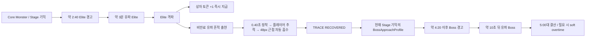

# Notion migration snapshot — 🗺️ 03 · UI · 생존 Flow Map

- Source page: https://app.notion.com/p/3c01b237eb1c81a2b859c8155c90ca75?pvs=204
- Fetched: 2026-08-28 KST
- Scope: current Notion structural/work-product snapshot; temporary signed Notion file URLs are redacted.
- Authority: migration archive only. Follow the repository canon mapped in `../MIGRATION_MANIFEST.md`.

---

Here is the result of "fetch" for the Page with URL https://app.notion.com/p/3c01b237eb1c81a2b859c8155c90ca75 as of 2026-08-27T14:34:06.768Z:
<page url="https://app.notion.com/p/3c01b237eb1c81a2b859c8155c90ca75" icon="🗺️">
<ancestor-path>
<parent-page url="https://app.notion.com/p/3c51b237eb1c8197853bed40c7c7dfb6" title="04 · Visual · UX · Assets"/>
<ancestor-2-page url="https://app.notion.com/p/3c41b237eb1c81aaa4e0e208ba4fb15e" title="닌자 서바이벌 · Home"/>
<ancestor-3-page url="https://app.notion.com/p/3c01b237eb1c814193aec528c4f3c40c" title="00 · 프로젝트 허브"/>
</ancestor-path>
<properties>
{"title":"03 · UI · 생존 Flow Map"}
</properties>
<content>
## 2026-08-27 · Current Screen Surface Coverage
현재 구현 기준의 화면 흐름은 **직접 Main 실행 → 유파 선택 → 천술류 전장(HUD/도움말) → Elite·흔적·Boss → 결과 → Persistent Workbench(임시 경로/Fate) → 다음 경로 미리보기 또는 Game Over 재시작**입니다.
- 전체 화면 구성 참조와 런타임 컴포넌트/승인 원본은 별도입니다. 동적 카드·버튼·도움말은 Godot UI와 텍스트가 실제 소비처이며 PNG 요구가 아닙니다.
- 현 수직 슬라이스에 없는 타이틀·저장·설정·로딩/복구·최종 엔딩 화면은 구현 완료로 취급하지 않습니다. 각 화면의 적용 여부와 후속 조건은 [GitHub 화면·시각 커버리지 정본](https://github.com/alsdmlals4-eng/ninja-survival-godot/blob/977158acce4dd7cd27eb82d9ae3699673f4e1029/docs/visual/SCREEN_SURFACE_AND_VISUAL_COVERAGE.md)에 기록합니다.
- 이번 감사는 이미지 생성·수정·승격 또는 Godot 코드 변경을 하지 않았습니다. 화면 캡처/읽기성·입력·Human 경험 검증은 **NOT_RUN / 보류**이며 자동화 통과와 구분합니다.
<callout icon="🗺️" color="green_bg">
	**NINJA_SURVIVAL · Flow Map** · 장비/가방, 생존 전투, 조합, 보상·성장 흐름을 봅니다.

```mermaid
flowchart LR
    A["무너진 공동 지부 / 시작 유파 선택"] --> RP1["Stage 1 위험·보상 Route Preview"]
    RP1 --> C1["미방문 유파 선택 / 명시 출격 확인"]
    C1 --> S1["유파 전장 / Core Monster·기믹"] --> E1["약 3분 유파 Elite"]
    E1 --> T1["상자 토큰 +1 / 비만료 흔적 출현"] --> P1["추적 이동 / 근접 자동 흡수"]
    P1 --> A1["BossApproachProfile / 약 4분대 경고"] --> B1["해당 유파 Boss"]
    B1 --> R1["RESULT / Boss Reward"] --> W1["공동 지부 / 흔적 안정화 / Persistent Workbench"]
    W1 --> RP2["Stage 2 미방문 유파 Preview / provisional 선택"]
    RP2 --> F2["백팩 재조정 / Fate가 route와 함께 commit"]
    F2 --> C2["선택 유파 Stage 2"]
    C2 --> S2["유파 전장"] --> E2["유파 Elite"] --> T2["토큰 +1 / 흔적"] --> P2["자동 흡수 / Boss 접근"] --> B2["유파 Boss"] --> R2["RESULT / Boss Reward"] --> W2["지부 / 안정화 / Workbench"]
    W2 --> RP3["Stage 3 미방문 유파 Preview / provisional 선택"] --> F3["백팩 재조정 / Fate commit"] --> C3["선택 유파 Stage 3"]
    C3 --> S3["유파 전장"] --> E3["유파 Elite"] --> T3["토큰 +1 / 흔적"] --> P3["자동 흡수 / Boss 접근"] --> B3["유파 Boss"] --> R3["RESULT / Boss Reward"] --> W3["지부 / 안정화 / Workbench"]
    W3 --> RP4["마지막 유파 자동 provisional / Stage 4 위험 공개"] --> F4["백팩 재조정 / Fate commit"] --> C4["마지막 유파 Stage 4"]
    C4 --> S4["유파 전장"] --> E4["유파 Elite"] --> T4["토큰 +1 / 4번째 흔적"] --> P4["자동 흡수 / Boss 접근"] --> B4["4번째 유파 Boss · 약 20분"]
    B4 --> FR["RESULT / Boss Reward"] --> FW["4흔적 결속 / 최종 결속 Workbench / 네 번째 Fate"]
    FW --> FB["난세 재앙핵 · 별도 Run 최종 Boss"] --> H["이번 전선 평정 / 최종 결과 / 닌자소울 / 전설"]
    S1 -->|"전투불능"| X["후퇴 / Run 종료 / 지부 재정비"]
    S2 -->|"전투불능"| X
    S3 -->|"전투불능"| X
    S4 -->|"전투불능"| X
    FB -->|"전투불능"| X
    X --> A
```

</callout>

> `VISUAL_MAP_DERIVED` · DEC-014\~025 최신 보정. **다음 유파는 매 휴식마다 미방문 유파 중 자유 선택**합니다. 유파는 전장·흔적·전용 Monster/Elite/Boss/기믹의 정체성을 결정하고, `Stage 1→4` 번호가 적 HP·피해·spawn/패턴 압박과 **유파 기믹 단계**를 결정합니다. Stage가 뒤일수록 `기본 문법 → 상호작용 → 연계 → 숙련형 기믹`으로 깊어지며, Stage 4에서도 동시 고급 기믹은 기본 2개까지로 제한합니다. 흔적은 Boss 격파 후 해당 유파의 전승 접근권을 열지만 직접 전투 modifier를 주지 않습니다. 네 흔적은 마지막 휴식에서 결속되어 Final Boss 진입과 4유파 동맹 지원 준비를 확정하며, 실제 최종 전투력은 기존 아이템의 백팩 배치·인접·조합으로 완성합니다. 이후 상대하는 `난세 재앙핵`은 **4유파 내분과 금기술 충돌로 봉인·요맥이 무너져 요기가 과포화되고, 왜곡된 4유파 전승 잔향이 응집해 생긴 발생형 재앙**입니다.
<database url="https://app.notion.com/p/3c01b237eb1c8164b9d3de5d4b65b0df" inline="true" data-source-url="collection://4c49f406-67a2-4524-97b9-f8f1aa730f16"></database>
## DEC-019\~025 · 전승 접근 / 경로 선택 / 최종 결속 Flow

```mermaid
flowchart LR
    A["유파 Boss 격파"] --> R["RESULT / 강제 Boss Reward"]
    R --> T["지부 귀환 / 흔적 STABILIZED / 전승 package OPEN"]
    T --> W["Persistent Workbench"]
    W --> Q["미방문 유파 위험·보상 Preview"]
    Q --> S["pending next school provisional 선택"]
    S --> B["Shop / Chest / Backpack / Combination 재조정"]
    B --> F["Fate가 백팩 + 운명 + 다음 유파를 atomic commit"]
    F --> N["Final Preview / 다음 COMBAT"]
    N --> C["4유파 순회 완료"]
    C --> FW["4흔적 결속 / 최종 결속 Workbench"]
    FW --> FB["난세 재앙핵"]
    FB --> A1["평정 순서대로 4유파 동맹 콜백 · 각 1회"]
    A1 --> P["플레이어 백팩 빌드가 최종 평정"]
```

> 흔적은 자동 유파 버프가 아니라 **선택지를 여는 전승 접근권**입니다. 경로 후보는 Workbench 안에서 먼저 비교하고 Fate 전까지 변경할 수 있어, 플레이어가 다음 위험에 맞춰 백팩을 다시 조정할 수 있습니다. Fate가 경로와 빌드를 함께 확정하며, 최종전의 4유파 지원은 백팩 채용 여부와 분리된 세계 진행 보상입니다.
## DEC-2026-08-20-024 · Elite → 흔적 → 유파 Boss 전환

<callout icon="🌀" color="purple_bg">
	흔적은 상자 토큰과 다른 **필수 진행 오브젝트**입니다. 시간 만료하지 않고 플레이어에게 접근해 별도 버튼 없이 흡수됩니다. 회수 전에는 신규 일반 적 spawn을 멈춰 무한 파밍을 막고, 전투 시계는 계속 흐릅니다.
</callout>
- Elite 사망 시 상자 토큰은 즉시 지급하고 흔적은 별도 전장 오브젝트로 시간차를 두어 보여줍니다.
- 흔적은 `AVAILABLE → RECOVERED → STABILIZED` 세 상태를 가집니다.
- `RECOVERED`는 Boss 접근만 열며 즉시 전투 버프나 전승 아이템 접근권을 제공하지 않습니다.
- Boss 격파 후 공동 지부 귀환 시 `STABILIZED`가 되어 해당 유파 signature access package를 엽니다.
- Boss는 `Elite 격파 + 흔적 회수 + earliest time + 경고 완료`를 모두 만족해야 등장합니다.
- 4:20 이후 늦게 흔적을 회수하면 즉시 Boss 경고를 시작하며, 5:00은 hard fail이 아닙니다.
- `TRACE_AVAILABLE` 동안 새 spawn은 중지하지만 기존 적과 위험 영역은 유지합니다. 회수 후에는 현재 Stage에서 이미 배운 기믹만 Boss 예고형으로 재조합합니다.
- 흔적은 기존 RewardOrb의 5초 lifetime, ORB/STYLE 증가, GOLD 처리와 분리합니다.
- HUD에는 `TRACE AVAILABLE / TRACE RECOVERED / BOSS APPROACHING / OVERTIME · TRACE` 같은 실제 milestone을 표시합니다.
## DEC-2026-08-20-025 · 다음 유파 위험·보상 Preview

<callout icon="🧭" color="blue_bg">
	**선택 시점:** 첫 전장은 시작 유파 선택 뒤 별도 확인으로 확정합니다. 이후 경로는 Workbench 안에서 임시 선택·변경하고, Fate가 백팩·운명·다음 유파를 함께 commit합니다.
</callout>
### 카드가 항상 보여줄 정보
- 유파 이름·문양과 전투 철학 한 줄.
- 현재 Stage에서 추가되는 `기본 / 상호작용 / 연계 / 숙련` 기믹.
- Elite/Boss의 핵심 위험 한 줄.
- Boss 평정 직후 3택에서 보장되는 해당 유파 전승 후보.
- 지부 안정화 뒤 열리는 대표 전승 3종.
- 현재 백팩 tag·기존 조합 재료와의 실제 연결 이유.
- 이번 선택이 Final Boss에서 몇 번째 유파 지원이 되는지.
### 공개하지 않는 정보
- 정확한 적 HP·피해 multiplier, spawn 시각표, 공격 cooldown.
- Shop/Chest/Boss Reward의 실제 다음 결과.
- 예상 DPS·승률·TTK 또는 AI `추천도` 점수.
### Route History
`1 흑영 ✓ → 2 봉마 ✓ → 3 [선택 중] → 4 ?`처럼 평정 순서를 남겨 최종전 유파 지원 순서와 연결합니다.
### 입력·반응형
- Windows: 후보 수에 따라 4/3/2/1 card grid + focus detail panel.
- Android: 1-card pager, 명시 이전/다음 버튼, 고정 confirm. swipe만으로 진행하지 않습니다.
- Mouse·keyboard/gamepad·touch 모두 같은 정보와 완료 경로를 가집니다.
- 유파·위험·완료 상태는 색 외에 이름·문양·outline·상태 text를 병행합니다.
### Stage 4
마지막 유파 1개는 자동 provisional select하지만 카드와 Stage 4 추가 기믹은 자동 확장해 보여줍니다. 별도 선택 클릭은 생략하고 Fate가 최종 commit합니다.
### Boss Reward 접근 시점 보정
Boss Reward는 흔적 안정화 전이므로, 강제 Boss Reward 1회에만 방금 격파한 유파 package의 후보를 만들 수 있는 provisional access를 사용합니다. 공동 지부 귀환 후 흔적이 STABILIZED되어야 이후 Shop/Chest pool에 정식 OPEN합니다.
</content>
</page>
