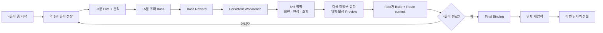
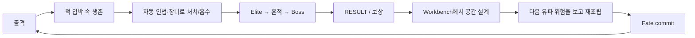
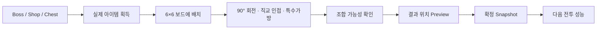
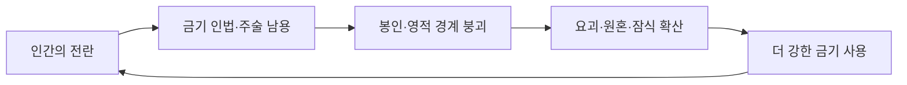

# Notion migration snapshot — 🥷 닌자 서바이벌 · Home

- Source page: https://app.notion.com/p/3c41b237eb1c81aaa4e0e208ba4fb15e?pvs=204
- Fetched: 2026-08-28 KST
- Scope: current Notion structural/work-product snapshot; temporary signed Notion file URLs are redacted.
- Authority: this is a migration archive, not the active product authority. Follow the repository canon mapped in `../MIGRATION_MANIFEST.md`.

---
Here is the result of "fetch" for the Page with URL https://app.notion.com/p/3c41b237eb1c81aaa4e0e208ba4fb15e as of 2026-08-28T12:46:39.826Z:
<page url="https://app.notion.com/p/3c41b237eb1c81aaa4e0e208ba4fb15e" icon="🥷">
<ancestor-path>
<parent-page url="https://app.notion.com/p/3c01b237eb1c814193aec528c4f3c40c" title="00 · 프로젝트 허브"/>
</ancestor-path>
<properties>
{"title":"닌자 서바이벌 · Home"}
</properties>
<content>
> **현재 결정 · DEC-033 (2026-08-28)** — GOLD는 Run 안에서 쓰고, 닌자소울은 Run 종료 Result에서만 받습니다. 일반 몬스터는 권장 20%로 1G, Elite는 5G, 학교 Boss는 10G와 소울 집계 자격을 줍니다. Elite는 닌자소울을 주지 않습니다. 서로 다른 학교 Boss마다 2소울, 보스 진척 랭크(C/B/A/S)에 따라 0/1/2/4소울을 합산합니다. 한 번의 같은-학교 재도전은 보유 닌자소울 1을 쓰며, 성공 Workbench checkpoint가 필요합니다. 구현·Human 검증은 아직 진행 전입니다.
<callout icon="🔄" color="gray_bg">
	**FRESH-READ BOOTSTRAP** · 새 채팅은 과거 대화를 전제로 하지 않습니다. 이 Home과 **해당 프로젝트 GitHub current truth**를 함께 fresh-read하여 `project identity → current goal → current quality/stage → protected scope → next safe action → evidence ceiling`을 재구성합니다. GitHub↔Notion 불일치가 있으면 mutation 전에 `CONTEXT_DRIFT_RECHECK_REQUIRED`. Notion은 사람용 현재 그림, GitHub/실제 runtime은 구조화·구현 사실을 소유합니다.
</callout>
<callout icon="🖼️" color="yellow_bg">
	**CURRENT VISUAL DELIVERY STATUS · Original-First Gate 적용** 
	이 프로젝트의 승인 Hybrid Visual 3종은 **방향/역할 승인은 유지되지만 현재 Notion 첨부본은 legacy low-resolution preview**입니다. 따라서 새 작업에서 이 preview를 원본이나 최종 전달 완료로 취급하지 않습니다. 실제 사용·수정·handoff 전에는 **canonical source/version fresh-read → pixel dimensions·file size·Hash 확인 → canonical original bytes를 Notion File Upload/create-attachment로 업로드 → 반환된 file-upload를 그대로 attach → destination Notion-owned readback** 순서로 승격해야 합니다. 원본 승격 전 상태는 `LEGACY_PREVIEW_NEEDS_ORIGINAL`; 저해상도 이미지는 `DISPLAY_PREVIEW_ONLY`입니다.
</callout>
<callout icon="🥷" color="blue_bg">
	**닌자의 신 · Project Living GDD + Visual Dashboard**
	이 Home 하나만 읽어도 **무슨 게임인지 / 플레이어가 무엇을 반복하는지 / 우리가 실제로 무엇을 만들어야 하는지 / 최종적으로 어떻게 보여야 하는지** 판단할 수 있어야 합니다.
</callout>
<callout icon="✅" color="green_bg">
	**최상위 Acceptance Criterion** · **Main Home만 보면 무엇을 만들 게임인지와 어떻게 만들 것인지 판단할 수 있고, AI/System Workspace를 보면 그것을 실제로 구현·검증하는 데 필요한 세부 데이터가 부족하지 않아야 합니다.**
</callout>
# 01 · PROJECT NORTH STAR
## 이 게임은 무엇인가
<table fit-page-width="true" header-row="true">
<tr>
<td>질문</td>
<td>닌자의 신의 답</td>
</tr>
<tr>
<td>**① 이 게임은 무엇인가?**</td>
<td>네 유파 전장을 평정하고 전승을 다시 이은 뒤, **6×6 백팩에 인법과 도구를 조립해 자기만의 닌자 방식을 완성하는 2D 서바이벌 로그라이크**입니다.</td>
</tr>
<tr>
<td>**② 플레이어는 무엇을 반복하는가?**</td>
<td>유파 전장 약 5분 → Elite/흔적 → Boss → 보상 → Persistent Workbench → 다음 유파/빌드/Fate 결정 → 다음 전장.</td>
</tr>
<tr>
<td>**③ 우리가 실제로 무엇을 만들어야 하는가?**</td>
<td>자동전투의 즉시 피드백, 서로 다른 4유파 위험 처리 방식, 공간 백팩·조합, 읽기 쉬운 Route/Fate 선택, 그리고 이를 연결하는 release-near 한 유파 Slice.</td>
</tr>
<tr>
<td>**④ 최종적으로 어떻게 보여야 하는가?**</td>
<td>어두운 달빛의 닌자 판타지, 강한 실루엣, 먹·붓·한국어 캘리그래피, 검정/남색/적색/금색 기반에 유파별 accent가 분명한 화면.</td>
</tr>
</table>
## Visual GDD · 한 장으로 읽는 제품 구조

<callout icon="🧭" color="gray_bg">
	**Visual GDD 우선 규칙** · Home 최상단 시각자료는 장식용 Concept Art보다 **게임 구조·시스템·화면·플레이 방법을 설명하는 자료**를 우선합니다. 승인되지 않은 예시 이미지는 정본으로 승격하지 않습니다.
</callout>
## 현재 승인 시각자료 · Master DB Linked View
아래 Gallery는 별도 복사본이 아니라 `ASSET LIBRARY · Master`의 **Project=NINJA_SURVIVAL + Approved + APPROVED** 자료만 직접 보여줍니다.
<database url="https://app.notion.com/p/3c61b237eb1c81d18a4ff45d3bacaef3" inline="true" data-source-url="collection://4c49f406-67a2-4524-97b9-f8f1aa730f16"></database>
> 현재 Visual 방향은 **Hybrid Master Style**입니다. 인게임은 C 방향에 가까운 **dark painterly anime ninja fantasy**를 유지·강화하고, 타이틀·일러스트·전승·기획·로딩·마케팅은 **손그림 수묵/닌자 비전서 언어**를 사용합니다. 두 계열은 얼굴·복식·무기·유파 상징·먹 원·달·붓글씨·핵심 팔레트를 공유해 한 IP처럼 이어집니다. 승인 Hybrid Key Visual의 Notion native 미리보기는 Visual Bible에 첨부되어 있습니다.
# 02 · HOW THE GAME WORKS
## Core Gameplay Loop

**플레이어에게 남아야 할 감정:** `압박 → 해소 → 획득 → 고민 → 재조립 → 다음 전투 기대 → 내 빌드가 맞았다는 결과`.
## 5분 유파 전장
<table fit-page-width="true" header-row="true">
<tr>
<td>시점</td>
<td>플레이 의미</td>
</tr>
<tr>
<td>0:00\~0:30</td>
<td>선택 유파의 고유 위험 처리 방식이 즉시 읽혀야 함.</td>
</tr>
<tr>
<td>약 2:40\~3:00</td>
<td>Elite 경고와 유파 Elite. 해당 유파의 핵심 철학을 시험.</td>
</tr>
<tr>
<td>Elite 격파 후</td>
<td>상자 토큰 즉시 획득 + 비만료 유파 흔적 출현. 흔적은 직접 버프가 아니라 진행 열쇠.</td>
</tr>
<tr>
<td>약 4:20 이후</td>
<td>흔적 회수와 시간 Gate를 만족하면 Boss 경고.</td>
</tr>
<tr>
<td>약 5분대</td>
<td>유파 Boss 결산. 필요 시 soft overtime.</td>
</tr>
</table>
## 4유파 · 같은 공통 시스템, 다른 위험 처리법
<table fit-page-width="true" header-row="true">
<tr>
<td>유파</td>
<td>위험 처리 철학</td>
<td>플레이 감정</td>
<td>백팩에서 좋은 관계</td>
</tr>
<tr>
<td>**봉마류**</td>
<td>공간을 준비하고 식신·결계가 대신 싸우게 한다.</td>
<td>이동형 진지 · 안정 · 지속 장악</td>
<td>소환 + 설치/결계</td>
</tr>
<tr>
<td>**천술류**</td>
<td>상태를 만들고 순서대로 원소 반응을 일으킨다.</td>
<td>Setup → 반응 연쇄 · 전장 변환</td>
<td>서로 다른 원소·상태</td>
</tr>
<tr>
<td>**귀인류**</td>
<td>위험한 근접 체류를 유지하며 힘을 끌어낸다.</td>
<td>난전 · 압박 감수 · 돌파</td>
<td>근접 무기 + 생존/회복</td>
</tr>
<tr>
<td>**흑영류**</td>
<td>위험한 대상을 표식·우선순위·처형으로 먼저 제거한다.</td>
<td>선별 · 기습 · 위협 제거</td>
<td>투척/원거리 + 표식/독/처형</td>
</tr>
</table>
<callout icon="⚔️" color="orange_bg">
	유파마다 별도 게임을 4개 만들지 않습니다. **공통 자동전투 + 백팩 + Workbench + Fate 프레임을 공유**하고, 각 유파의 얕은 고유 앵커와 콘텐츠 관계로 체감을 다르게 만듭니다.
</callout>
## 백팩 / 조합 / Workbench

- Preview·버퍼·미확정 아이템은 전투력을 주지 않습니다.
- Shop / Chest / Backpack / Combination 순서를 강제하지 않습니다.
- 다음 유파는 Workbench 안에서 provisional 선택하고 Fate 전까지 바꿀 수 있습니다.
- 최종적으로 **Build + Fate + Route가 하나의 commit 경계**에서 확정되는 것이 승인 제품 방향입니다.
# 03 · HOW IT SHOULD LOOK
## 현재 확정 Visual North Star
- **분위기:** dark moonlit ninja fantasy · 난세의 밤 · 달빛 · 성곽/공동 지부의 깊은 암부.
- **캐릭터:** premium painterly anime illustration · 작아도 읽히는 강한 실루엣.
- **프레이밍:** 먹 번짐 · 붓 자국 · 원형 brush stroke · 한국어 brush-calligraphy.
- **기본 팔레트:** black / deep navy / charcoal + red + warm gold.
- **유파 accent:** 봉마 gold · 천술 elemental blue/orange · 귀인 red · 흑영 purple/black.
- **VFX:** 동세는 강하되 적·투사체·위험·획득물의 가독성을 삼키지 않음.
<callout icon="🎨" color="purple_bg">
	**Hybrid Visual Rule** · **Gameplay = C-leaning painterly anime**, **Presentation/Lore = hand-drawn ink codex**. 양피지·표·패널형 고밀도 인포그래픽은 Flow·비교·학습용 supporting visual로 유지하되, 실제 타이틀/키아트는 중앙 캐릭터·4유파·붓글씨가 먼저 읽히도록 단순화합니다. 인게임도 붓 결·먹 번짐·거친 가장자리를 절제해서 섞어 Presentation과의 이질감을 줄입니다.
</callout>
**상세 Visual:** <mention-page url="https://app.notion.com/p/3c01b237eb1c81169028c8c8c427e467"/> 
**상세 UI/Flow:** <mention-page url="https://app.notion.com/p/3c01b237eb1c81a2b859c8155c90ca75"/> 
**승인 Asset:** <mention-page url="https://app.notion.com/p/3c01b237eb1c81e69d5bc467b5ad2b1e"/>
# 04 · CORE GAME DATA
## 사람이 바로 봐야 하는 핵심 수치
<table fit-page-width="true" header-row="true">
<tr>
<td>영역</td>
<td>현재 확정값 / 경계</td>
<td>왜 중요한가</td>
</tr>
<tr>
<td>Run</td>
<td>4유파 전장을 각각 정확히 1회 + 별도 최종전</td>
<td>유파 순서 선택과 최종 결속이 한 판의 정체성.</td>
</tr>
<tr>
<td>전투 시간</td>
<td>4번째 유파 Boss까지 active combat 약 20분 목표</td>
<td>Final Binding/최종 Boss는 별도 시간.</td>
</tr>
<tr>
<td>유파 전장</td>
<td>Elite 약 3분 / Boss 약 5분</td>
<td>짧은 압박과 결산 cadence.</td>
</tr>
<tr>
<td>백팩</td>
<td>전체 6×6 / 시작 4×3 / 아이템·가방 90° 회전</td>
<td>보유량보다 공간 설계가 빌드가 됨.</td>
</tr>
<tr>
<td>시너지</td>
<td>직교 인접 / 특수 가방 1셀 이상 overlap</td>
<td>어디에 놓는지가 실제 성능을 바꿈.</td>
</tr>
<tr>
<td>REST 버퍼</td>
<td>6 slots</td>
<td>정리 편의는 주되 전투 전에는 반드시 정리.</td>
</tr>
<tr>
<td>현재 item 범위</td>
<td>기본 획득 19종 / 1차 조합 결과 3종 / 구매 가방 5종</td>
<td>DEC-029에 따라 첫 Human validation 전에는 네 유파의 shared lifecycle을 완결한다. 단, 공통 primitive/Workbench/route를 재사용하고 content를 유파별 독립 시스템으로 증식하지 않는다.</td>
</tr>
<tr>
<td>Shop</td>
<td>base item 3 + purchasable bag 1 / reroll 5→10→15→15…</td>
<td>짧은 REST에서 읽을 수 있는 선택량 유지.</td>
</tr>
<tr>
<td>Chest</td>
<td>token 1 → item 2</td>
<td>Elite 보상이 Workbench 판단으로 연결.</td>
</tr>
<tr>
<td>Boss Reward</td>
<td>3개 중 1개 선택 · 최소 1개는 해당 유파와 직접 연관</td>
<td>이번 유파 학습을 다음 빌드로 연결.</td>
</tr>
<tr>
<td>유파 콘텐츠 목표</td>
<td>각 Core Monster ×3 / Elite ×1 / Boss ×1 + bounded gimmick library</td>
<td>4개 독립 게임으로 분열하지 않는 제작 상한.</td>
</tr>
<tr>
<td>고급 기믹</td>
<td>Stage 4에서도 동시 기본 cap 2</td>
<td>숙련도는 높이되 인지 부하는 제한.</td>
</tr>
</table>
## 사람용 Master Data Linked View
아래 표는 `CORE SYSTEM · Master`에서 **Project=NINJA_SURVIVAL + Status=CONFIRMED** 레코드만 보여주며, 내부 ID/SHA/Source Path 대신 `Player Meaning / Values / Rule` 중심으로 노출합니다.
<database url="https://app.notion.com/p/3c61b237eb1c819eb85cc9bb01335273" inline="true" data-source-url="collection://b0b4e81d-2400-43f2-b02b-88f1d3c1cb79"></database>
# 05 · CONTENT & DESIGN
## 세계관 · 왜 「닌자의 신」인가
<callout icon="🌙" color="purple_bg">
	**전설은 출생이 아니라 결과입니다.** 플레이어는 예정된 구원자가 아니라 무너진 4유파 공동 전선 지부에 남은 미완성 닌자이며, 네 전승을 다시 잇고 자기 방식으로 난세를 평정한 결과 후대가 「닌자의 신」이라 부를 전설이 됩니다.
</callout>

- 흔적은 자동 공격력 버프가 아니라 **전승 접근권을 여는 진행 열쇠**입니다.
- 4흔적은 Final Binding을 열지만, 최종 전투력은 플레이어가 만든 백팩 빌드가 소유합니다.
- `난세 재앙핵`은 4유파 내분·금기술 충돌로 봉인과 요맥이 무너진 결과 생긴 **발생형 재앙**입니다.
- 공동 지부 복구는 기지건설/경영 코어가 아니라 기록실·수련장·공방·비전고 등 **수평 해금을 읽게 하는 표현 레이어**입니다.
**세계/스토리 상세:** <mention-page url="https://app.notion.com/p/3c11b237eb1c8142acf0db0a7fe0a463"/>
# 06 · DEVELOPMENT REALITY
## 2026-08-28 · 현재 검증 범위
- **사용자 승인 DEC-029/030/031:** 첫 Human/Player validation은 천술류 한 유파가 아니라, 봉마·천술·귀인·흑영의 shared lifecycle과 실제 unvisited-school route/Workbench commit이 모두 구현·machine 검증된 뒤 시작합니다. 첫 검증의 종점은 네 번째 Boss Result/Reward가 `final_binding_eligible`을 알리는 지점입니다.
- 이 범위는 공통 자동전투·공용 pattern primitive·Backpack·Workbench·Fate를 재사용합니다. 4개의 독립 게임이나 유파별 독립 UI/경제를 만들지 않습니다.
- 기본 사망은 Run 전체 종료입니다. 다만 성공 Workbench checkpoint가 있으면 영구 `닌자소울` 1을 지불해 한 Run에 한 번만 같은 학교를 `0:00`부터 재도전할 수 있습니다. failed-school의 임시 GOLD·보상·Trace·진행은 잃고, 이미 확정된 Backpack/Fate/route/clear order 및 Boss 소울 집계 자격은 정산 중복 없이 복구합니다. 새 token·자동 부활은 만들지 않습니다.
- **DEC-032:** 첫 30초에 강제 안내를 넣지 않습니다. 원하면 현재 선택 유파의 `기능 도움말`에서 위험 처리 방식, 볼 정보, 이동/위치 시도, 성공 신호와 다음 목표를 더 자세히 읽습니다. 이 선택형 설명은 무보조 첫인상 검증을 대체하지 않습니다.
- Final Binding Workbench 전용 화면·난세 재앙핵 Boss·전설 결말 구현은 이번 네 유파 lifecycle 범위에 자동 포함되지 않습니다. 가짜 엔딩이나 축소된 마지막 Boss로 대체하지 않으며, 최종 결전은 별도 package입니다.
- Human Usability / Player Experience / device evidence는 여전히 **NOT_RUN**입니다.
## 사람이 알아야 할 현재 단계
<table fit-page-width="true" header-row="true">
<tr>
<td>영역</td>
<td>현재 상태</td>
</tr>
<tr>
<td>MVP-0\~3 기반</td>
<td>통합된 rollback/regression baseline.</td>
</tr>
<tr>
<td>T01\~T16</td>
<td>백팩·조합·전투 modifier·route·encounter·전승 접근/reward, Atomic Workbench/Fate/Route, Persistent Workbench UI, 천술 lifecycle, 유파 기능 도움말의 \<strong\>machine scope\</strong\>까지 통합.</td>
</tr>
<tr>
<td>현재 제품 Gate</td>
<td>**DEC-029/030/031/032 네 유파 shared lifecycle·default Run-end + GOLD 1회 same-school retry·선택형 확장 유파 도움말 구현·machine evidence → fourth-Boss Final Binding eligibility까지 User vertical-slice validation** · Human/Player evidence는 NOT_RUN.</td>
</tr>
<tr>
<td>Persistent Workbench 실제 UI/input</td>
<td>route/Fate preview와 readiness presentation은 machine scope에 있으나, Boss reward 선택·6×6 배치/회전·가방·조합 입력은 아직 현재 runtime에 없습니다. Human 이해·조작·피로도도 NOT_RUN입니다.</td>
</tr>
<tr>
<td>천술 release-near Slice</td>
<td>lifecycle / Boss-clear Workbench machine path 통합. live-render·Human Usability·Player Experience는 NOT_RUN.</td>
</tr>
<tr>
<td>Human Usability / Player Experience</td>
<td>NOT_RUN.</td>
</tr>
<tr>
<td>Device / Android export</td>
<td>NOT_RUN.</td>
</tr>
</table>
> 자동 테스트가 통과했다는 사실은 “재미있다 / 잘 읽힌다 / 모바일에서 쓸 수 있다”는 증거가 아닙니다. 실제 플레이·입력·가독성·기기 검증은 별도 Gate입니다.
### 다음 Human Slice에서 답해야 할 질문
- 첫 30초에 선택 유파가 다른 위험 처리 방식으로 읽히는가?
- Core → Elite → 흔적 → Boss의 긴장 곡선이 공정한가?
- 흔적을 왜 먹어야 하는지 이해되는가?
- 백팩을 바꾼 이유가 다음 전투 기대와 연결되는가?
- Workbench가 정리 피로보다 “다음 전투를 설계한다”는 기대를 주는가?
- 한국어와 mouse / keyboard-gamepad / touch 경로가 실제 화면에서 완결되는가?
**상세 구현/검증 증거:** <mention-page url="https://app.notion.com/p/3c01b237eb1c81b4a3f5ec575f3c77b5"/>
# 07 · DETAIL LIBRARY & AI WORKSPACE
## 상세 정본으로 이동
- **방향·기획:** <mention-page url="https://app.notion.com/p/3c51b237eb1c8105b7bada42ab387b2a">01 · Direction · Planning</mention-page>
- **전투·유파·백팩:** <mention-page url="https://app.notion.com/p/3c51b237eb1c81a1b20bcd43555aacc3">02 · Combat · Schools · Backpack</mention-page>
- **세계·스토리·콘텐츠:** <mention-page url="https://app.notion.com/p/3c51b237eb1c81b789fbecca44caf95e">03 · World · Story · Content</mention-page>
- **Visual·UX·Assets:** <mention-page url="https://app.notion.com/p/3c51b237eb1c8197853bed40c7c7dfb6">04 · Visual · UX · Assets</mention-page>
- **Production·Validation:** <mention-page url="https://app.notion.com/p/3c51b237eb1c81118160eccc16740ff8">05 · Production · Validation</mention-page>
- **Reference·Benchmark:** <mention-page url="https://app.notion.com/p/3c51b237eb1c818baeedc379f4ee5f7f">06 · Reference · Benchmark</mention-page>
## AI/System Workspace 경계
<callout icon="🤖" color="gray_bg">
	**사람용 Home ≠ AI 작업 로그.** schema / field ID / internal ID / source mapping / assumption / evidence / validation / test / PR / issue / implementation status / handoff / provenance / unresolved conflict는 Project Registry/System과 Production/GitHub에 충분히 보존합니다. 반대로 사람이 판단해야 하는 유파·시스템·경제·콘텐츠·Visual 데이터는 Home에서 숨기지 않습니다.
</callout>
**AI/System Record:** <mention-page url="https://app.notion.com/p/3c01b237eb1c814c892ddd3d07bfef54"/>
## 내가 기획을 수정하는 방법
1. **게임 의미나 규칙을 바꾸는 수정**은 해당 Detail Canon / Master DB owner에서 먼저 변경합니다.
2. Home의 표·Linked View는 그 정본을 사람이 읽기 쉽게 보여주는 projection으로 유지합니다.
3. 동일 데이터를 Home용으로 복사해 별도 관리하지 않습니다.
4. 새로운 시스템 결정을 요구하지 않는 정보 구조·배치 문제는 바로 교정할 수 있습니다.
5. 새로운 게임 규칙·수치·아트 방향 결정이 필요하면 기존 내용을 임의 확정하지 않고 별도 결정 대상으로 분리합니다.

운영·증거 원본은 어디에 있나

	- Project Registry/System: repository identity, sync, tool/runtime binding, AI 작업 메타데이터.
	- Production · Handoff: exact implementation/CI/PR/evidence receipt.
	- GitHub: Markdown/JSON/code/Scene/Resource/Test/runtime truth.
	- Home은 이 운영 정보를 복사하는 두 번째 정본이 아니라 **사람이 게임과 제작 방향을 판단하는 Living GDD projection**입니다.

<page url="https://app.notion.com/p/3c51b237eb1c8105b7bada42ab387b2a">01 · Direction · Planning</page>
<page url="https://app.notion.com/p/3c51b237eb1c81a1b20bcd43555aacc3">02 · Combat · Schools · Backpack</page>
<page url="https://app.notion.com/p/3c51b237eb1c81b789fbecca44caf95e">03 · World · Story · Content</page>
<page url="https://app.notion.com/p/3c51b237eb1c8197853bed40c7c7dfb6">04 · Visual · UX · Assets</page>
<page url="https://app.notion.com/p/3c51b237eb1c81118160eccc16740ff8">05 · Production · Validation</page>
<page url="https://app.notion.com/p/3c51b237eb1c818baeedc379f4ee5f7f">06 · Reference · Benchmark</page>
</content>
</page>
