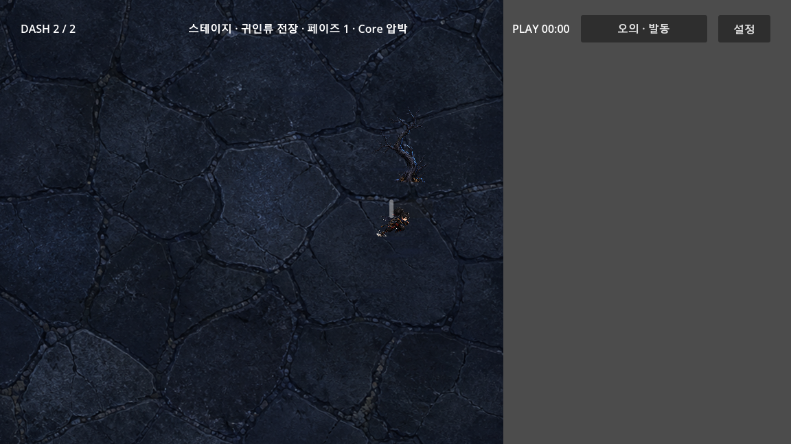

# Manual ultimate input — bounded implementation review

Date: 2026-09-10. Authority: approved A+B follow-up, current Decisions and dated
screen blueprint. Branch: `codex/replanning-art-motion-20260910`. Parent before
this package: `2b70c6955684c7279e667d526cd59314f42309d5`; fetched main:
`b5c2dd61cd589ebd218d1b4da3f016fb94a02126`. Main is not this package's delivery state.
Base observation unchanged at `2f93e872d9ed4fa18018ac759b01acd7d34e9b58`;
project-native adaptation and five-loop review floor retained.

## Before → after / scope

Existing school ultimates had no live main-input/HUD consumer. Now E, joypad Y,
and one top-bar button request the same runtime-owned ultimate. Ordinary katana,
shuriken and ninjutsu remain automatic. Runtime owns charge, targets, costs and
effects; HUD emits intent and renders ready/charging plus 1.4-second feedback.
Cheonsul charged-without-target preserves charge and reports target absence.
Noncombat, death, settings and visible selection/help block execution.

No damage/timing balance, save format, new resource owner/autoload, backpack,
Trace/Fate/route, enemy density, source image or historical PDF was changed.
The earlier new image remains a candidate, not LOCK/canon/runtime art.
Rollback is a revert of this input package; no persistent-data migration.

## Current research and feasibility

- ADAPT [Godot InputEvent routing](https://docs.godotengine.org/en/stable/tutorials/inputs/inputevent.html):
  a dedicated InputMap action and unhandled input let GUI consume input first.
- ADAPT [BaseButton](https://docs.godotengine.org/en/stable/classes/class_basebutton.html):
  one existing-style top control; no keyboard focus capture after clicking,
  because Space is already dash and also the engine's UI accept key.
- REJECT frame polling for this discrete request (repeat/modal risks); REJECT
  HUD-owned charge/targets (duplicate domain authority). Lower multi-skill tray
  remains rejected by the approved blueprint. No incremental paid dependency.
- Official engine archive checked; retain verified Godot
  `4.7.1.stable.official.a13da4feb`, GUT 9.7.1 matching project CI.
  Existing scenes/scripts provide all consumers; no additional raster art is
  necessary for this text/button input slice.

## Executed evidence

| Evidence | Result / ceiling |
|---|---|
| Existing HUD baseline | 10/10 tests, 97 assertions |
| Initial focused RED → GREEN | 8 tests: 6 failed before implementation → 8 passed |
| Focus regression | Forced button focus exposed dash/UI-accept conflict; focus disabled and click-path regression added |
| Real selection-path regression | Replaced helper's hidden selection canvas with real `_choose`; 6/11 failed, corrected modal owner query → 12/12 passed |
| Persisted InputMap regression | Device IDs 16/0 rejected by new config test; changed both to all devices (-1) |
| Final full GUT, production settings | 91 scripts, 618/618 tests, 6,830 assertions; 13.827s; no `SCRIPT ERROR:`, `ERROR:` or `WARNING:` in full log |
| Headless main-scene smoke | 120 frames, exit 0, engine banner only; temporary plugin settings removed |
| Live button | Editor 16784 / sole game 37720: semantic top-button click changed Guiin charge 100 → 0 and duration 0 → 5.9s |
| Live E key after persisted-device fix | Editor 14828 / sole game 39736: physical E event changed charge 100 → 0 and duration 0 → 5.933s |
| Actual viewport | 1152×648 capture below; Korean activation label readable, no lower ordinary skill tray |
| Live paused requests | NOT_VERIFIED: Hera v1.0 runtime inspector stopped processing with paused SceneTree. Automated pause/selection/help/death checks passed; these are not a live-input PASS |
| Human, physical gamepad/touch, balance, full redesign | NOT_RUN |

Live fixtures set health to 100000 and filled Guiin charge through its existing
setter. This proves input wiring, not natural charge pacing or balance. No
fixture values were persisted to game files or user saves. User data was isolated
under `NinjaSurvival-AB-QA-20260910` for runtime QA.

This is not a new-art mockup or visual-quality PASS. The right-side uncovered
floor is a valid follow-up finding; seamless floor and full-screen readiness
remain unverified. No screenshot repaint/crop hides this defect.

Durable [full GUT log](manual-ultimate-gut-20260910.log).
Capture SHA-256: `8c2ee71e596f4081e7bf75867ec9198ca0e03b0b6d24c2309963165c6c7d35c7`.

## Adversarial review lineage

Each pass rechecked the complete bounded package: user promise, owner boundaries,
code/input/UI, existing assets, tests/evidence, scope, rollback and delivery.

1. Source/acceptance attack: retained runtime cost/effect authority; found the
   button focus conflict and corrected it with a focused regression.
2. Actual-entry/runtime attack: found selection-canvas guard false positives
   and device-specific input mapping. Reproduced in RED tests, corrected,
   observed real E/button activation. No duplicated manual attack owner.
3. Full-regression/document attack: 618/618 final tests; reconciled current
   Decisions/Active Context/Blueprint/Roadmap/Handoff to branch reality. Kept
   paused-tool, floor, Human/device and new-art limits explicit.
4. Cleanup/export-boundary attack: removed temporary editor plugin/autoload,
   custom-user settings, override file and editor-only scene serialization.
   Smoke passed without those settings. Removed 94 task-generated sidecars
   and the two untracked verification addons after exact task processes stopped.
   `git diff HEAD -- assets exports scenes/main/main_scene.tscn` is empty.
5. Final changed-state/readback attack: local package rechecked against all
   acceptance criteria and protected files. Diff/static and full-regression
   evidence cover the code; runtime proof is bounded to E/button activation.
   No valid MUST_FIX remains for that bounded wiring package. Full-screen
   floor coverage, paused-tool QA, physical devices and Human remain open,
   not waived. Exact remote checks are a separate delivery gate below.

## Automation / lessons / next work

- Real-main fixtures must follow the actual selection path; hiding the whole
  canvas falsely proved input readiness. Added regression for open/closed help.
- Validate persisted InputMap device scope, not only direct handler calls.
- Tool lesson: Hera v1.0 docs differ from the newer installed skill. Its official
  [command reference](https://raw.githubusercontent.com/NotNull92/hera-agent-godot/v1.0.0/docs/COMMANDS.md)
  and addon source were read. It selects one fresh matching game, fails on
  ambiguity, and lacks explicit `--pid`; sole instance and isolated user data
  were verified. Never fall back to the concurrent other-project editor.
- `override.cfg` applied to runtime but not editor inspection paths; temporary
  matching project settings fixed discovery. Temporary tooling is not product.
- These are project-local regressions and Base promotion candidates only;
  no Base rules/version lock or shared installation was changed.
- Next safe work: exact-head CI/readback, floor coverage diagnosis and regression,
  then candidate art decision/state-family production. Do not call the full
  replanning cycle finished or infer candidate LOCK from generic continuation.

## Delivery

Independent read-only code review: Critical 0 / Important 0; ready for PR.
Minor test-hardening follow-ups: isolate the SceneTree pause guard from the
settings-panel guard, and isolate visible selection-panel rejection from other
noncombat conditions. Existing combined cases do not independently prove each
guard. Source includes both guards; no runtime behavior fix was requested.

PR/head/checks: PENDING. Unrelated open PRs #135 and #49 remain read-only.
No direct-main push, merge, force push or ruleset bypass.
