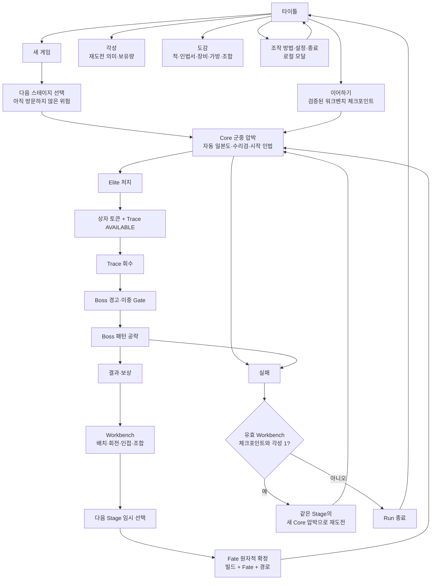
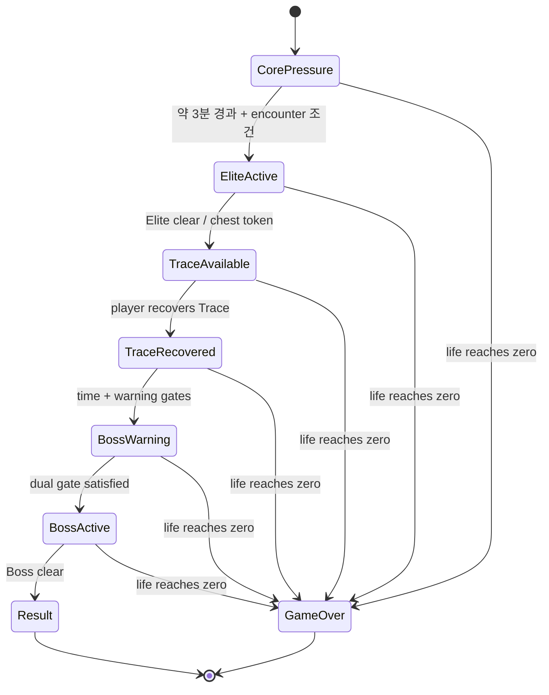

# 닌자의 신 — 화면 블루프린트·와이어프레임·플로우맵

```yaml
blueprint_id: NS-BLUEPRINT-001
status: CURRENT_BLUEPRINT_PREPRODUCTION
created_at: 2026-09-01 KST
baseline_main: afbba903d5fcf32b8ecc8082c59baecb01e895c5
scope: screen_flow_wireframe_consumer_linkage
package_kind: DOCUMENTATION_PREPRODUCTION_ONLY
new_image_binary: NOT_CREATED
reused_visual_reference: SCRREF-BATTLE-AUTOCOMBAT-03
runtime_render_evidence: NOT_RUN
human_play_evidence: NOT_RUN
device_export_evidence: NOT_RUN
```

## 1. 역할·정본 경계·읽는 순서

이 문서는 **플레이어가 어떤 화면에서 무엇을 보고, 무엇을 선택하며, 다음
화면으로 어떻게 넘어가는지**를 편집 가능한 text-native 형태로 보여 주는
블루프린트다. Mermaid 플로우와 고정폭 와이어프레임은 이후 Godot `Control`,
`CanvasLayer`, Scene, asset consumer, 테스트로 번역할 수 있는 설명 원본이며,
픽셀 이미지나 런타임 구현 사실을 대체하지 않는다.

이 문서는 다음을 소유하지 않는다.

- 게임 규칙, 수치, Economy, Route/Fate/Workbench transaction 권한
- 이미지 원본, SHA-256, provenance, approval 상태
- Godot Scene/Script의 실제 동작 또는 Runtime/Human/device 증거
- PR #135를 포함한 오픈 PR의 병합·재개·현재-main 구현 판정

| 읽는 목적 | 우선 정본 |
| --- | --- |
| 제품 의미·보호 범위 | [`CURRENT_CONFIRMED_DECISIONS.md`](../CURRENT_CONFIRMED_DECISIONS.md), [product canon](../canon/2026-08-21-dec014-025-product-canon.md), [encounter budget](../canon/2026-08-22-dec026-encounter-pattern-budget.md) |
| 조작 닌자·Stage/Phase·3×3 시작 가방 | [DEC-037](../canon/2026-08-30-dec037-player-control-stage-3x3-backpack.md) |
| 현재 재개 지점과 증거 한계 | [`ACTIVE_CONTEXT.md`](../ACTIVE_CONTEXT.md) |
| 화면 커버리지/실제 소비처 | [`SCREEN_SURFACE_AND_VISUAL_COVERAGE.md`](SCREEN_SURFACE_AND_VISUAL_COVERAGE.md) |
| 시각 방향·잠금 자산·후속 시각 게이트 | [`CURRENT_VISUAL_HANDOFF.md`](../CURRENT_VISUAL_HANDOFF.md) |
| 실제 행동 | `scenes/**`, `scripts/**`, `data/**`, `tests/**` |

### 현재 범위와 증거 한계

| 구분 | 이 블루프린트가 확정하는 것 | 이 블루프린트가 확정하지 않는 것 |
| --- | --- | --- |
| Flow | 화면의 목적, 상태 전이, 선택의 의미, Godot 소비처 연결 | 모든 전이가 현재 실행 중이라는 주장 |
| Wireframe | 정보 우선순위, 화면 안전 영역, input 피드백 목표 | 실제 해상도·폰트·터치 가독성 PASS |
| Visual input | 기존 잠금/승인 참조를 어디에 재사용하는지 | 새 자산의 생성·승인·runtime import |
| Combat read | 정상 HUD와 Elite/Trace/Boss 이벤트 HUD의 분리 | live telegraph fairness 또는 실제 성능 |

## 2. 플레이어 약속과 공개 용어

> 한 명의 닌자를 직접 움직여 거대한 침식 닌자·요괴 군중을 가르고, 자동으로
> 발동하는 일본도·수리검·인법의 조합과 작은 가방의 배치 선택으로 네 전장의
> 위험을 돌파한다.

### 화면이 보호해야 하는 네 가지

1. **자동은 무관여가 아니다.** 플레이어는 이동·군집 유도·무적 Dash·Boss
   전조 회피를 결정한다. 일본도, 수리검, 시작 인법은 자동으로 발동하되 서로
   다른 거리와 효과로 읽혀야 한다.
2. **군중은 계속 압박한다.** 화면에는 닌자와 바닥에 닿아 추적하는 다수의
   적이 있어야 한다. 일반 적이 초반부터 장판·부적을 쌓아 HUD와 전장을
   덮지 않는다.
3. **가방은 선택의 지형이다.** 시작의 실제 사용 가능 영역은 정확히 3×3이고
   확장 가능한 기술적 외곽은 6×6이다. 아직 사용할 수 없는 외곽은 처음부터
   내 가방처럼 보이지 않는다.
4. **Stage는 다음 위험, Phase는 그 안의 압박이다.** 플레이어는 다음
   스테이지를 고르고, 한 스테이지 안에서 페이즈 1–4의 압박 상승을 읽는다.

## 3. 전체 플레이어 여정



### Title에서 전투로 가는 길

| Title action | 플레이어에게 보이는 의미 | 결과/경계 |
| --- | --- | --- |
| 새 게임 | 새 Run과 다음 Stage 선택을 시작한다 | 기존 이어하기가 있으면 확인 후에만 삭제한다. Title이 Route/Save 권한을 갖지 않는다. |
| 이어하기 | 마지막으로 안전하게 확정한 Workbench 상태에서 다음 Stage를 재개한다 | mid-combat replay가 아니라, 검증된 checkpoint의 fresh Core-pressure 진입이다. |
| 각성 | 영구 재화와 제한된 재도전의 의미를 확인한다 | player copy는 `각성`; 기존 wallet 기술 식별자는 호환을 위해 별도 유지할 수 있다. |
| 도감 | 적/인법서/장비/가방/조합의 의미를 읽는다 | 정보 표면이며 Run journal, discovery gate, 별도 progression이 아니다. |
| 조작 방법·설정·종료 | 시작 전에 보조 행동을 수행한다 | 전부 Title 위의 local modal/intent이며 전투 상태를 직접 바꾸지 않는다. |

## 4. 전투 생명주기와 Gate



이 상태도는 현재 lifecycle owner와 의도된 화면 피드백의 관계를 설명한다.
문서에 적혔다고 새 Node, pattern, timer, Boss actor, input, Render가
구현되었다는 뜻은 아니다.

| 단계 | 플레이어 질문 | 화면이 답해야 할 것 | 소유 경계 |
| --- | --- | --- | --- |
| Core pressure | 어디를 지나가고 적을 어떻게 모을까? | 닌자 위치, 군중, 바닥 위 안전 경로, Dash 준비 여부 | Player/auto-combat/encounter owners |
| Elite | 무엇이 지금의 첫 시험인가? | Elite의 구분 실루엣과 pattern 전조 | encounter/lifecycle + runtime visual consumer |
| Trace | 왜 위험을 무릅쓰고 저기에 가야 하나? | 상자 토큰과 Trace는 일반 ORB/Gold와 다른 Boss 진입 진행 | lifecycle/route owners |
| Boss warning | 지금부터 무엇이 달라졌나? | Boss Gate가 열렸다는 짧고 명확한 경고 | lifecycle + HUD feedback |
| Boss | 어떤 전조를 피하고 어떤 위치를 잡을까? | 활성 pattern, 피해 가능 구역, Boss life/phase 정보 | Boss pattern owner + runtime VFX/HUD |
| Result/Workbench | 무엇을 얻었고, 다음 위험을 어떻게 준비할까? | reward source → placement → provisional route → Fate commit 순서 | Rest/Backpack/Route/Fate owners |

## 5. 참조·자산·증거의 기본 규칙

### 재사용할 전투 참조

`SCRREF-BATTLE-AUTOCOMBAT-03`은 이미 user `LOCK`된 planning reference다.
연속되는 달빛 석재 바닥, 드문 독립 소품, 유닛의 접지 그림자, 탑다운 SD
군중, 상단 중심 자동전투 HUD라는 정확한 역할을 이미 가진다. 이 블루프린트는
그 참조를 다시 설명 가능한 화면 계약으로 연결하며, 같은 역할의 새 HUD
이미지를 생성하지 않는다.

### 새 이미지가 필요한 경우의 단일 Gate

```text
실제 Godot 소비처 + existing locked/approved source가 못 채우는 visual gap 확인
→ 한 문단 brief
→ 이미지 모델로 candidate 1개 생성
→ user LOCK / REVISE / REJECT
→ LOCK 후에만 repository source + SHA-256/provenance + consumer/import evidence
```

현재 이 Blueprint package에서 `new_image_binary: NOT_CREATED`다. 이 문서는
새 image binary, provenance, runtime texture를 만들거나 바꾸지 않는다.

## 6. 다음 구현·검증 Gate

| 다음 작업 | 시작 조건 | 이 블루프린트가 제공하는 입력 | 아직 필요한 증거 |
| --- | --- | --- | --- |
| Stage/Phase와 3×3 가방 runtime migration | DEC-037 이행 범위 별도 승인 | 공개 용어·화면 상태·3×3 가시화 wireframe | data/save/resolver/UI/test/runtime evidence |
| Title/Continue/각성/도감 | 별도 현재-main package 승인 | title hierarchy, modal, dynamic text/UI boundary | exact branch/PR/head tests, runtime render/input |
| Battle HUD/telegraph implementation | 실제 HUD consumer 범위 승인 | top-only visibility matrix, event priority, forbidden clutter | Godot parse/smoke, live render/input, Human readability |
| New image asset | actual visual gap 확인 | brief placement, existing-source reuse decision | one candidate + user lock + provenance + import |
| Human vertical slice | exact playable candidate | questions for readability, Dash, Trace, Workbench, Korean copy | E6 human playtest; currently NOT_RUN |

## 7. 화면 와이어프레임

아래 wireframe은 해상도·폰트·수치의 확정값이 아니라 **정보의 우선순위와
입력의 목적**을 고정한다. 모든 수치, 버튼, 카드, 탭, 상태 문구는
`GODOT_UI` / `TEXT_LAYER`인 Godot `Control`이 렌더한다. 이미지에는 고정 배경·캐릭터·상징만 두며,
동적 메뉴를 PNG에 굽지 않는다.

### `BP-TITLE-01` — 타이틀·시작점

```text
16:9 full viewport
┌─────────────────────────────────────────────────────────────────────────────┐
│                                                                             │
│  [ 닌자의 신 WORDMARK ]   [ 4조각 유파 흔적 메달 ]                          │
│  ─────────────────────────────────                                          │
│  > 새 게임                                                                  │
│    이어하기                  ┌─────────────────────────────────────────┐  │
│    각성                      │ 달빛·먹선·성인 닌자 Key Art Backdrop     │  │
│    도감                      │ (왼쪽 메뉴 안전영역을 침범하지 않음)     │  │
│    조작 방법                 └─────────────────────────────────────────┘  │
│    설정                                                                    │
│    종료                                                                    │
│                                                                             │
│  [modal open 시]                                                           │
│                 ┌──────────────────────────────────────┐                  │
│                 │ 각성 / 도감 / 설정 / 확인 / 종료 확인 │                  │
│                 │  현재 action만 조작 가능              │                  │
│                 └──────────────────────────────────────┘                  │
└─────────────────────────────────────────────────────────────────────────────┘
```

| 플레이어 질문 | “새 Run을 시작할까, 안전한 기록으로 돌아갈까, 무엇을 더 알아볼까?” |
| --- | --- |
| 1차 행동 | 새 게임. valid checkpoint가 있으면 이어하기가 그 아래에 보인다. |
| 정보 우선순위 | wordmark → 작은 별도 메달 → 현재 포커스 action → 이어하기 상태 → Key Art. |
| keyboard/controller | 새 게임 기본 focus → 이어하기 → 각성 → 도감 → 조작 방법 → 설정 → 종료. Modal은 첫 안전 action으로 focus하고 닫으면 origin으로 복귀. |
| pointer/touch | action 전체가 누를 수 있는 Control이며 backdrop은 pointer를 가로채지 않는다. Modal backdrop만 뒤 입력을 막는다. |
| actual consumer | `PLANNED_CONSUMER`. PR #135의 `TitleScreen`/title assets은 read-only implementation reference이며 현재-main 구현 증거가 아니다. |
| evidence | `E0_CONTRACT` wireframe only. title runtime/input/Human evidence is `NOT_RUN`. |

### `BP-SCHOOL-SELECT-01` — 다음 위험 선택

```text
┌─────────────────────────────────────────────────────────────────────────────┐
│  다음 스테이지 선택                                      [? 위험 방식 설명] │
│  “같은 닌자, 다른 위험을 고른다”                                           │
│                                                                             │
│  ┌───────────────┐  ┌───────────────┐  ┌───────────────┐  ┌───────────────┐│
│  │ 봉마          │  │ 천술          │  │ 귀인          │  │ 흑영          ││
│  │ 결계·식신     │  │ 상태·반응     │  │ 위험한 근접   │  │ 위협 우선순위 ││
│  │ ○ 미방문      │  │ ○ 미방문      │  │ ○ 미방문      │  │ ○ 미방문      ││
│  │ [선택]        │  │ [선택]        │  │ [선택]        │  │ [선택]        ││
│  └───────────────┘  └───────────────┘  └───────────────┘  └───────────────┘│
│                                                                             │
│  선택 뒤: “다음 위험을 정했습니다. Fate 전까지 경로는 임시입니다.”          │
└─────────────────────────────────────────────────────────────────────────────┘
```

| 플레이어 질문 | “다음 전장에서 어떤 판단을 시험할까?” |
| --- | --- |
| 1차 행동 | 네 개의 위험 방식 중 하나를 선택하고, 필요할 때 도움말을 연다. |
| 정보 우선순위 | 스테이지 위험 철학 → 미방문/방문 상태 → 현재 focus/선택 → 도움말. |
| 금지 표현 | 네 주인공·네 코스튬 선택처럼 보이는 portrait grid, 색만 다른 원소 선택, Fate 확정처럼 보이는 irreversible copy. |
| keyboard/controller | 카드 4개를 좌우로 이동하고 help dialog를 닫으면 원래 카드로 focus 복귀. |
| pointer/touch | 카드 전체와 help affordance가 독립 hit target. |
| actual consumer | `Main/SchoolSelectionUI`; four school buttons/help dialog are actual current surface. |
| evidence | selection/help machine contracts exist; target-resolution visual/focus/touch/gamepad evidence is `NOT_RUN`. |

### `BP-BATTLE-HUD-01` — 군중과 위치를 먼저 읽는 전투

```text
┌─────────────────────────────────────────────────────────────────────────────┐
│ [생명 ████████░░] [DASH ● ● ○]                02:37       [Ⅱ] [설정]      │
│ ── event band는 평상시 비어 있음 ────────────────────────────────────────── │
│                                                                             │
│               침식 닌자·요괴 군중      ───────→  추적 방향                │
│                     ● ● ● ● ● ● ●                                             │
│          작은 전조/피격 effect      ● ● ● ● ●                                │
│                                                                             │
│                         [ 고정 닌자 ]                                        │
│                       └─ 짧은 접지 그림자                                   │
│                                                                             │
│     자동 일본도(근접 호)  /  수리검(원거리 투사체)  /  시작 인법(effect)    │
│                                                                             │
│   연속 달빛 바닥 — 화면 밖으로 이어짐; 등잔·고목·돌은 드문 독립 소품         │
│                                                                             │
│                              [ 하단 스킬바 없음 ]                           │
└─────────────────────────────────────────────────────────────────────────────┘
```

| 플레이어 질문 | “지금 어디로 빠지고, 어떤 군집을 남겨 두며, 언제 Dash를 쓸까?” |
| --- | --- |
| 1차 행동 | 이동. Dash는 포위선 이탈과 패턴 통과를 위한 무적 회피다. 공격은 자동. |
| 정보 우선순위 | 내 위치/접지 → 가까운 군중·위험 영역 → Dash 준비 → 자동 공격 결과 → event-only HUD. |
| 정상 상단 HUD | 생명, Dash 충전 횟수, 경과 시간, 일시정지/설정. |
| 자동공격 가독성 | 일본도는 가까운 호/절단, 수리검은 원거리 투사체, 시작 인법은 유파별 별도 effect로 분리한다. 공격 버튼·스킬 cooldown tray는 두지 않는다. |
| 일반 Core 위험 | 다수 추적과 contact pressure가 기본. opening에서 부적·장판·원거리 투사체가 누적되어 전장을 덮지 않는다. |
| enemy HP | 기본 숨김. 방금 피해를 받은 한 target만 짧게 표시할 수 있으며 persistent bar grid는 금지한다. |
| actual consumer | `Main`, `Main/HUD`, Player/Enemy/Projectile/Field runtime actors. |
| evidence | current scenes/assets consumer proof와 planning reference는 존재한다. exact live render, crowd performance, Dash feel, telegraph readability는 `NOT_RUN`. |

### `BP-TRACE-GATE-01` — Elite → Trace → Boss의 의미

```text
normal combat HUD
┌─────────────────────────────────────────────────────────────────────────────┐
│ [Elite 등장]                         event cue, 전투를 가리지 않는 짧은 띠 │
│                                                                             │
│ Elite clear → [상자 토큰] + [Trace AVAILABLE]                              │
│                     │                                                       │
│                     └── 전장 위 Trace로 이동해 회수                         │
│                                                                             │
│ [Trace 회수] → [Boss 경고] → [Boss 등장]                                    │
│                                                                             │
│ Boss active: [Boss 이름 · 생명] + 현재 전조 구역만 화면 위에 표시           │
└─────────────────────────────────────────────────────────────────────────────┘
```

| 플레이어 질문 | “왜 Trace로 가야 하며, 언제 Boss 준비가 끝났다고 알 수 있나?” |
| --- | --- |
| 1차 행동 | Elite 처치 후 일반 보상과 다른 Trace를 직접 회수하고 Boss 경고에 대비한다. |
| 정보 우선순위 | Elite/Trace 진행 → Boss warning → 현재 active telegraph → Boss life. |
| 피드백 원칙 | Trace는 ORB/STYLE/GOLD나 즉시 전투력 보상으로 보이지 않는다. Boss warning은 일반 Core effect와 다른 색·형태·타이밍을 가진다. |
| pattern 경계 | Core one ranged type은 승인된 introduction 이후에만 readable pressure를 가진다. Elite/Boss만 반복적으로 전조형 장판·투사체·유파 특색 패턴을 사용한다. |
| actual consumer | `Main` encounter lifecycle, Boss/Elite HUD feedback, Result transition. |
| evidence | lifecycle/domain machine evidence와 intent가 존재한다. live Boss pattern, VFX, difficulty, Human comprehension은 `NOT_RUN`. |

### `BP-RESULT-01` — 얻은 것과 다음 행동

```text
┌─────────────────────────────────────────────────────────────────────────────┐
│                              스테이지 결과                                  │
│                                                                             │
│  [Boss/보상 source]         [선택/획득 보상]         [다음: Workbench]      │
│                                                                             │
│  “보상은 아직 빌드가 아니다. 배치와 Fate 확정 뒤에만 전투력과 경로가 된다.” │
│                                                                             │
│                              [Workbench로]                                 │
└─────────────────────────────────────────────────────────────────────────────┘
```

| 플레이어 질문 | “방금 무엇을 얻었고, 지금 바로 무엇을 결정해야 하나?” |
| --- | --- |
| 1차 행동 | 획득/후보의 출처와 의미를 확인한 뒤 Workbench로 이동한다. |
| 정보 우선순위 | Boss/상자/상점 등 보상 source → 보상 정체 → Workbench handoff. |
| 피드백 원칙 | 획득과 배치·Fate 확정을 분리한다. preview item은 0 combat power라는 보호 규칙을 가린다거나 뒤집지 않는다. |
| keyboard/controller | primary action first focus, 뒤로 가기/닫기 시 안전한 이전 상태. |
| pointer/touch | 보상 card/action은 Godot Control; item text/image에 별도 baked UI가 필요하지 않다. |
| actual consumer | `RestFlowUI/ResultView`. |
| evidence | result/route machine surface exists; reward selection/placement의 완전 UX와 Human comprehension은 `NOT_RUN`. |

### `BP-WORKBENCH-01` — 3×3에서 6×6까지 만드는 빌드

```text
┌─────────────────────────────────────────────────────────────────────────────┐
│ Workbench                                                                   │
│                                                                             │
│  보상 후보 / 보유 아이템             가방 보드 (기술적 외곽 6×6)            │
│  ┌──────────────┐                  ┌───┬───┬───┬───┬───┬───┐               │
│  │ item / bag   │                  │░░ │░░ │░░ │░░ │░░ │░░ │               │
│  │ source/lane  │                  ├───┼───┼───┼───┼───┼───┤               │
│  └──────────────┘                  │░░ │[ ][ ][ ]│░░ │░░ │               │
│  [회전] [배치 취소]                 │░░ │[ ][ ][ ]│░░ │░░ │               │
│                                     │░░ │[ ][ ][ ]│░░ │░░ │               │
│  REST buffer (6 slots)              │░░ │░░ │░░ │░░ │░░ │               │
│  [1][2][3][4][5][6]                 └───┴───┴───┴───┴───┴───┘               │
│                                                                             │
│  인접/조합 preview      다음 스테이지 (임시)      Fate (임시) [확정]       │
│  “확정 전 preview는 전투력 0 / 확정은 모두 함께 commit”                    │
└─────────────────────────────────────────────────────────────────────────────┘
```

| 플레이어 질문 | “작은 공간에서 지금 강해질까, 다음 조합을 위해 자리를 남길까?” |
| --- | --- |
| 1차 행동 | 보상/가방을 골라 배치·90도 회전·인접/조합 preview를 보고, 다음 Stage/Fate를 임시로 정한다. |
| 정보 우선순위 | 3×3 실제 사용 가능 영역 → 새 가방으로 열린 영역 → 현재 보상/배치 legality → 조합 preview → 임시 Stage/Fate → 확정 가능 여부. |
| 공간 규칙 | 직교 인접, special-bag one-cell-or-more overlap, six REST slots, explicit combination을 보여 주되 legality/economy/route/Fate 권한은 UI가 소유하지 않는다. |
| commit 경계 | final backpack snapshot + pending Fate + provisional next Stage는 existing all-or-none commit. disabled reason은 명확한 text로 표시한다. |
| keyboard/controller | item/bag focus → board cell focus → rotate/place/cancel → REST → route → Fate → commit. |
| pointer/touch | drag/tap/rotate 대안이 필요하지만 현재 touch/gamepad visual proof는 `NOT_RUN`. |
| actual consumer | `RestFlowUI/WorkbenchView`, `BackpackState`, resolver/session, Route/Fate owners. |
| evidence | atomic domain/machine scope exists. exact 3×3 runtime migration, touch/gamepad usability, placement UX, Human decision value는 `NOT_RUN`. |

## 8. HUD 가시성 계약

| 전투 상태 | 계속 보이는 것 | 이벤트 때만 보이는 것 | 금지/배제 |
| --- | --- | --- | --- |
| Core opening | 생명, Dash charges, 경과 시간, 일시정지/설정 | 첫 위험이 필요할 때의 짧은 introduction cue | 하단 스킬바, 지속 enemy HP 행, 광범위한 stage 설명 패널, 다중 장판/부적 난사 |
| Crowd pressure | 같은 네 anchor, 닌자 위치와 가까운 적 | 방금 피격한 target의 짧은 HP, 짧은 reward/build feedback | 고정 status 문단, 모든 적 HP, 자동공격을 가리는 레이블 |
| Elite / Trace | 같은 네 anchor | Elite marker, chest token, Trace AVAILABLE/회수 feedback | Trace를 즉시 power/Gold처럼 보이게 하는 피드백 |
| Boss warning / Boss | 같은 네 anchor | Boss warning, Boss life, 활성 pattern의 전조 영역/방향 | Core projectile field를 Boss 전조처럼 재사용, 동시에 읽기 어려운 고급 기믹 3개 이상 |

### 상단 HUD의 설계 판정

- `ADOPT`: 이동 판단을 중심에 두고, 자동 공격은 world effect로 읽히게 한다.
- `ADAPT`: Boss information은 필요한 순간에만 상단 event band로 확장한다.
- `REJECT`: bottom skill tray(하단 skill button row), 지속적인 모든 enemy HP, opening에서의 규칙 과밀,
  generic effect를 Boss 전조로 쓰는 방식.

## 9. 화면별 입력·피드백 최소 계약

| Screen | keyboard/controller | pointer/touch | focus/feedback | evidence ceiling |
| --- | --- | --- | --- | --- |
| `BP-TITLE-01` | vertical menu, modal focus trap/restore | button hit target, modal backdrop block | selected/disabled/confirm states | planned / `NOT_RUN` runtime |
| `BP-SCHOOL-SELECT-01` | four-card move + help restore | card/help tap | selected vs provisional clarity | partial machine / visual `NOT_RUN` |
| `BP-BATTLE-HUD-01` | movement + Dash + pause/settings | movement/Dash equivalent requires later validation | Dash charge, hit-only HP, event cue | runtime composition `NOT_RUN` |
| `BP-TRACE-GATE-01` | battle path unchanged | battle path unchanged | Elite/Trace/Boss state change | lifecycle machine / live read `NOT_RUN` |
| `BP-RESULT-01` | primary action then safe back | Control card/action | source-to-Workbench handoff | machine surface / Human `NOT_RUN` |
| `BP-WORKBENCH-01` | item → board → REST → route → Fate → commit | drag/tap/rotate path required | legal/illegal/preview/pending/commit states | domain machine / input UX `NOT_RUN` |
