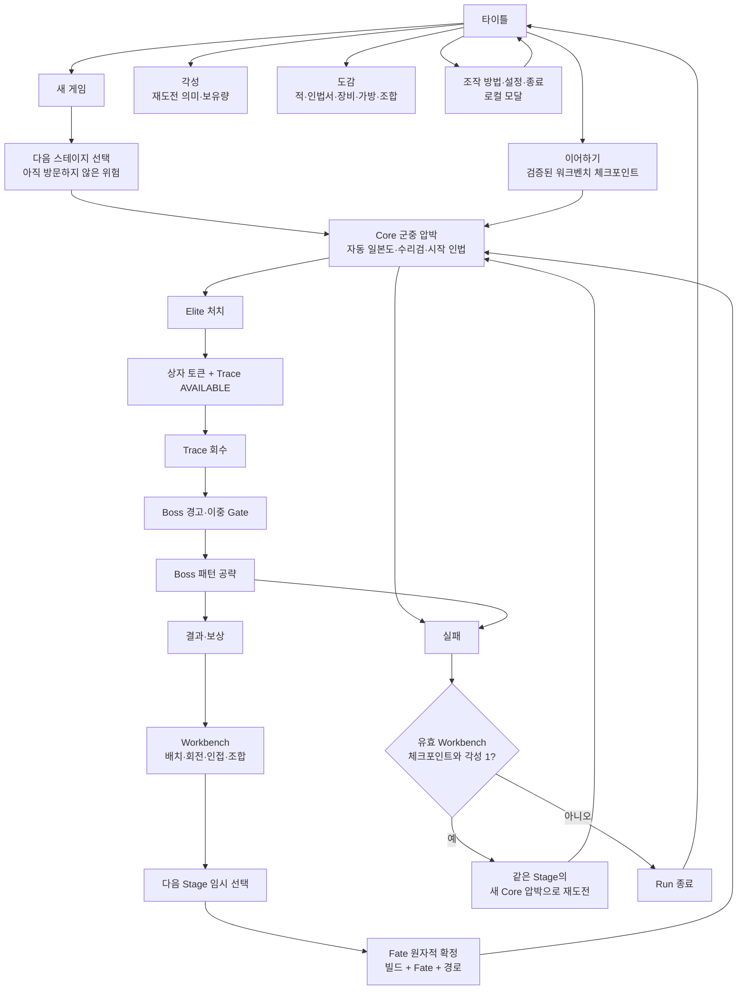
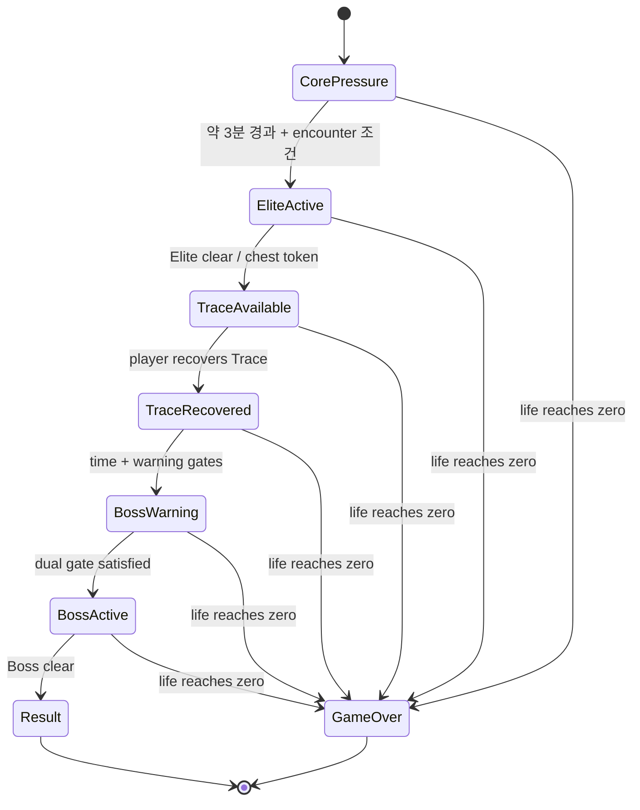

# 닌자의 신 — 화면 블루프린트·와이어프레임·플로우맵

```yaml
blueprint_id: NS-BLUEPRINT-001
status: CURRENT_BLUEPRINT_PREPRODUCTION
created_at: 2026-09-01 KST
baseline_main: afbba903d5fcf32b8ecc8082c59baecb01e895c5
scope: screen_flow_wireframe_consumer_linkage
package_kind: DOCUMENTATION_PREPRODUCTION_ONLY
new_image_binary: NOT_CREATED
reused_visual_reference: SCRREF-BATTLE-AUTOCOMBAT-03
runtime_render_evidence: NOT_RUN
human_play_evidence: NOT_RUN
device_export_evidence: NOT_RUN
```

## 1. 역할·정본 경계·읽는 순서

이 문서는 **플레이어가 어떤 화면에서 무엇을 보고, 무엇을 선택하며, 다음
화면으로 어떻게 넘어가는지**를 편집 가능한 text-native 형태로 보여 주는
블루프린트다. Mermaid 플로우와 고정폭 와이어프레임은 이후 Godot `Control`,
`CanvasLayer`, Scene, asset consumer, 테스트로 번역할 수 있는 설명 원본이며,
픽셀 이미지나 런타임 구현 사실을 대체하지 않는다.

이 문서는 다음을 소유하지 않는다.

- 게임 규칙, 수치, Economy, Route/Fate/Workbench transaction 권한
- 이미지 원본, SHA-256, provenance, approval 상태
- Godot Scene/Script의 실제 동작 또는 Runtime/Human/device 증거
- PR #135를 포함한 오픈 PR의 병합·재개·현재-main 구현 판정

| 읽는 목적 | 우선 정본 |
| --- | --- |
| 제품 의미·보호 범위 | [`CURRENT_CONFIRMED_DECISIONS.md`](../CURRENT_CONFIRMED_DECISIONS.md), [product canon](../canon/2026-08-21-dec014-025-product-canon.md), [encounter budget](../canon/2026-08-22-dec026-encounter-pattern-budget.md) |
| 조작 닌자·Stage/Phase·3×3 시작 가방 | [DEC-037](../canon/2026-08-30-dec037-player-control-stage-3x3-backpack.md) |
| 현재 재개 지점과 증거 한계 | [`ACTIVE_CONTEXT.md`](../ACTIVE_CONTEXT.md) |
| 화면 커버리지/실제 소비처 | [`SCREEN_SURFACE_AND_VISUAL_COVERAGE.md`](SCREEN_SURFACE_AND_VISUAL_COVERAGE.md) |
| 시각 방향·잠금 자산·후속 시각 게이트 | [`CURRENT_VISUAL_HANDOFF.md`](../CURRENT_VISUAL_HANDOFF.md) |
| 실제 행동 | `scenes/**`, `scripts/**`, `data/**`, `tests/**` |

### 현재 범위와 증거 한계

| 구분 | 이 블루프린트가 확정하는 것 | 이 블루프린트가 확정하지 않는 것 |
| --- | --- | --- |
| Flow | 화면의 목적, 상태 전이, 선택의 의미, Godot 소비처 연결 | 모든 전이가 현재 실행 중이라는 주장 |
| Wireframe | 정보 우선순위, 화면 안전 영역, input 피드백 목표 | 실제 해상도·폰트·터치 가독성 PASS |
| Visual input | 기존 잠금/승인 참조를 어디에 재사용하는지 | 새 자산의 생성·승인·runtime import |
| Combat read | 정상 HUD와 Elite/Trace/Boss 이벤트 HUD의 분리 | live telegraph fairness 또는 실제 성능 |

## 2. 플레이어 약속과 공개 용어

> 한 명의 닌자를 직접 움직여 거대한 침식 닌자·요괴 군중을 가르고, 자동으로
> 발동하는 일본도·수리검·인법의 조합과 작은 가방의 배치 선택으로 네 전장의
> 위험을 돌파한다.

### 화면이 보호해야 하는 네 가지

1. **자동은 무관여가 아니다.** 플레이어는 이동·군집 유도·무적 Dash·Boss
   전조 회피를 결정한다. 일본도, 수리검, 시작 인법은 자동으로 발동하되 서로
   다른 거리와 효과로 읽혀야 한다.
2. **군중은 계속 압박한다.** 화면에는 닌자와 바닥에 닿아 추적하는 다수의
   적이 있어야 한다. 일반 적이 초반부터 장판·부적을 쌓아 HUD와 전장을
   덮지 않는다.
3. **가방은 선택의 지형이다.** 시작의 실제 사용 가능 영역은 정확히 3×3이고
   확장 가능한 기술적 외곽은 6×6이다. 아직 사용할 수 없는 외곽은 처음부터
   내 가방처럼 보이지 않는다.
4. **Stage는 다음 위험, Phase는 그 안의 압박이다.** 플레이어는 다음
   스테이지를 고르고, 한 스테이지 안에서 페이즈 1–4의 압박 상승을 읽는다.

## 3. 전체 플레이어 여정



### Title에서 전투로 가는 길

| Title action | 플레이어에게 보이는 의미 | 결과/경계 |
| --- | --- | --- |
| 새 게임 | 새 Run과 다음 Stage 선택을 시작한다 | 기존 이어하기가 있으면 확인 후에만 삭제한다. Title이 Route/Save 권한을 갖지 않는다. |
| 이어하기 | 마지막으로 안전하게 확정한 Workbench 상태에서 다음 Stage를 재개한다 | mid-combat replay가 아니라, 검증된 checkpoint의 fresh Core-pressure 진입이다. |
| 각성 | 영구 재화와 제한된 재도전의 의미를 확인한다 | player copy는 `각성`; 기존 wallet 기술 식별자는 호환을 위해 별도 유지할 수 있다. |
| 도감 | 적/인법서/장비/가방/조합의 의미를 읽는다 | 정보 표면이며 Run journal, discovery gate, 별도 progression이 아니다. |
| 조작 방법·설정·종료 | 시작 전에 보조 행동을 수행한다 | 전부 Title 위의 local modal/intent이며 전투 상태를 직접 바꾸지 않는다. |

## 4. 전투 생명주기와 Gate



이 상태도는 현재 lifecycle owner와 의도된 화면 피드백의 관계를 설명한다.
문서에 적혔다고 새 Node, pattern, timer, Boss actor, input, Render가
구현되었다는 뜻은 아니다.

| 단계 | 플레이어 질문 | 화면이 답해야 할 것 | 소유 경계 |
| --- | --- | --- | --- |
| Core pressure | 어디를 지나가고 적을 어떻게 모을까? | 닌자 위치, 군중, 바닥 위 안전 경로, Dash 준비 여부 | Player/auto-combat/encounter owners |
| Elite | 무엇이 지금의 첫 시험인가? | Elite의 구분 실루엣과 pattern 전조 | encounter/lifecycle + runtime visual consumer |
| Trace | 왜 위험을 무릅쓰고 저기에 가야 하나? | 상자 토큰과 Trace는 일반 ORB/Gold와 다른 Boss 진입 진행 | lifecycle/route owners |
| Boss warning | 지금부터 무엇이 달라졌나? | Boss Gate가 열렸다는 짧고 명확한 경고 | lifecycle + HUD feedback |
| Boss | 어떤 전조를 피하고 어떤 위치를 잡을까? | 활성 pattern, 피해 가능 구역, Boss life/phase 정보 | Boss pattern owner + runtime VFX/HUD |
| Result/Workbench | 무엇을 얻었고, 다음 위험을 어떻게 준비할까? | reward source → placement → provisional route → Fate commit 순서 | Rest/Backpack/Route/Fate owners |

## 5. 참조·자산·증거의 기본 규칙

### 재사용할 전투 참조

`SCRREF-BATTLE-AUTOCOMBAT-03`은 이미 user `LOCK`된 planning reference다.
연속되는 달빛 석재 바닥, 드문 독립 소품, 유닛의 접지 그림자, 탑다운 SD
군중, 상단 중심 자동전투 HUD라는 정확한 역할을 이미 가진다. 이 블루프린트는
그 참조를 다시 설명 가능한 화면 계약으로 연결하며, 같은 역할의 새 HUD
이미지를 생성하지 않는다.

### 새 이미지가 필요한 경우의 단일 Gate

```text
실제 Godot 소비처 + existing locked/approved source가 못 채우는 visual gap 확인
→ 한 문단 brief
→ 이미지 모델로 candidate 1개 생성
→ user LOCK / REVISE / REJECT
→ LOCK 후에만 repository source + SHA-256/provenance + consumer/import evidence
```

현재 이 Blueprint package에서 `new_image_binary: NOT_CREATED`다. 이 문서는
새 image binary, provenance, runtime texture를 만들거나 바꾸지 않는다.

## 6. 다음 구현·검증 Gate

| 다음 작업 | 시작 조건 | 이 블루프린트가 제공하는 입력 | 아직 필요한 증거 |
| --- | --- | --- | --- |
| Stage/Phase와 3×3 가방 runtime migration | DEC-037 이행 범위 별도 승인 | 공개 용어·화면 상태·3×3 가시화 wireframe | data/save/resolver/UI/test/runtime evidence |
| Title/Continue/각성/도감 | 별도 현재-main package 승인 | title hierarchy, modal, dynamic text/UI boundary | exact branch/PR/head tests, runtime render/input |
| Battle HUD/telegraph implementation | 실제 HUD consumer 범위 승인 | top-only visibility matrix, event priority, forbidden clutter | Godot parse/smoke, live render/input, Human readability |
| New image asset | actual visual gap 확인 | brief placement, existing-source reuse decision | one candidate + user lock + provenance + import |
| Human vertical slice | exact playable candidate | questions for readability, Dash, Trace, Workbench, Korean copy | E6 human playtest; currently NOT_RUN |

