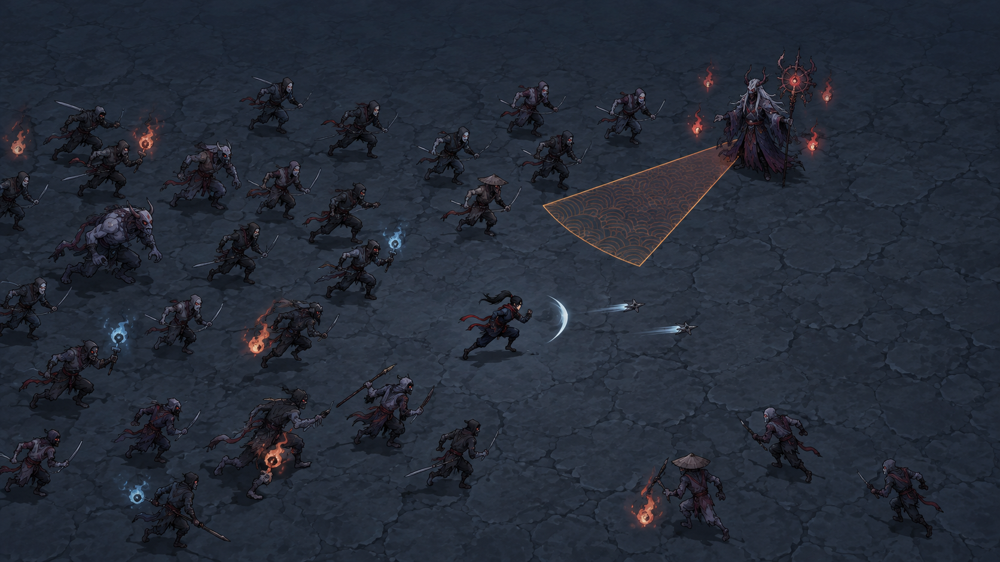
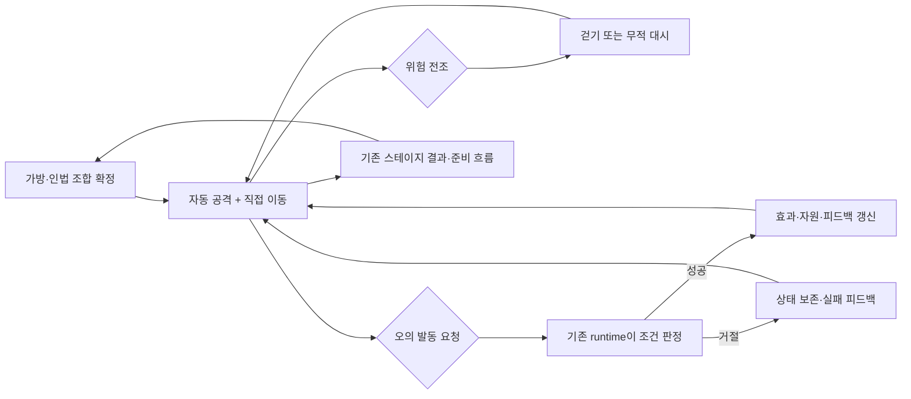
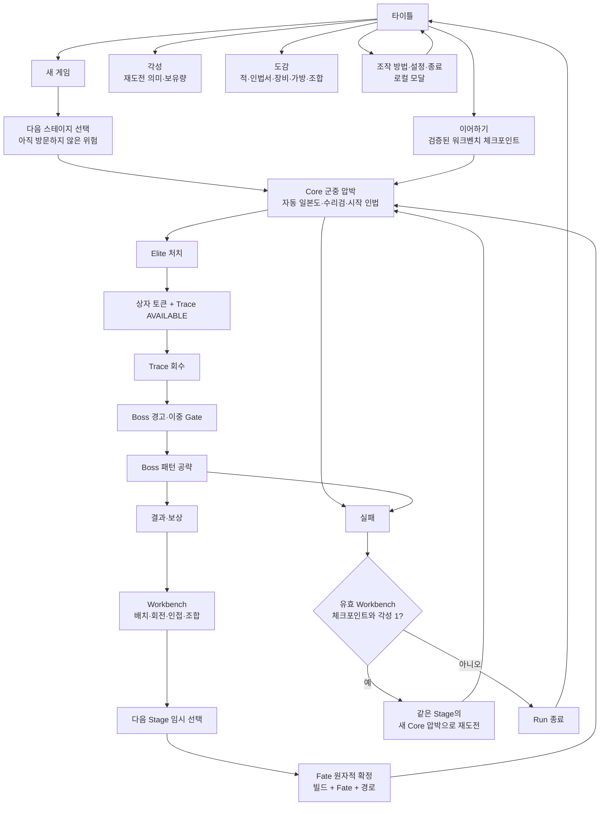
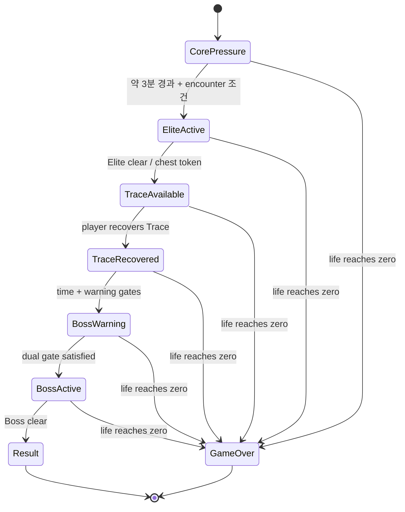
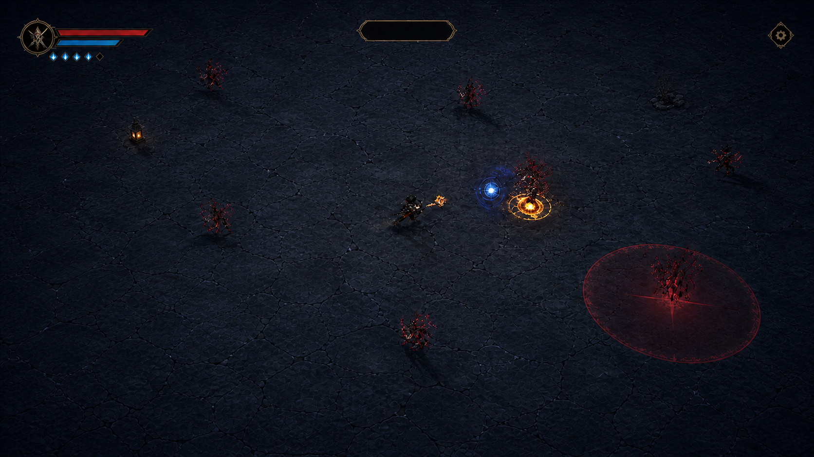

# 닌자의 신 — 화면 블루프린트·와이어프레임·플로우맵

## 2026-09-10 재기획 — A+B 대표 플레이·조작·모션

최신 상세 규칙: [NS-DESIGN-RULES](../design/NINJA_SURVIVAL_DETAILED_RULES.md).
사용자 위임으로 선택한 무기·인법·혼합·가방·전장·성장 설계의 단일 원본이며,
아래 기존 규칙 검증 장면과 다를 때 새 설계 의도는 그 문서를 따른다.
아래 그림은 그대로 보존한 후보다. 현재는 기획 검토 단계로 신규 이미지/구현을
진행하지 않으며, 새 규칙이 이 그림이나 런타임에 반영됐다고 해석하지 않는다.

**승인된 조작을 구체화한 설계 초안.** 아래 2026-09-02 아틀라스와 PDF는 보존된
이전 설계다. 새 주기의 조작은 [Decisions](../CURRENT_CONFIRMED_DECISIONS.md)가
소유한다. 이전 이미지의 LOCK은 새 이미지 승인으로 이어지지 않는다.
이 절은 새 화면의 설계이며 실행 화면이 아니다. 아래 이미지는 새로 만든 구성 후보로,
최종 승인 자산·게임 캡처·모션 완성본이 아니다.



[후보 원본·프롬프트·검토 기록](candidates/ab-gameplay-composition-v1.md).
상단의 동적 오의/대시/시간/설정은 아래 wireframe과 함께 읽는다. 시안에는 UI를 굽지 않았다.

### 한 문장으로 이해하는 게임

> 작은 가방에 무기와 인법의 조합을 준비하고, 자동으로 적을 베는 닌자를 직접
> 움직여 요괴 군중을 가르며, 무적 대시와 결정적인 오의 타이밍으로 강적을 돌파하는
> 공간 빌드형 액션 서바이버 로그라이트.

자동 공격은 손을 비워 준다. 그 손으로 **거리·방향·회피 시점·오의 시점**을 결정한다.
가방과 전투는 별개 미니게임이 아니라, 준비한 빌드를 어떤 위치에서 활용할지의 관계다.
다만 배치에 따라 실제 행동이 달라진다는 차별화는 아직 플레이 검증할 가설이다.
닌자·침식 닌자·요괴라는 소재는 이동과 회피, 인법의 방출에서 드러내며 새 세계관 사건을
이 설계만으로 추가하지 않는다.

| 구분 | 자동/직접 | 플레이어 판단 | 이번 변경 경계 |
|---|---|---|---|
| 일본도·수리검·획득 인법 | 자동 | 좋은 사거리와 군집 모양을 만든다 | 수동 공격·조준·평타 콤보 입력을 추가하지 않음 |
| 이동 | 직접 | 빈 통로, 적 접근 방향, 공격이 닿는 거리 | 기존 이동 owner 재사용 |
| 무적 대시 | 직접 | 걷기로 피할지, 충전을 쓸지 | 기존 무적 판정 유지; 새 대시 공격 미승인 |
| 패턴 공략 | 직접 판단 | 전조를 읽고 위험 밖으로 이동한다 | 패턴 공략은 별도 버튼이 아님 |
| 오의 | 직접 발동 요청 | 지금 사용하거나 다음 위협까지 보존한다 | 기존 유파 runtime의 효과·비용·실패 조건 유지 |
| 가방·조합 | 준비 단계 직접 | 공간, 인접, 조합과 다음 전투의 균형 | 확정 전 전투력 0 / 원자적 확정 유지 |

### 대표 상황 — 천술류를 이용한 기존 규칙 검증

1. **군중을 모은다.** 일본도·수리검·시작 인법은 자동으로 작동한다.
   플레이어는 접근하는 적 사이의 통로를 찾아 이동한다. 모든 방향이 벽처럼 닫힌
   배치를 기본으로 요구하지 않는다.
2. **전조에 대응한다.** 엘리트의 준비 동작과 위험 영역을 보고 걷기로 빠지거나
   무적 대시를 쓴다. 대시는 입력 성공·이동·무적·충전 소비가 서로 맞아야 한다.
3. **오의를 판단한다.** 천술류 기존 코드에서는 상태 반응이 충전 조건이며,
   상태가 있는 유효 적이 오의 대상이다. 군중에게 쓸지, 다가올 강적에 남길지를
   판단한다. 오의가 모든 탄을 지우거나 보스를 경직시킨다고 가정하지 않는다.
4. **헛입력을 이해한다.** 충전됐어도 대상이 없으면 기존 runtime은 실패를 반환하고
   충전을 보존한다. 화면도 성공 연출 대신 짧은 이유를 전달해야 한다.
5. **준비의 효과를 비교한다.** 다음 준비 단계에서 기존 인접/조합 효과를 바꾼 후
   같은 전투 과제를 비교한다. 공격 범위·속도·충전 등 실제 카탈로그에 있는 효과만
   사용하며, '대시하면 인법 발동' 같은 신규 효과를 임의로 추가하지 않는다.

이 대표 상황은 전체 스테이지를 짧게 재편하거나 기존 Elite/Trace/Boss 시간을
바꾸라는 뜻이 아니다. 테스트용 구간 진입과 실제 Run 시간은 분리한다.

### 전투 화면 초안 — 일반 스킬바 없이 수동 오의만

```text
┌──────────────────────────────────────────────────────────────┐
│ 대시 2/2       02:37       [오의 · 충전 중/준비]      [설정]   │
│              필요할 때만 엘리트·보스 이벤트 정보             │
│                                                              │
│       추적하는 요괴 군중          전조를 내는 엘리트           │
│              ↘ ↘                    [위험 방향]               │
│                    닌자 → 빈 통로                             │
│           짧은 검격 / 별도 수리검 / 인법 효과                  │
│                                                              │
│            연속 바닥 · 발밑 그림자 · 소품은 독립 배치          │
└──────────────────────────────────────────────────────────────┘
하단 일반 스킬 목록 없음. 수치·문구·버튼은 Godot UI로 표시.
위의 대시 수·시간은 배치 설명용 예시이며 밸런스 확정값이 아님.
```

| 표시 대안 | 판정 | 이유·트레이드오프 |
|---|---|---|
| 상단 오의 한 칸 | ADAPT / 권장 초안 | 기존 상단 HUD와 결합, 화면 중앙을 보존. 전장에서 눈을 옮겨야 하는 비용은 검증 필요 |
| 플레이어 주위 상시 충전 링 | TEST / 보류 | 시선 이동은 줄지만 그림자·전조·인법과 겹침. 색만 다른 링은 상태 식별에 부족 |
| 하단 다중 스킬바 | REJECT | 자동 인법을 수동처럼 오해시키고 기존 사용자 요구와 충돌 |

오의 상태는 `충전 중 → 준비 → 요청 → 성공 또는 거절`로 구분한다.
거절은 충전 부족·비전투/모달·유효 대상 없음 등을 정확한 owner 사실로 표시한다.
현재 작업 브랜치에는 기존 runtime의 `ultimate_block_reason()` 조회가 추가됐다.
충전 부족·대상 없음은 같은 상단 버튼에 짧게 표시하며 비전투·모달 중 요청은
실행하지 않는다. UI 자체가 충전을 계산하거나 자원을 차감하지 않는다.

키보드·패드 action 한 개와 화면 버튼은 같은 요청 경로를 사용한다.
현재 구현 키는 E / 패드 Y이며 상단 버튼도 같은 요청 경로를 사용한다.
자동 테스트와 실제 E/클릭 발동은 확인했으나 물리 패드·터치는 별도 검증 대상이다.
터치에서는 상단 상태를 유지하면서 엄지 도달성을 별도로 검증한다. 대시와 오의
동시 입력, 모달을 닫은 순간의 잔여 입력, 키 반복에 따른 연속 발동을 검사한다.
피격/생명 정보의 기존 화면 누락 여부는 별도 UX 검토 항목이며 현재 체력바가
표시된다고 주장하지 않는다.



### 모션과 이미지 제작 계약 — 조작을 가리지 않는다

| 대상 | 필요한 표현 상태 | 판정 owner와 표현의 경계 |
|---|---|---|
| 플레이어 | 대기·이동·대시·피격·사망, 오의 성공 피드백 | 위치/무적은 PlayerController. 기본 공격마다 전신 모션으로 이동을 끊지 않음 |
| 일본도·수리검 | 검격/발사·비행·명중·소멸 | BasicWeaponController와 투사체 owner가 판정. 프레임 재생이 두 번째 피해를 만들지 않음 |
| 인법·오의 | 조건부 준비·방출·종료, 실패 시 성공 효과 없음 | SchoolRuntimeHost → active runtime. 실제 성공 이후 VFX 동기화 |
| 일반 적 | 접근·피격·사망 | 지상 유닛은 발밑 접지점 일정; 떠 있는 요괴는 의도된 고도와 그림자 구분 |
| 엘리트·보스 | 준비·활성·회복·사망 | 전조와 피해 시점 일치. 크기만 키운 일반 적을 대체 디자인으로 간주하지 않음 |

다음 필요한 이미지 소비처는 이 블루프린트의 **대표 전투 구성 검토판**이다.
신규 후보 1장에 작은 닌자, 추적 요괴, 식별되는 엘리트 1체, 한 가지 전조와
빈 탈출 경로를 같은 광원·접지·카메라로 보여 준다. 기존 아트는 참고자료만 사용한다.
최종 그림체·유닛 비율은 이 후보에서 검토하며 키아트 확대판을 인게임 화면으로
대체하지 않는다. 현재 상태는 `GENERATED_CANDIDATE / USER_APPROVAL_PENDING`이다.
한 장을 생성·육안 검토했으며 추가 제작은 LOCK/REVISE/REJECT 이후 진행한다.
플레이어 명도 분리·바닥 질감·엘리트 비율은 실제 줌에서 재검토할 항목이다.

화면 구성 후보 자체는 Aseprite 편집 대상이 아니다. 승인된 캐릭터 방향을 실제
프레임으로 제작할 때 이미지 모델 원화를 쓰고, 동등 셀·발 pivot·상태 이름·프레임
시간을 Aseprite에서 관리/출력한다. 픽셀아트를 자동 선택하거나 정지 그림을
복제해서 걷기 완성이라고 하지 않는다. 프레임 수·방향 수·출력 크기는 실제 플레이
줌 비교 후 정한다. PNG/atlas JSON을 Godot 표현 노드에 연결하되 이동·피해 owner는
유지한다. 기존 runtime 이미지는 교체 승인과 검증 전까지 보존한다.

### 구현 가능성·다음 검증

| 실제 소비처 | 확인한 구현 | 다음 bounded 작업 / 증거 |
|---|---|---|
| `scripts/schools/school_runtime_host.gd` | `try_use_ultimate`, readiness/resource 신호 | 새 전역 charge owner 없이 요청 연결 |
| `scripts/schools/cheonsul_runtime.gd` | 충전 판정·상태 대상 필터·성공 때 초기화 | 대상 없음 실패와 자원 보존 회귀 테스트 |
| `scripts/core/main_controller.gd` | 일반 입력/포인터 이동/대시, 전투 허용 경계 | 오의 요청 경로 추가; 모달·결과·사망 때 차단 테스트 |
| `scripts/ui/hud.gd`, `scenes/ui/hud.tscn`, `project.godot` | 상단 한 오의 버튼과 E/Y 연결, readiness/거절 표시 | 실제 기기·터치 도달성과 전체 화면 품질 검증은 남음 |
| `scripts/player/player_visual_controller.gd` | 이동/피격 텍스처 교체 | 새 모션 전이와 표현-only 책임 검증; 현재 프레임 모션 완성 아님 |

첫 구현 패키지는 오의 연결과 실패 피드백에 한정한다. 밸런스·세이브 스키마·
Trace/Fate·스폰 상한·새 공격 규칙을 변경하지 않는다. 되돌림은 이 패키지 변경만
역커밋하며 기존 자산과 저장 기록은 건드리지 않는다. 새 의존성/유료 도구는 불필요하다.
이 패키지는 작업 브랜치에서 Godot 4.7.1로 구현·자동 테스트와 실제 E/버튼 발동을
확인했다. [검증 기록](../reviews/2026-09-10-manual-ultimate-review.md)을 기준으로
증거 범위를 읽는다. 전체 화면·모션·물리 기기 검증 완료를 뜻하지 않는다.

성공 검증 목표: 자동공격이 계속 작동하고, 오의 요청이 한 번만 처리되며,
거절 때 자원이 유지되고, 모달/비전투 입력이 새지 않는다. 실제 화면에서는
오의 준비와 거절을 구별하고 전조·닌자·탈출 경로가 묻히지 않아야 한다.
행동 검증은 같은 빌드/상황에서 오의 사용 이유·회피 경로를 관찰한 뒤 질문한다.
클리어율만으로 재미나 패턴 이해를 판정하지 않는다. Human/device/성능은 `NOT_RUN`.

### 이번 보강의 조사 근거와 한계

- [God Of Weapons 공식 제품 설명](https://store.steampowered.com/app/2342950/God_Of_Weapons/): 자동 공격·회피·인벤토리 배치가 함께 존재한다. ADAPT — 이 조합 자체를 독창성 근거로 쓰지 않고 우리 오의 판단과 빌드의 행동 차이를 검증한다.
- [Microsoft XAG 103](https://learn.microsoft.com/en-us/xbox/accessibility/xbox-accessibility-guidelines/103): 중요 정보는 복수 채널로 전달한다. ADAPT — 준비/거절을 색만으로 표현하지 않고 텍스트·형태와 필요 시 소리를 함께 검토한다. 접근성 PASS는 아님.
- [Godot 2D sprite animation](https://docs.godotengine.org/en/stable/tutorials/2d/2d_sprite_animation.html): AnimatedSprite2D 또는 Sprite2D+AnimationPlayer 경로를 비교할 수 있다. TEST — 현재 Sprite2D 표현 owner와 실제 프레임 요구를 확인한 뒤 선택하며 문서의 stable 엔진을 로컬 버전으로 간주하지 않는다.

조회일 2026-09-10. 기존 [15개 게임·SWOT 조사](../research/2026-09-10-full-product-reassessment.md)는
비교 근거로 유지한다. 이번 추가 조사는 공개 제품·공식 문서와 실제 소스 검토이며
직접 비교 게임 플레이나 신규 사용자 테스트의 증거는 아니다. 신규 이미지 생성은
별도 후보 기록이 증명하며, 생성 성공이 승인이나 runtime 검증을 의미하지 않는다.

---

## 보존된 2026-09-02 화면 아틀라스

아래의 current/LOCK/no-new-image 문구와 메타데이터는 당시 보강 패키지에만
해당한다. 새 주기에는 위 절과 최신 Decisions/Visual Handoff를 먼저 적용한다.

```yaml
blueprint_id: NS-BLUEPRINT-001
status: CURRENT_MAIN_RECONCILED_SCREEN_ATLAS
revision: 2
created_at: 2026-09-01 KST
reconciled_at: 2026-09-02 KST
baseline_main: 477ac7343bd655278d4f045d3152f6b7e4214062
scope: human_reader_route_screen_flow_wireframe_consumer_linkage
package_kind: DOCUMENTATION_CURRENT_MAIN_RECONCILIATION
new_image_binary: NOT_CREATED
reused_visual_references:
  - SCRREF-SCHOOL-SELECT-02
  - SCRREF-BATTLE-AUTOCOMBAT-03
  - SCRREF-WORKBENCH-02
  - SCRREF-RESULT-02
  - SCRREF-GAME-OVER-02
source_machine_evidence: CURRENT_MAIN_SCENE_SCRIPT_TEST_READBACK
runtime_render_evidence: NOT_RUN
human_play_evidence: NOT_RUN
device_export_evidence: NOT_RUN
```

## 1. 역할·정본 경계·읽는 순서

이 문서는 **플레이어가 어떤 화면에서 무엇을 보고, 무엇을 선택하며, 다음
화면으로 어떻게 넘어가는지**를 보여 주는 현재-main 기준 화면 아틀라스다.
Mermaid 플로우와 고정폭 와이어프레임은 Godot `Control`, `CanvasLayer`, Scene,
asset consumer, 테스트의 관계를 설명한다. 다만 pixel capture, 실제 runtime render,
Human/device 증거를 대신하지 않는다.

이 문서는 다음을 소유하지 않는다.

- 게임 규칙, 수치, Economy, Route/Fate/Workbench transaction 권한
- 이미지 원본, SHA-256, provenance, approval 상태
- Godot Scene/Script의 실제 동작 또는 Runtime/Human/device 증거
- PR #135를 포함한 오픈 PR의 병합·재개·현재-main 구현 판정

| 읽는 목적 | 우선 정본 |
| --- | --- |
| 제품 의미·보호 범위 | [`CURRENT_CONFIRMED_DECISIONS.md`](../CURRENT_CONFIRMED_DECISIONS.md), [product canon](../canon/2026-08-21-dec014-025-product-canon.md), [encounter budget](../canon/2026-08-22-dec026-encounter-pattern-budget.md) |
| 조작 닌자·Stage/Phase·3×3 시작 가방 | [DEC-037](../canon/2026-08-30-dec037-player-control-stage-3x3-backpack.md) |
| 현재 재개 지점과 증거 한계 | [`ACTIVE_CONTEXT.md`](../ACTIVE_CONTEXT.md) |
| 화면 커버리지/실제 소비처 | [`SCREEN_SURFACE_AND_VISUAL_COVERAGE.md`](SCREEN_SURFACE_AND_VISUAL_COVERAGE.md) |
| 시각 방향·잠금 자산·후속 시각 게이트 | [`CURRENT_VISUAL_HANDOFF.md`](../CURRENT_VISUAL_HANDOFF.md) |
| 사람용 전체 여정·핵심 재미·가방 선택·현재 wireframe/visual companion | [통합 Human Blueprint PDF](../../exports/NINJA_SURVIVAL_HUMAN_BLUEPRINT_INTEGRATED_20260902.pdf), [`NINJA_SURVIVAL_HUMAN_GDD.md`](../design/NINJA_SURVIVAL_HUMAN_GDD.md), [보존 28쪽 snapshot](../../exports/NINJA_SURVIVAL_HUMAN_GDD_20260830.pdf) |
| 실제 행동 | `scenes/**`, `scripts/**`, `data/**`, `tests/**` |

### 먼저 이렇게 읽는다 — 이전 Blueprint를 보존하는 열람 경로

이 문서는 28쪽 사람용 Blueprint/PDF를 대체하거나 줄이지 않는다. 기본 PDF 열람본은
기존 28쪽을 page object 그대로 보존한 [통합 Human Blueprint](../../exports/NINJA_SURVIVAL_HUMAN_BLUEPRINT_INTEGRATED_20260902.pdf)다. 이 문서의 editable
flow/wireframe과 잠금 화면·Title·봉마 Boss/식신 참조는 통합본의 보강부로 결합되며,
`NINJA_SURVIVAL_HUMAN_GDD.md`는 플레이어 판타지·장르·Stage 여정·무기와 인법·가방
성장·조합/Fate를 순서대로 읽는 **상세 독자용 원본**으로 남는다.

| 보고 싶은 것 | 먼저 볼 문서 | 이어서 확인할 것 | 현재 증거 경계 |
| --- | --- | --- | --- |
| 게임을 처음 이해하는 전체 흐름과 화면 보강 | [통합 Human Blueprint PDF](../../exports/NINJA_SURVIVAL_HUMAN_BLUEPRINT_INTEGRATED_20260902.pdf) | `NINJA_SURVIVAL_HUMAN_GDD.md`, [보존 28쪽 snapshot](../../exports/NINJA_SURVIVAL_HUMAN_GDD_20260830.pdf) | PDF/문서/설계 snapshot; human play PASS가 아님 |
| 한 화면의 우선순위와 전환 | 이 Screen Blueprint의 wireframe·flow | 아래 Visual Atlas와 `scenes/**` | current-main source/machine scope; live render 별도 |
| 실제 이미지 상태·승인·hash | `CURRENT_VISUAL_HANDOFF.md`와 asset manifest | `screen-references/README.md` | planning reference는 runtime texture가 아님 |

> **시간축 주의.** 통합본은 앞 3쪽과 끝 7쪽에서 current-main 화면 흐름·와이어프레임·잠금 image 소비처를 보강한다. 그 안의 28쪽 PDF는 당시의 사람용 검수 snapshot을 보존한다. 그 안의
> “다음 runtime migration” 문구는 이후 PR #139와 현재 `main`에 합쳐진 Title,
> Stage/Phase, 3×3 start의 구현 상태를 되돌리지 않는다. 현재 runtime 사실은 이
> 문서의 consumer 표와 실제 Scene/Script/Test가 소유한다.

### 현재 범위와 증거 한계

| 구분 | 이 블루프린트가 확정하는 것 | 이 블루프린트가 확정하지 않는 것 |
| --- | --- | --- |
| Flow | 화면의 목적, 상태 전이, 선택의 의미, Godot 소비처 연결 | 모든 전이가 현재 실행 중이라는 주장 |
| Wireframe | 정보 우선순위, 화면 안전 영역, input 피드백 목표 | 실제 해상도·폰트·터치 가독성 PASS |
| Visual input | 기존 잠금/승인 참조를 어디에 재사용하는지 | 새 자산의 생성·승인·runtime import |
| Combat read | 정상 HUD와 Elite/Trace/Boss 이벤트 HUD의 분리 | live telegraph fairness 또는 실제 성능 |

## 2. 플레이어 약속과 공개 용어

> 한 명의 닌자를 직접 움직여 거대한 침식 닌자·요괴 군중을 가르고, 자동으로
> 발동하는 일본도·수리검·인법의 조합과 작은 가방의 배치 선택으로 네 전장의
> 위험을 돌파한다.

### 화면이 보호해야 하는 네 가지

1. **자동은 무관여가 아니다.** 플레이어는 이동·군집 유도·무적 Dash·Boss
   전조 회피를 결정한다. 일본도, 수리검, 시작 인법은 자동으로 발동하되 서로
   다른 거리와 효과로 읽혀야 한다.
2. **군중은 계속 압박한다.** 화면에는 닌자와 바닥에 닿아 추적하는 다수의
   적이 있어야 한다. 일반 적이 초반부터 장판·부적을 쌓아 HUD와 전장을
   덮지 않는다.
3. **가방은 선택의 지형이다.** 시작의 실제 사용 가능 영역은 정확히 3×3이고
   확장 가능한 기술적 외곽은 6×6이다. 아직 사용할 수 없는 외곽은 처음부터
   내 가방처럼 보이지 않는다.
4. **Stage는 다음 위험, Phase는 그 안의 압박이다.** 플레이어는 다음
   스테이지를 고르고, 한 스테이지 안에서 페이즈 1–4의 압박 상승을 읽는다.

## 3. 전체 플레이어 여정



### Title에서 전투로 가는 길

| Title action | 플레이어에게 보이는 의미 | 결과/경계 |
| --- | --- | --- |
| 새 게임 | 새 Run과 다음 Stage 선택을 시작한다 | 기존 이어하기가 있으면 확인 후에만 삭제한다. Title이 Route/Save 권한을 갖지 않는다. |
| 이어하기 | 마지막으로 안전하게 확정한 Workbench 상태에서 다음 Stage를 재개한다 | mid-combat replay가 아니라, 검증된 checkpoint의 fresh Core-pressure 진입이다. |
| 각성 | 영구 재화와 제한된 재도전의 의미를 확인한다 | player copy는 `각성`; 기존 wallet 기술 식별자는 호환을 위해 별도 유지할 수 있다. |
| 도감 | 적/인법서/장비/가방/조합의 의미를 읽는다 | 정보 표면이며 Run journal, discovery gate, 별도 progression이 아니다. |
| 조작 방법·설정·종료 | 시작 전에 보조 행동을 수행한다 | 전부 Title 위의 local modal/intent이며 전투 상태를 직접 바꾸지 않는다. |

## 4. 전투 생명주기와 Gate



이 상태도는 현재 lifecycle owner와 의도된 화면 피드백의 관계를 설명한다.
문서에 적혔다고 새 Node, pattern, timer, Boss actor, input, Render가
구현되었다는 뜻은 아니다.

| 단계 | 플레이어 질문 | 화면이 답해야 할 것 | 소유 경계 |
| --- | --- | --- | --- |
| Core pressure | 어디를 지나가고 적을 어떻게 모을까? | 닌자 위치, 군중, 바닥 위 안전 경로, Dash 준비 여부 | Player/auto-combat/encounter owners |
| Elite | 무엇이 지금의 첫 시험인가? | Elite의 구분 실루엣과 pattern 전조 | encounter/lifecycle + runtime visual consumer |
| Trace | 왜 위험을 무릅쓰고 저기에 가야 하나? | 상자 토큰과 Trace는 일반 ORB/Gold와 다른 Boss 진입 진행 | lifecycle/route owners |
| Boss warning | 지금부터 무엇이 달라졌나? | Boss Gate가 열렸다는 짧고 명확한 경고 | lifecycle + HUD feedback |
| Boss | 어떤 전조를 피하고 어떤 위치를 잡을까? | 활성 pattern, 피해 가능 구역, Boss life/phase 정보 | Boss pattern owner + runtime VFX/HUD |
| Result/Workbench | 무엇을 얻었고, 다음 위험을 어떻게 준비할까? | reward source → placement → provisional route → Fate commit 순서 | Rest/Backpack/Route/Fate owners |

## 5. 참조·자산·증거의 기본 규칙

### 재사용할 전투 참조

`SCRREF-BATTLE-AUTOCOMBAT-03`은 이미 user `LOCK`된 planning reference다.
연속되는 달빛 석재 바닥, 드문 독립 소품, 유닛의 접지 그림자, 탑다운 SD
군중, 상단 중심 자동전투 HUD라는 정확한 역할을 이미 가진다. 이 블루프린트는
그 참조를 다시 설명 가능한 화면 계약으로 연결하며, 같은 역할의 새 HUD
이미지를 생성하지 않는다.

### 새 이미지가 필요한 경우의 단일 Gate

```text
실제 Godot 소비처 + existing locked/approved source가 못 채우는 visual gap 확인
→ 한 문단 brief
→ 이미지 모델로 candidate 1개 생성
→ user LOCK / REVISE / REJECT
→ LOCK 후에만 repository source + SHA-256/provenance + consumer/import evidence
```

현재 이 Blueprint package에서 `new_image_binary: NOT_CREATED`다. 이 문서는
새 image binary, provenance, runtime texture를 만들거나 바꾸지 않는다.

### Visual Atlas — 이미 잠금된 화면 참조를 다시 한눈에 본다

아래는 새로 만든 이미지를 채운 보드가 아니다. 기존에 승인/잠금된 원본을
Markdown 문서 소비처로 다시 연결한 것이다. 각 이미지의 SHA-256·승인 상태·원본
경로는 [`screen-references/README.md`](screen-references/README.md)와 visual handoff가
소유한다. **모두 planning reference이며 Godot texture가 아니다.**

| 화면 | 사람에게 보여 주는 질문 | 잠금 참조 | current-main surface / 검증 경계 |
| --- | --- | --- | --- |
| 다음 Stage 선택 | “어떤 위험 방식을 고를까?” | `SCRREF-SCHOOL-SELECT-02` | `Main/SchoolSelectionUI`; source/machine surface, live focus/readability `NOT_RUN` |
| 자동전투 전장 | “어디로 빠지고 어떤 군집을 유도할까?” | `SCRREF-BATTLE-AUTOCOMBAT-03` | `Main`, HUD, actor runtime; live composition/crowd feel `NOT_RUN` |
| Result → Workbench | “무엇을 얻었고 무엇을 배치할까?” | `SCRREF-WORKBENCH-02` | `RestFlowUI/WorkbenchView`; pointer/touch/gamepad UX `NOT_RUN` |
| 결과·보상 | “방금 얻은 보상이 다음 판단에 어떻게 연결되나?” | `SCRREF-RESULT-02` | `RestFlowUI/ResultView`; Human comprehension `NOT_RUN` |
| 실패·재도전 | “왜 멈췄고 어디서 다시 시작하나?” | `SCRREF-GAME-OVER-02` | `HUD/GameOverPanel`; target-resolution visual review `NOT_RUN` |

#### Stage 선택


#### 자동전투 — 연속 바닥과 접지된 군중



#### Workbench — 보상에서 가방·경로·Fate 확정으로


#### Result


#### Game Over


### 2026-09-02 visual-board approval — title hierarchy correction

The review-only title/Stage/combat/Workbench board was used to make the
blueprint inspectable at a glance. The user approved that direction with one
specific live-title correction: retain the independent four-traditions medal,
but render it as a small support mark approximately the height of the `닌`
glyph in the `닌자의 신` wordmark. The actual `TitleScreen/TitleMedal` contract
is a `0.055` viewport-width by `0.120` viewport-height aspect-preserved box;
the user-locked PNG source, its hash, and its current consumer remain owned by
[`CURRENT_VISUAL_HANDOFF.md`](../CURRENT_VISUAL_HANDOFF.md) and the asset
manifest. This review direction does not create or register a new runtime
image binary, and it does not turn a static visual board into runtime/Human
evidence.

## 6. 다음 구현·검증 Gate

| 작업/검증 | 현재 상태·시작 조건 | 이 블루프린트가 제공하는 입력 | 아직 필요한 증거 |
| --- | --- | --- | --- |
| Stage/Phase와 3×3 시작 가방 current-main readback | PR #139 이후 current `main` Scene/Script/Test와 DEC-037을 함께 읽는다 | 공개 용어·화면 상태·3×3 가시화 wireframe | exact Workbench visual/input path, touch/gamepad, Human decision value |
| Title/Continue/각성/도감/조작/설정/종료 readback | `Main/TitleScreen`과 title integration tests를 함께 읽는다 | title hierarchy, modal, dynamic text/UI boundary | target-resolution render, full keyboard/controller/touch modal UX, Human readability |
| Battle HUD/telegraph human slice | current `Main/HUD` consumer와 encounter owner가 존재 | top-only visibility matrix, event priority, forbidden clutter | live render/input, actual telegraph fairness, crowd performance, Human readability |
| New image asset | actual visual gap 확인 | brief placement, existing-source reuse decision | one candidate + user lock + provenance + import |
| Human vertical slice | exact playable candidate | questions for readability, Dash, Trace, Workbench, Korean copy | E6 human playtest; currently NOT_RUN |

## 7. 화면 와이어프레임

아래 wireframe은 해상도·폰트·수치의 확정값이 아니라 **정보의 우선순위와
입력의 목적**을 고정한다. 모든 수치, 버튼, 카드, 탭, 상태 문구는
`GODOT_UI` / `TEXT_LAYER`인 Godot `Control`이 렌더한다. 이미지에는 고정 배경·캐릭터·상징만 두며,
동적 메뉴를 PNG에 굽지 않는다.

### `BP-TITLE-01` — 타이틀·시작점

```text
16:9 full viewport
┌─────────────────────────────────────────────────────────────────────────────┐
│                                                                             │
│  [ 닌자의 신 WORDMARK ]   [ 4조각 유파 흔적 메달 ]                          │
│  ─────────────────────────────────                                          │
│  > 새 게임                                                                  │
│    이어하기                  ┌─────────────────────────────────────────┐  │
│    각성                      │ 달빛·먹선·성인 닌자 Key Art Backdrop     │  │
│    도감                      │ (왼쪽 메뉴 안전영역을 침범하지 않음)     │  │
│    조작 방법                 └─────────────────────────────────────────┘  │
│    설정                                                                    │
│    종료                                                                    │
│                                                                             │
│  [modal open 시]                                                           │
│                 ┌──────────────────────────────────────┐                  │
│                 │ 각성 / 도감 / 설정 / 확인 / 종료 확인 │                  │
│                 │  현재 action만 조작 가능              │                  │
│                 └──────────────────────────────────────┘                  │
└─────────────────────────────────────────────────────────────────────────────┘
```

| 플레이어 질문 | “새 Run을 시작할까, 안전한 기록으로 돌아갈까, 무엇을 더 알아볼까?” |
| --- | --- |
| 1차 행동 | 새 게임. valid checkpoint가 있으면 이어하기가 그 아래에 보인다. |
| 정보 우선순위 | wordmark → 작은 별도 메달 → 현재 포커스 action → 이어하기 상태 → Key Art. |
| keyboard/controller | 새 게임 기본 focus → 이어하기 → 각성 → 도감 → 조작 방법 → 설정 → 종료. Modal은 첫 안전 action으로 focus하고 닫으면 origin으로 복귀. |
| pointer/touch | action 전체가 누를 수 있는 Control이며 backdrop은 pointer를 가로채지 않는다. Modal backdrop만 뒤 입력을 막는다. |
| actual consumer | `Main/TitleScreen` → [`scenes/ui/title_screen.tscn`](../../scenes/ui/title_screen.tscn), with `MainController` as the Run/save/exit owner. PR #135 itself stays historical/read-only; its current-main reconciliation is PR #139. |
| evidence | scene/script/test current-main readback and prior exact-head machine CI exist. Target-resolution render, full controller/touch modal route, Human readability and device evidence remain `NOT_RUN`. |

### `BP-SCHOOL-SELECT-01` — 다음 위험 선택

```text
┌─────────────────────────────────────────────────────────────────────────────┐
│  다음 스테이지 선택                                      [? 위험 방식 설명] │
│  “같은 닌자, 다른 위험을 고른다”                                           │
│                                                                             │
│  ┌───────────────┐  ┌───────────────┐  ┌───────────────┐  ┌───────────────┐│
│  │ 봉마          │  │ 천술          │  │ 귀인          │  │ 흑영          ││
│  │ 결계·식신     │  │ 상태·반응     │  │ 위험한 근접   │  │ 위협 우선순위 ││
│  │ ○ 미방문      │  │ ○ 미방문      │  │ ○ 미방문      │  │ ○ 미방문      ││
│  │ [선택]        │  │ [선택]        │  │ [선택]        │  │ [선택]        ││
│  └───────────────┘  └───────────────┘  └───────────────┘  └───────────────┘│
│                                                                             │
│  선택 뒤: “다음 위험을 정했습니다. Fate 전까지 경로는 임시입니다.”          │
└─────────────────────────────────────────────────────────────────────────────┘
```

| 플레이어 질문 | “다음 전장에서 어떤 판단을 시험할까?” |
| --- | --- |
| 1차 행동 | 네 개의 위험 방식 중 하나를 선택하고, 필요할 때 도움말을 연다. |
| 정보 우선순위 | 스테이지 위험 철학 → 미방문/방문 상태 → 현재 focus/선택 → 도움말. |
| 금지 표현 | 네 주인공·네 코스튬 선택처럼 보이는 portrait grid, 색만 다른 원소 선택, Fate 확정처럼 보이는 irreversible copy. |
| keyboard/controller | 카드 4개를 좌우로 이동하고 help dialog를 닫으면 원래 카드로 focus 복귀. |
| pointer/touch | 카드 전체와 help affordance가 독립 hit target. |
| actual consumer | `Main/SchoolSelectionUI`; four school buttons/help dialog are actual current surface. |
| evidence | selection/help machine contracts exist; target-resolution visual/focus/touch/gamepad evidence is `NOT_RUN`. |

### `BP-BATTLE-HUD-01` — 군중과 위치를 먼저 읽는 전투

```text
┌─────────────────────────────────────────────────────────────────────────────┐
│ [생명 ████████░░] [DASH ● ● ○]                02:37       [Ⅱ] [설정]      │
│ ── event band는 평상시 비어 있음 ────────────────────────────────────────── │
│                                                                             │
│               침식 닌자·요괴 군중      ───────→  추적 방향                │
│                     ● ● ● ● ● ● ●                                             │
│          작은 전조/피격 effect      ● ● ● ● ●                                │
│                                                                             │
│                         [ 고정 닌자 ]                                        │
│                       └─ 짧은 접지 그림자                                   │
│                                                                             │
│     자동 일본도(근접 호)  /  수리검(원거리 투사체)  /  시작 인법(effect)    │
│                                                                             │
│   연속 달빛 바닥 — 화면 밖으로 이어짐; 등잔·고목·돌은 드문 독립 소품         │
│                                                                             │
│                              [ 하단 스킬바 없음 ]                           │
└─────────────────────────────────────────────────────────────────────────────┘
```

| 플레이어 질문 | “지금 어디로 빠지고, 어떤 군집을 남겨 두며, 언제 Dash를 쓸까?” |
| --- | --- |
| 1차 행동 | 이동. Dash는 포위선 이탈과 패턴 통과를 위한 무적 회피다. 공격은 자동. |
| 정보 우선순위 | 내 위치/접지 → 가까운 군중·위험 영역 → Dash 준비 → 자동 공격 결과 → event-only HUD. |
| 정상 상단 HUD | 생명, Dash 충전 횟수, 경과 시간, 일시정지/설정. |
| 자동공격 가독성 | 일본도는 가까운 호/절단, 수리검은 원거리 투사체, 시작 인법은 유파별 별도 effect로 분리한다. 공격 버튼·스킬 cooldown tray는 두지 않는다. |
| 일반 Core 위험 | 다수 추적과 contact pressure가 기본. opening에서 부적·장판·원거리 투사체가 누적되어 전장을 덮지 않는다. |
| enemy HP | 기본 숨김. 방금 피해를 받은 한 target만 짧게 표시할 수 있으며 persistent bar grid는 금지한다. |
| actual consumer | `Main`, `Main/HUD`, Player/Enemy/Projectile/Field runtime actors. |
| evidence | current scenes/assets consumer proof와 planning reference는 존재한다. exact live render, crowd performance, Dash feel, telegraph readability는 `NOT_RUN`. |

### `BP-TRACE-GATE-01` — Elite → Trace → Boss의 의미

```text
normal combat HUD
┌─────────────────────────────────────────────────────────────────────────────┐
│ [Elite 등장]                         event cue, 전투를 가리지 않는 짧은 띠 │
│                                                                             │
│ Elite clear → [상자 토큰] + [Trace AVAILABLE]                              │
│                     │                                                       │
│                     └── 전장 위 Trace로 이동해 회수                         │
│                                                                             │
│ [Trace 회수] → [Boss 경고] → [Boss 등장]                                    │
│                                                                             │
│ Boss active: [Boss 이름 · 생명] + 현재 전조 구역만 화면 위에 표시           │
└─────────────────────────────────────────────────────────────────────────────┘
```

| 플레이어 질문 | “왜 Trace로 가야 하며, 언제 Boss 준비가 끝났다고 알 수 있나?” |
| --- | --- |
| 1차 행동 | Elite 처치 후 일반 보상과 다른 Trace를 직접 회수하고 Boss 경고에 대비한다. |
| 정보 우선순위 | Elite/Trace 진행 → Boss warning → 현재 active telegraph → Boss life. |
| 피드백 원칙 | Trace는 ORB/STYLE/GOLD나 즉시 전투력 보상으로 보이지 않는다. Boss warning은 일반 Core effect와 다른 색·형태·타이밍을 가진다. |
| pattern 경계 | Core one ranged type은 승인된 introduction 이후에만 readable pressure를 가진다. Elite/Boss만 반복적으로 전조형 장판·투사체·유파 특색 패턴을 사용한다. |
| actual consumer | `Main` encounter lifecycle, Boss/Elite HUD feedback, Result transition. |
| evidence | lifecycle/domain machine evidence와 intent가 존재한다. live Boss pattern, VFX, difficulty, Human comprehension은 `NOT_RUN`. |

### `BP-RESULT-01` — 얻은 것과 다음 행동

```text
┌─────────────────────────────────────────────────────────────────────────────┐
│                              스테이지 결과                                  │
│                                                                             │
│  [Boss/보상 source]         [선택/획득 보상]         [다음: Workbench]      │
│                                                                             │
│  “보상은 아직 빌드가 아니다. 배치와 Fate 확정 뒤에만 전투력과 경로가 된다.” │
│                                                                             │
│                              [Workbench로]                                 │
└─────────────────────────────────────────────────────────────────────────────┘
```

| 플레이어 질문 | “방금 무엇을 얻었고, 지금 바로 무엇을 결정해야 하나?” |
| --- | --- |
| 1차 행동 | 획득/후보의 출처와 의미를 확인한 뒤 Workbench로 이동한다. |
| 정보 우선순위 | Boss/상자/상점 등 보상 source → 보상 정체 → Workbench handoff. |
| 피드백 원칙 | 획득과 배치·Fate 확정을 분리한다. preview item은 0 combat power라는 보호 규칙을 가린다거나 뒤집지 않는다. |
| keyboard/controller | primary action first focus, 뒤로 가기/닫기 시 안전한 이전 상태. |
| pointer/touch | 보상 card/action은 Godot Control; item text/image에 별도 baked UI가 필요하지 않다. |
| actual consumer | `RestFlowUI/ResultView`. |
| evidence | result/route machine surface exists; reward selection/placement의 완전 UX와 Human comprehension은 `NOT_RUN`. |

### `BP-WORKBENCH-01` — 3×3에서 6×6까지 만드는 빌드

```text
┌─────────────────────────────────────────────────────────────────────────────┐
│ Workbench                                                                   │
│                                                                             │
│  보상 후보 / 보유 아이템             가방 보드 (기술적 외곽 6×6)            │
│  ┌──────────────┐                  ┌───┬───┬───┬───┬───┬───┐               │
│  │ item / bag   │                  │░░ │░░ │░░ │░░ │░░ │░░ │               │
│  │ source/lane  │                  ├───┼───┼───┼───┼───┼───┤               │
│  └──────────────┘                  │░░ │[ ][ ][ ]│░░ │░░ │               │
│  [회전] [배치 취소]                 │░░ │[ ][ ][ ]│░░ │░░ │               │
│                                     │░░ │[ ][ ][ ]│░░ │░░ │               │
│  REST buffer (6 slots)              │░░ │░░ │░░ │░░ │░░ │               │
│  [1][2][3][4][5][6]                 └───┴───┴───┴───┴───┴───┘               │
│                                                                             │
│  인접/조합 preview      다음 스테이지 (임시)      Fate (임시) [확정]       │
│  “확정 전 preview는 전투력 0 / 확정은 모두 함께 commit”                    │
└─────────────────────────────────────────────────────────────────────────────┘
```

| 플레이어 질문 | “작은 공간에서 지금 강해질까, 다음 조합을 위해 자리를 남길까?” |
| --- | --- |
| 1차 행동 | 보상/가방을 골라 배치·90도 회전·인접/조합 preview를 보고, 다음 Stage/Fate를 임시로 정한다. |
| 정보 우선순위 | 3×3 실제 사용 가능 영역 → 새 가방으로 열린 영역 → 현재 보상/배치 legality → 조합 preview → 임시 Stage/Fate → 확정 가능 여부. |
| 공간 규칙 | 직교 인접, special-bag one-cell-or-more overlap, six REST slots, explicit combination을 보여 주되 legality/economy/route/Fate 권한은 UI가 소유하지 않는다. |
| commit 경계 | final backpack snapshot + pending Fate + provisional next Stage는 existing all-or-none commit. disabled reason은 명확한 text로 표시한다. |
| keyboard/controller | item/bag focus → board cell focus → rotate/place/cancel → REST → route → Fate → commit. |
| pointer/touch | drag/tap/rotate 대안이 필요하지만 현재 touch/gamepad visual proof는 `NOT_RUN`. |
| actual consumer | `RestFlowUI/WorkbenchView`, `BackpackState`, resolver/session, Route/Fate owners. |
| evidence | `BackpackState.create_starting_state()` and its current unit contract establish the centered 3×3 active area; atomic domain/machine scope exists. Exact Workbench visual/input path, touch/gamepad usability, placement UX and Human decision value는 `NOT_RUN`. |

## 8. HUD 가시성 계약

| 전투 상태 | 계속 보이는 것 | 이벤트 때만 보이는 것 | 금지/배제 |
| --- | --- | --- | --- |
| Core opening | 생명, Dash charges, 경과 시간, 일시정지/설정 | 첫 위험이 필요할 때의 짧은 introduction cue | 하단 스킬바, 지속 enemy HP 행, 광범위한 stage 설명 패널, 다중 장판/부적 난사 |
| Crowd pressure | 같은 네 anchor, 닌자 위치와 가까운 적 | 방금 피격한 target의 짧은 HP, 짧은 reward/build feedback | 고정 status 문단, 모든 적 HP, 자동공격을 가리는 레이블 |
| Elite / Trace | 같은 네 anchor | Elite marker, chest token, Trace AVAILABLE/회수 feedback | Trace를 즉시 power/Gold처럼 보이게 하는 피드백 |
| Boss warning / Boss | 같은 네 anchor | Boss warning, Boss life, 활성 pattern의 전조 영역/방향 | Core projectile field를 Boss 전조처럼 재사용, 동시에 읽기 어려운 고급 기믹 3개 이상 |

### 상단 HUD의 설계 판정

- `ADOPT`: 이동 판단을 중심에 두고, 자동 공격은 world effect로 읽히게 한다.
- `ADAPT`: Boss information은 필요한 순간에만 상단 event band로 확장한다.
- `REJECT`: bottom skill tray(하단 skill button row), 지속적인 모든 enemy HP, opening에서의 규칙 과밀,
  generic effect를 Boss 전조로 쓰는 방식.

## 9. 화면별 입력·피드백 최소 계약

| Screen | keyboard/controller | pointer/touch | focus/feedback | evidence ceiling |
| --- | --- | --- | --- | --- |
| `BP-TITLE-01` | vertical menu and current modal focus/restore contracts | button hit target and modal backdrop block | selected/disabled/confirm states | current-main machine surface; target-resolution/controller/touch/Human `NOT_RUN` |
| `BP-SCHOOL-SELECT-01` | four-card move + help restore | card/help tap | selected vs provisional clarity | partial machine / visual `NOT_RUN` |
| `BP-BATTLE-HUD-01` | movement + Dash; HUD settings intent is runtime-owned | movement/Dash equivalent requires later validation | Dash charge, hit-only HP, event cue | current scene/machine scope; runtime composition/Human `NOT_RUN` |
| `BP-TRACE-GATE-01` | battle path unchanged | battle path unchanged | Elite/Trace/Boss state change | lifecycle machine / live read `NOT_RUN` |
| `BP-RESULT-01` | primary action then safe back | Control card/action | source-to-Workbench handoff | machine surface / Human `NOT_RUN` |
| `BP-WORKBENCH-01` | item → board → REST → route → Fate → commit | drag/tap/rotate path required | legal/illegal/preview/pending/commit states | domain machine / input UX `NOT_RUN` |

## 10. 화면 → Godot 소비처·시각 입력 매트릭스

이 표는 새 이미지를 요청하는 목록이 아니다. 현재 화면이 무엇을 실제로
소비하는지, 무엇은 text/Control로 충분한지, 무엇은 별도 consumer가 생긴
뒤에만 검토할지 구분한다. asset approval/SHA/provenance의 정본은 기존
manifest이며, 여기서는 그 역할을 복제하지 않는다.

| Blueprint screen | Godot consumer | surface mode | existing visual/text input | missing state / boundary | evidence ceiling |
| --- | --- | --- | --- | --- | --- |
| `BP-TITLE-01` | `Main/TitleScreen` → `scenes/ui/title_screen.tscn`; `MainController` connects new/continue/quit and resume state | `CURRENT_MAIN_CONSUMER`, `GODOT_UI`, `TEXT_LAYER`, existing title raster lineage | user-approved wordmark, four-piece medal, moonlit key-art backdrop; dynamic action/modal UI is Godot Control | no title-screen screenshot is substituted for actual live render; new key art/medal 생성 금지 | source/test and exact-head machine CI; target render/input/Human `NOT_RUN` |
| `BP-SCHOOL-SELECT-01` | `Main/SchoolSelectionUI` | `GODOT_UI`, `TEXT_LAYER`, `PLANNING_REFERENCE` | existing school-select v2 screen reference; four equal symbols/help dialog | final focus scale and touch/gamepad cue are unverified | machine/UI surface; visual `NOT_RUN` |
| `BP-BATTLE-HUD-01` | `Main`, `Main/HUD`, player/enemy/projectile/field actors | `GODOT_UI`, `TEXT_LAYER`, `EXISTING_APPROVED_RASTER`, `PLANNING_REFERENCE`, `RUNTIME_VFX` | `SCRREF-BATTLE-AUTOCOMBAT-03`; runtime floor/prop/contact-shadow/player/enemy core lineage | live layering, horde density, Dash feel, target-size readability | source/consumer only; runtime/visual/Human `NOT_RUN` |
| `BP-TRACE-GATE-01` | encounter lifecycle + HUD feedback | `GODOT_UI`, `TEXT_LAYER`, `RUNTIME_VFX` | existing event/lifecycle and feedback owners | Elite/Boss telegraph animation and actual pattern readability need future proof | machine lifecycle only; live/Human `NOT_RUN` |
| `BP-RESULT-01` | `RestFlowUI/ResultView` | `GODOT_UI`, `TEXT_LAYER`, `PLANNING_REFERENCE` | result v2 screen reference; dynamic result control tree | reward selection/placement is not made true by an image | machine surface; UX `NOT_RUN` |
| `BP-WORKBENCH-01` | `RestFlowUI/WorkbenchView`, `BackpackState`, resolver/session, Route/Fate | `GODOT_UI`, `TEXT_LAYER`, `PLANNING_REFERENCE` | Workbench v2 screen reference; board/cards/controls come from snapshots; state starts with centered 3×3 active area | pointer/touch/gamepad usability, full placement loop and Human decision value | domain/current 3×3 unit scope; runtime/Human `NOT_RUN` |

### 시각 입력 ledger

| Input family | Reuse / production decision | Consumer boundary | Why it is or is not new image work |
| --- | --- | --- | --- |
| continuous floor, sparse props, contact shadows | `REUSE_LOCKED_REFERENCE` + existing runtime source lineage | `SCRREF-BATTLE-AUTOCOMBAT-03`; `Main/BattlefieldBackdrop/FloorTile`, `Main/BattlefieldProps`, actor ground shadows | the locked reference already owns the desired open-floor/grounded-unit composition. This package makes no duplicate background/HUD image. |
| fixed ninja, corrupted ninja/yokai Core, Elite, Boss | `EXISTING_APPROVED_RASTER` | player/enemy/Boss Sprite2D consumers and approved visual-core manifest | visual state gaps must be proven against an actual state consumer; no generic new enemy sheet is requested here. |
| Japanese sword, shuriken, starting ninjutsu read | `RUNTIME_VFX` + current actor behavior | battle actors and effect owners | distance/effect readability is a runtime composition question, not a button icon request. |
| wordmark, four-piece medal, key-art backdrop | `EXISTING_APPROVED_TITLE_LINEAGE` | `Main/TitleScreen/LogoLockup`, `TitleMedal`, and title backdrop; PR #135 itself remains historical/read-only | title imagery is an existing current-main runtime lineage; the 2026-09-02 reduced medal box is preserved. No replacement art is authorized. |
| menu buttons, settings, modal copy, Codex tabs, result cards, Workbench controls | `GODOT_UI` + `TEXT_LAYER` | title/selection/HUD/Rest Flow Controls | values, disabled reasons, Korean localization, focus, and input state must remain dynamic. |
| Elite/Boss warnings and pattern shapes | `RUNTIME_VFX` + `GODOT_UI` | active encounter/HUD only | only active threat needs a spatial telegraph; a static whole-screen PNG would be inaccurate. |
| `SCRREF-BATTLE-HORDE-HUD-01` | `DO_NOT_CREATE_DUPLICATE` | none | its proposed role is already covered by user-locked `SCRREF-BATTLE-AUTOCOMBAT-03`. |

### 미래 이미지 후보의 최소 Gate

| Condition | Required action | Cannot be claimed yet |
| --- | --- | --- |
| live review finds an actual screen/state without a suitable existing source | declare exact Godot consumer and a one-paragraph brief | that a gap automatically justifies an asset |
| brief is reviewed as necessary | create exactly one image-model `GENERATED_CANDIDATE` | approval, provenance, runtime import, or visual PASS |
| user `LOCK` | copy source, record SHA-256/provenance/consumer, then perform applicable import evidence | Human play/device/release acceptance |

## 11. 벤치마크 판정 — 12개 패턴의 역공학

조사는 표면 모방이 아니라 장기적으로 유지 가능한 판단 구조를 찾기 위한
것이다. 각 작품의 캐릭터, 이름, 아이템, map, 조형, 수치, UI trade dress를
복사하지 않는다. 아래 `source` 링크는 패턴을 확인한 1차/직접 판매·개발자
자료이며, 이 Blueprint의 게임 규칙 정본은 아니다.

| Benchmark | Observed pattern | Decision | Ninja Survival disposition |
| --- | --- | --- | --- |
| [Vampire Survivors](https://store.steampowered.com/app/1794680/Vampire_Survivors/) | escalating horde and survival-time tension | `ADAPT` | 군중 압력과 failure→다음 판단의 의미만 채택; 무기/레벨업 surface는 복사하지 않는다. |
| [Brotato](https://store.steampowered.com/app/1942280/Brotato) | short decision cadence and readable trade-off | `ADAPT` | 선택의 읽기 쉬움을 Workbench 배치/조합/Fate에 적용; wave shop 구조는 채택하지 않는다. |
| [Halls of Torment](https://store.steampowered.com/app/2218750/Halls_of_Torment/) | horde 안의 Elite/Boss와 전조형 threat | `ADAPT` | Core와 Elite/Boss 전조를 시각적으로 분리; Diablo-like loot surface는 채택하지 않는다. |
| [Death Must Die](https://store.steampowered.com/app/2334730/Death_Must_Die/) | build synergy plus items in dark-fantasy survivor loop | `ADAPT` | 인법서·장비·가방 조합의 설명 가능성만 채택; item rarity/hero roster는 복사하지 않는다. |
| [Soulstone Survivors](https://soulstonesurvivors.com/) | large skill/build volume and boss capstones | `REFERENCE_ONLY` | Boss capstone과 synergy readability만 참고; content-volume race와 3D spectacle 목표는 거절한다. |
| [20 Minutes Till Dawn](https://store.steampowered.com/app/1966900/20_Minutes_Till_Dawn/) | short runs and weapon/build differentiation | `REFERENCE_ONLY` | 짧은 run의 명료한 시작 pattern만 참고; manual shooter loop는 자동전투 닌자와 다르다. |
| [Nordic Ashes](https://store.steampowered.com/app/2068280/Nordic_Ashes_Survivors_of_Ragnarok/) | horde survival plus relic customization | `REFERENCE_ONLY` | build customization의 정보 구조만 참고; Norse theme/relic surface는 채택하지 않는다. |
| [Rogue: Genesia](https://puls.games/rogue-genesia) | auto-attacking horde survival with route map/shop/rest/boss choices | `ADAPT` | provisional route와 risk/reward의 흐름만 적용; Fate/Workbench atomic ownership을 유지한다. |
| [Army of Ruin](https://store.steampowered.com/app/1918040/Army_of_Ruin/) | automatic attacks leave movement and build choice as attention focus | `ADAPT` | 공격 버튼 대신 battlefield effect 가독성을 채택; weapon surface와 HUD는 복사하지 않는다. |
| [Yet Another Zombie Survivors](https://store.steampowered.com/app/2163330/Yet_Another_Zombie_Survivors/) | automatic aim/fire while a large horde pursues | `REFERENCE_ONLY` | automatic accessibility와 crowd presence만 참고; squad structure와 zombie setting은 거절한다. |
| [Deep Rock Galactic: Survivor](https://store.steampowered.com/app/2321470/Deep_Rock_Galactic_Survivor/) | auto-shooter missions, upgrade cards, environment objectives | `REFERENCE_ONLY` | mission/objective clarity만 참고; mining/terrain destruction은 현재 scope 밖이다. |
| [Magic Survival](https://play.google.com/store/apps/details?id=com.vkslrzm.Zombie) | one-hand auto-survival and early-wave projectile restraint | `ADAPT` | early Core는 crowd/contact learning을 우선하고, 복합 원거리/장판은 Elite/Boss introduction 뒤에 둔다. |

### 블루프린트에 반영한 공통 결론

1. 자동 공격의 재미는 공격 버튼 수가 아니라 **이동·위치·Dash·build**에
   집중된 판단에서 나온다.
2. 군중은 화면의 중심 압력이고, Boss 전조는 그 압력 위에 덧씌워지는
   별도 읽기 층이다.
3. 고급 UI는 전투 중 지속 노출하지 않고, Result/Workbench에서 의도적으로
   넓어진다.
4. 장기 성장은 item 목록 수가 아니라 가방 공간·인접·조합·경로 확정이
   실제 전투 결과에 연결될 때 의미가 생긴다.
5. 초반에 일반 적의 투사체와 장판을 동시에 쌓으면 Dash의 학습 대상이
   흐려지므로, 한 번에 하나의 주요 위험만 강화한다.
